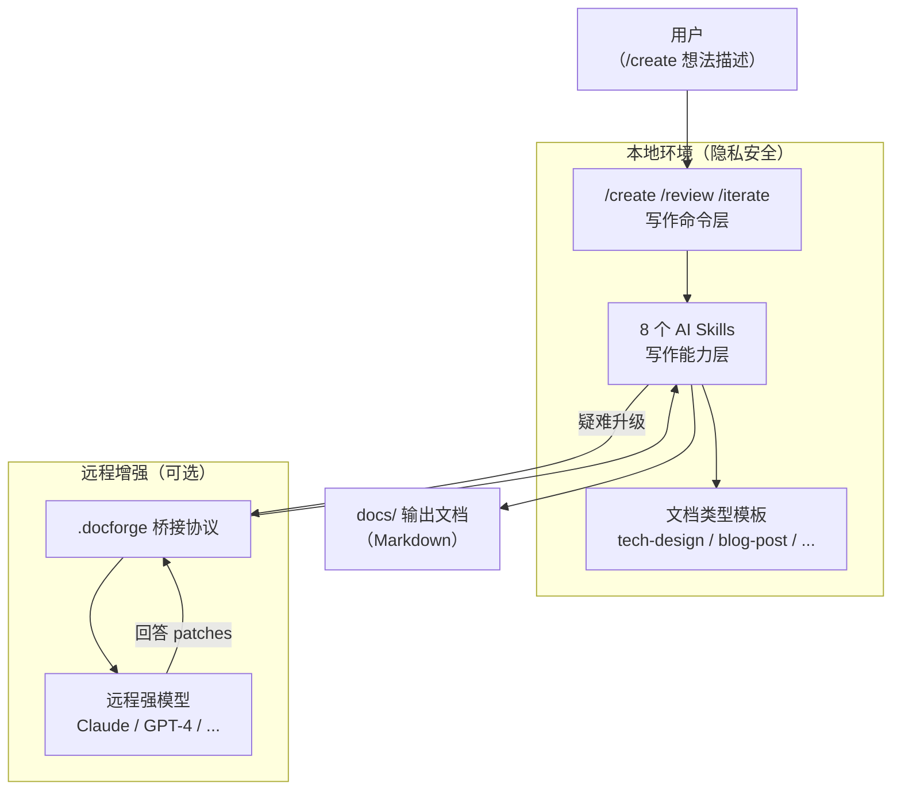

# MaeDoc

> **通用文档 AI Agent 生成器，基于 OpenCode**
>
> Generate any document, with any AI, on your terms.

---

## 这是什么？

MaeDoc 是一个**文档工作区模板**，也是一套运行在 [OpenCode](https://opencode.ai) 上的 AI 写作流水线。

**使用方式很简单**：把这个仓库 Clone 下来（或 Fork、Use as Template），它就是你的文档工作区。你在 `docs/` 里写文档，AI Skills 和模板就在同一个仓库里。

```
你的文档仓库（从 MaeDoc fork/clone）
├── docs/              ← 你写的文档存在这里
│   └── _templates/    ← 内置文档类型（tech-design、blog-post 等）
└── .opencode/
    ├── skills/        ← AI 写作能力（MaeDoc 内置）
    └── commands/      ← 写作命令，如 /create
```

**核心差异**：不限于技术文档，支持任意文档类型；每个环节都有对应的 AI Skill；结构化、可追溯、可复用。

---

## 前置准备

### 1. 安装 OpenCode

OpenCode 是运行 MaeDoc 的 AI 终端工具。

```bash
# macOS / Linux（推荐）
curl -fsSL https://opencode.ai/install.sh | sh

# 或通过 npm
npm install -g opencode
```

> 完整安装指南见 [opencode.ai/docs](https://opencode.ai/docs)

### 2. 配置 AI 模型

OpenCode 支持多种 AI 模型。设置你已有的服务商 API Key：

```bash
# 使用 Anthropic Claude（推荐）
export ANTHROPIC_API_KEY="your-key-here"

# 或 OpenAI
export OPENAI_API_KEY="your-key-here"

# 或使用本地 Ollama（完全免费，完全本地）
# 先安装 Ollama: https://ollama.ai
ollama pull llama3.1
```

---

## 5 分钟快速上手

### Step 1：获取 MaeDoc

**方式 A：Fork（推荐个人使用）**

点击 GitHub 右上角 Fork 按钮，Fork 到你的账号后 clone：

```bash
git clone https://github.com/YOUR_USERNAME/maedoc.git
cd maedoc
```

**方式 B：直接 Clone（快速体验）**

```bash
git clone https://github.com/your-org/maedoc.git
cd maedoc
```

### Step 2：启动 OpenCode

```bash
# 在 maedoc 目录下运行
opencode
```

OpenCode 启动后，会自动发现 `.opencode/skills/` 下的所有 AI Skills 和 `.opencode/commands/` 下的写作命令。

你会看到类似这样的交互界面：

```
Welcome to OpenCode
Working directory: /path/to/maedoc
Skills loaded: 8 (doc-outline-generate, doc-content-fill, ...)
Commands loaded: 1 (create)

>
```

### Step 3：创建你的第一个文档

在 OpenCode 的输入框中输入：

```
/create 我想写一篇关于微服务架构迁移的技术设计文档
```

接下来，MaeDoc 会引导你完成完整的写作流程：

```
MaeDoc: 根据你的描述，我建议使用以下文档类型：

📄 技术设计文档（tech-design）
用于系统架构与技术方案设计。

可用类型：
1. 技术设计文档（tech-design）
2. 博客文章（blog-post）
3. 通用文档（generic）

✅ 是否使用推荐类型「技术设计文档」？

> 1（确认）

MaeDoc: 正在生成大纲...

# 文档大纲：微服务架构迁移技术设计

## 1. 执行摘要 [必需]
所需输入：迁移目标、核心方案、预期收益
...

✅ 是否确认大纲，开始填充内容？
1. 确认，开始填充
2. 修改大纲
3. 重新生成

> 1

MaeDoc: 正在填充：## 执行摘要（1/10）
正在填充：## 背景与问题陈述（2/10）
...

🎉 文档创建完成！
📄 文件路径：docs/microservice-migration-design.md
```

### Step 4：查看生成的文档

```bash
# 在终端里查看
cat docs/microservice-migration-design.md

# 或用你喜欢的编辑器打开
code docs/microservice-migration-design.md
```

---

## 当前可用功能

### 命令

| 命令 | 描述 | 状态 |
|------|------|:----:|
| `/create` | 一键创建新文档（意图 → 大纲确认 → 内容填充 → 格式化） | ✅ 可用 |
| `/review` | 对现有文档进行全面审阅 | 🚧 开发中 |
| `/iterate` | 基于反馈定向迭代文档 | 🚧 开发中 |
| `/audit` | 批量文档质量检查 | 🚧 开发中 |
| `/list-types` | 浏览所有可用文档类型 | 🚧 开发中 |
| `/new-type` | 交互式创建自定义文档类型 | 🚧 开发中 |

### AI Skills（由命令自动调用，也可单独使用）

| Skill | 功能 | 状态 |
|-------|------|:----:|
| `doc-outline-generate` | 根据想法 + 文档类型生成结构化大纲 | ✅ 可用 |
| `doc-content-fill` | 按章节填充完整内容，标注信心等级 | ✅ 可用 |
| `doc-review` | 结构、逻辑、语言多维度审阅 | ✅ 可用 |
| `doc-format-normalize` | Markdown 格式规范化，输出 diff | ✅ 可用 |
| `doc-structure-audit` | 检查是否符合文档类型结构要求 | ✅ 可用 |
| `doc-quality-score` | 量化质量评分（0–100）+ 改进建议 | ✅ 可用 |
| `doc-iterate` | 基于反馈定向修改，输出 diff | ✅ 可用 |
| `doc-translate` | 保持结构的多语言翻译 | ✅ 可用 |

Skills 可单独调用，例如直接在 OpenCode 中说：

```
帮我用 doc-quality-score 给这篇文档打分：docs/my-design.md
```

### 内置文档类型

| 类型 ID | 名称 | 状态 |
|---------|------|:----:|
| `tech-design` | 技术设计文档 | ✅ 可用 |
| `blog-post` | 博客文章 | ✅ 可用 |
| `generic` | 通用文档 | ✅ 可用 |
| `project-proposal` | 项目提案 | 🚧 开发中 |
| `meeting-notes` | 会议纪要 | 🚧 开发中 |
| `api-doc` | API 文档 | 🚧 开发中 |
| `adr` | 架构决策记录（ADR） | 🚧 开发中 |

---

## 使用场景示例

### 写一篇技术设计文档

```
/create 我们要把用户认证模块从单体抽出来，做成独立的认证服务，用 JWT 替换 Session
```

### 写博客文章

```
/create 写一篇讲解 Rust 生命周期的博客文章，面向有 C++ 背景的读者
```

### 对已有文档质量评分

```
帮我用 doc-quality-score 评估 docs/my-doc.md 的质量
```

### 翻译文档

```
帮我用 doc-translate 把 docs/design.md 翻译成英文
```

### 审阅并给出修改建议

```
帮我用 doc-review 审阅 docs/proposal.md，重点关注逻辑一致性
```

---

## 项目结构

```
maedoc/
├── docs/
│   ├── _templates/         # 文档类型模板库
│   │   ├── tech-design/    # type.json + template.md + guidelines.md
│   │   ├── blog-post/
│   │   └── generic/
│   ├── guides/             # 用户指南
│   └── examples/           # 示例文档
├── schemas/                # JSON Schema 定义
├── .opencode/
│   ├── skills/             # AI 写作 Skills（8 个）
│   ├── commands/           # 写作命令（/create 等）
│   ├── tools/              # 可执行工具
│   └── plugins/            # 插件
├── .docforge/              # 远程增强桥接（本地↔远程模型）
├── scripts/                # 自动化脚本
├── tests/                  # 测试套件
└── opencode.jsonc          # OpenCode 配置（权限、模型、规范）
```

---

## 架构概览



---

## 技术栈

| 层级 | 技术 |
|------|------|
| AI 运行时 | [OpenCode](https://opencode.ai) |
| Skills | Markdown（提示型） / TypeScript（工具型） |
| 文档格式 | Markdown + Mermaid |
| 类型规范 | JSON Schema Draft-07 |
| 配置 | `opencode.jsonc` |

---

## Roadmap

| 里程碑 | 内容 | 状态 |
|--------|------|------|
| M0: 基础设施 | 项目骨架、配置、Agent 规则 | ✅ 完成 |
| M1: 文档类型系统 | 类型 Schema + 3 种内置模板 | ✅ 完成 |
| M2: AI 写作能力 | 8 个核心 Skills | ✅ 完成 |
| M3: 写作命令 | `/create` 等 6 个命令 | 🚧 进行中（1/6） |
| M4: 技能治理 | Schema 校验 + 自检 Skills | ⏳ 计划中 |
| M5: 远程桥接 | 本地+远程协同写作 | ⏳ 计划中 |
| M6: 安全审计 | 敏感信息扫描 + 审计日志 | ⏳ 计划中 |
| M7: CI/CD | GitHub Actions + 质量门禁 | ⏳ 计划中 |
| M8: 测试 | 测试框架 + 回归用例 | ⏳ 计划中 |
| M9: 更多类型 | ADR、会议纪要、API 文档等 | ⏳ 计划中 |
| M10: 品牌发布 | 文档完善 + README 升级 | ⏳ 计划中 |

完整迭代计划见 [`maedoc/dev_plan.md`](maedoc/dev_plan.md)。

---

## License

MIT License — 详见 [LICENSE](LICENSE)
