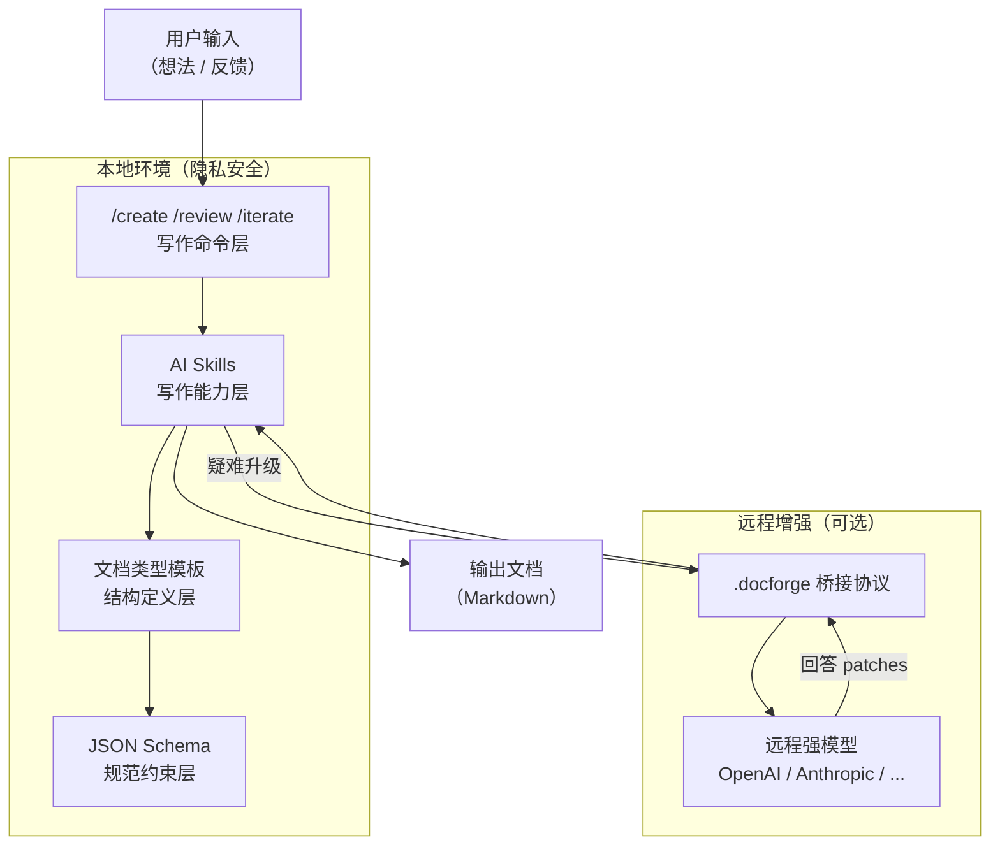

# MaeDoc

> **通用文档 AI Agent 生成器，基于 Open Code**
>
> Generate any document, with any AI, on your terms.

---

## 为什么是 MaeDoc？

大多数 AI 写作工具只解决"写什么"，而忽略了"怎么管理"。MaeDoc 把文档视为**结构化产物**，通过可复用的文档类型模板和 AI Skills 流水线，让你从想法到成稿的每一步都可控、可追溯、可复用。

---

## 核心价值

- **任意文档类型** — 技术设计、博客文章、项目提案、会议纪要、API 文档、ADR……不受场景限制，你定义文档的形状
- **开箱即用 + 可自定义扩展** — 内置多种文档类型模板，一条命令注册你自己的文档类型
- **AI 驱动的完整写作流水线** — 从大纲生成、内容填充、格式规范化到质量审阅，每个环节都有专属 Skill
- **本地优先 + 远程增强** — 默认一切在本地运行，隐私可控；遇到疑难问题可主动升级到远程强模型
- **基于 Open Code Skills 生态** — Skills 可复用、可组合、可共享，社区协作生产高质量写作能力

---

## 功能预览

### 核心写作命令

| 命令 | 描述 | 状态 |
|------|------|------|
| `/create` | 一键创建新文档（意图 → 大纲 → 成稿） | WIP |
| `/review` | 对现有文档进行全面审阅 | WIP |
| `/iterate` | 基于反馈定向迭代文档 | WIP |
| `/audit` | 批量文档质量检查 | WIP |
| `/list-types` | 浏览所有可用文档类型 | WIP |
| `/new-type` | 交互式创建自定义文档类型 | WIP |
| `/escalate` | 手动触发远程增强流程 | WIP |
| `/ingest-remote` | 接收并合并远程模型回答 | WIP |

### AI Skills

| Skill | 功能 | 状态 |
|-------|------|------|
| `doc.outline.generate` | 根据想法 + 文档类型生成结构化大纲 | WIP |
| `doc.content.fill` | 按章节填充完整内容 | WIP |
| `doc.review` | 多维度文档审阅 | WIP |
| `doc.format.normalize` | Markdown 格式规范化 | WIP |
| `doc.structure.audit` | 结构合规性检查 | WIP |
| `doc.quality.score` | 量化质量评分（0-100） | WIP |
| `doc.iterate` | 基于反馈定向修改 | WIP |
| `doc.translate` | 保持结构的多语言翻译 | WIP |
| `doc.changelog.generate` | 从 git 历史生成 CHANGELOG | WIP |
| `doc.drift.detect` | 文档与现实状态漂移检测 | WIP |
| `sec.secret.scan` | 敏感信息扫描 | WIP |
| `sec.prompt_injection.check` | 提示注入风险检查 | WIP |

### 内置文档类型

| 类型 | 描述 | 状态 |
|------|------|------|
| `generic` | 通用文档 | WIP |
| `tech-design` | 技术设计文档 | WIP |
| `blog-post` | 博客文章 | WIP |
| `project-proposal` | 项目提案 | WIP |
| `meeting-notes` | 会议纪要 | WIP |
| `api-doc` | API 文档 | WIP |
| `adr` | 架构决策记录（ADR） | WIP |

---

## Quick Start

> 详细指南见 [`docs/guides/quickstart.md`](docs/guides/quickstart.md)（WIP）

```bash
# 1. 安装 Open Code
# https://opencode.ai/docs/installation

# 2. 克隆 MaeDoc
git clone https://github.com/your-org/maedoc.git
cd maedoc

# 3. 启动 Open Code
opencode

# 4. 创建你的第一个文档
/create 我想写一篇关于微服务架构迁移的技术设计文档
```

---

## 架构概览



---

## 技术栈

| 层级 | 技术 |
|------|------|
| AI 运行时 | [Open Code](https://opencode.ai) |
| Skills 语言 | Markdown（提示型）/ TypeScript（工具型） |
| 文档格式 | Markdown + Mermaid |
| Schema 规范 | JSON Schema Draft-07 |
| 远程桥接协议 | JSON（`.docforge` 文件协议） |
| CI/CD | GitHub Actions |
| 质量门禁 | Python + pytest |

---

## 项目结构

```
maedoc/
├── docs/
│   ├── _templates/      # 文档类型模板库（type.json + template.md + guidelines.md）
│   ├── guides/          # 用户指南
│   └── examples/        # 示例文档
├── schemas/             # JSON Schema 定义
├── .opencode/
│   ├── skills/          # AI 写作 Skills
│   ├── commands/        # 写作命令
│   ├── tools/           # 可执行工具
│   └── plugins/         # 插件
├── .docforge/
│   ├── outbox/          # 远程请求出队
│   └── inbox/           # 远程响应入队
├── scripts/             # 自动化脚本
└── tests/               # 测试套件
```

---

## Roadmap

| 里程碑 | 内容 | 状态 |
|--------|------|------|
| M0: 基础设施 | 项目骨架、配置、Agent 规则 | 🚧 进行中 |
| M1: 文档类型系统 | 类型 Schema + 内置模板 | ⏳ 计划中 |
| M2: AI 写作能力 | 8 个核心 Skills | ⏳ 计划中 |
| M3: 写作命令 | 6 个用户命令 | ⏳ 计划中 |
| M4: 技能治理 | Schema + 自检 Skills | ⏳ 计划中 |
| M5: 远程桥接 | 本地+远程协同写作 | ⏳ 计划中 |
| M6: 安全审计 | 安全扫描 + 审计日志 | ⏳ 计划中 |
| M7: CI/CD | 自动化质量保障 | ⏳ 计划中 |
| M8: 测试 | 测试框架 + 回归用例 | ⏳ 计划中 |
| M9: 更多类型 | 4 种新文档类型 | ⏳ 计划中 |
| M10: 品牌发布 | 文档打磨 + README 升级 | ⏳ 计划中 |

完整迭代计划见 [`docs/dev_plan.md`](docs/dev_plan.md)。

---

## License

MIT License — 详见 [LICENSE](LICENSE)
