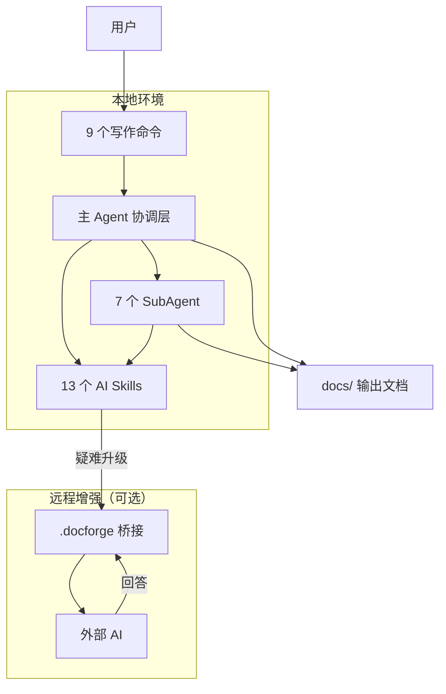

# MaeDoc

> **通用文档 AI Agent 生成器，基于 OpenCode**
>
> Generate any document, with any AI, on your terms.

---

## 这是什么？

MaeDoc 是一个**文档工作区模板**，也是一套运行在 [OpenCode](https://opencode.ai) 上的 AI 写作流水线。

**使用方式很简单**：把这个仓库 Clone 下来（或 Fork、Use as Template），它就是你的文档工作区。你可以直接在 `docs/` 里写文档，也可以让 `/companion` 全程代管文档库演进。

```
你的文档仓库（从 MaeDoc fork/clone）
├── docs/              ← 你写的文档存在这里
└── .opencode/
    ├── skills/        ← AI 写作能力（MaeDoc 内置）
    ├── commands/      ← 写作命令，如 /create
    └── agents/        ← SubAgent 定义（质量评估、规划、写作）
```

**核心差异**：每个写作环节都有对应的 AI Skill；结构化、可追溯、可复用。

---

## 前置准备

### 1. 安装 OpenCode

OpenCode 是运行 MaeDoc 的 AI 终端工具。

```bash
# macOS / Linux（推荐）
curl -fsSL https://opencode.ai/install.sh | sh

# 或通过 npm
npm install -g opencode
```

> 完整安装指南见 [opencode.ai/docs](https://opencode.ai/docs)

### 2. 配置 AI 模型

OpenCode 支持多种 AI 模型。设置你已有的服务商 API Key：

```bash
# 使用 Anthropic Claude（推荐）
export ANTHROPIC_API_KEY="your-key-here"

# 或 OpenAI
export OPENAI_API_KEY="your-key-here"

# 或使用本地 Ollama（完全免费，完全本地）
ollama pull llama3.1
```

---

## 5 分钟快速上手

### Step 1：获取 MaeDoc

```bash
git clone https://github.com/your-org/maedoc.git
cd maedoc
```

### Step 2：启动 OpenCode

```bash
opencode
```

OpenCode 启动后会自动发现所有 Skills、Commands 和 SubAgents。

### Step 3：创建你的第一个文档

```
/create 我想写一篇关于微服务架构迁移的技术设计文档
```

MaeDoc 会引导你完成完整的写作流程：需求探询 → 大纲规划 → 内容填充 → 质量门检查。

如果你希望“少交互、高自治”：

```
/companion 我想把文档库重心切到 AI Agent 协作写作
```

### Step 4：查看生成的文档

```bash
cat docs/microservice-migration-design.md
```

---

## 当前可用功能

### 命令（9 个）

| 命令 | 描述 | 状态 |
|------|------|:----:|
| `/create` | 一键创建新文档（意图 → 大纲 → 内容 → 质量门） | ✅ 可用 |
| `/companion` | 高自治写作伴侣入口（Plan → Build → Crystallize） | ✅ 可用 |
| `/focus` | 快速切换探索焦点并同步状态 | ✅ 可用 |
| `/review` | 对现有文档进行只读质量审阅 | ✅ 可用 |
| `/iterate` | 基于反馈迭代文档（智能追问 + 质量门） | ✅ 可用 |
| `/evolve` | 文档树结构演进（全库扫描 + 变更计划） | ✅ 可用 |
| `/escalate` | 打包上下文发给外部 AI | ✅ 可用 |
| `/ingest-remote` | 导入外部 AI 回答并应用 | ✅ 可用 |
| `/do-todo` | 查看或执行待办事项 | ✅ 可用 |

### AI Skills（13 个）

| Skill | 功能 | 状态 |
|-------|------|:----:|
| `doc-outline-generate` | 根据想法生成结构化大纲 | ✅ 可用 |
| `doc-content-fill` | 按章节填充完整内容 | ✅ 可用 |
| `doc-evaluate` | 统一质量评估：7 维度评分 + P0/P1/P2 问题清单 | ✅ 可用 |
| `doc-format-normalize` | Markdown 格式规范化 | ✅ 可用 |
| `doc-iterate` | 基于反馈定向修改 | ✅ 可用 |
| `doc-translate` | 保持结构的多语言翻译 | ✅ 可用 |
| `doc-tree-fill` | 多文件文档树批量填充 | ✅ 可用 |
| `doc-tree-evolve` | 文档树结构演进 | ✅ 可用 |
| `hardness-classify` | 六维硬度评估 + 自动求助 | ✅ 可用 |
| `todo-append` | TODO 追加机制 | ✅ 可用 |
| `doc-focus-map` | 全库主题图谱与焦点迁移分析 | ✅ 可用 |
| `knowledge-crystallize` | 真知提炼（论断 + 证据链 + 置信度） | ✅ 可用 |
| `companion-state-sync` | 伴侣控制平面状态同步 | ✅ 可用 |

### SubAgents（7 个）

| Agent | 职责 | Temperature |
|-------|------|:-----------:|
| `doc-planner` | 文档规划、大纲生成 | 0.3 |
| `doc-writer` | 内容填充、格式化 | 0.7 |
| `doc-analyst` | 质量评估（7 维度） | 0.1 |
| `doc-library-analyst` | 全库扫描、知识图谱 | 0.1 |
| `doc-explorer` | 主题探索与焦点迁移建议 | 0.2 |
| `doc-companion-planner` | 伴侣执行计划编排 | 0.25 |
| `knowledge-synthesizer` | 真知提炼与冲突检测 | 0.2 |

---

## 使用场景示例

### 写一篇技术设计文档

```
/create 我们要把用户认证模块从单体抽出来，做成独立的认证服务，用 JWT 替换 Session
```

### 审阅文档质量

```
/review docs/my-design.md
```

### 基于反馈迭代

```
/iterate docs/my-design.md 补充安全章节的威胁模型分析
```

### 全库演进

```
/evolve 全面梳理文档库，消除不一致，对齐当前方向
```

### 伴侣自治写作

```
/companion 你来主导整个 docs 文档库，围绕“多 Agent 文档工程”持续演进
```

---

## 项目结构

```
maedoc/
├── docs/                   # 用户文档
│   ├── index.md            # 导航枢纽
│   ├── companion/          # 伴侣控制平面（焦点/主题/晶体/续航）
│   ├── maedoc/             # MaeDoc 核心架构设计
│   ├── retrospect/         # 回顾与反思
│   ├── forward/            # 方向与规划
│   ├── learning/           # 学习笔记
│   └── TODO.md             # 待办事项
├── maedoc/                 # MaeDoc 自身配置与文档
├── .opencode/
│   ├── skills/             # AI 写作 Skills（13 个）
│   ├── commands/           # 写作命令（9 个）
│   ├── agents/             # SubAgent 定义（7 个）
│   ├── tools/              # 可执行工具
│   └── plugins/            # 插件（含 maedoc-guardian）
├── .docforge/              # 远程增强桥接（本地↔远程）
└── opencode.jsonc          # OpenCode 配置
```

---

## 架构概览



---

## 技术栈

| 层级 | 技术 |
|------|------|
| AI 运行时 | [OpenCode](https://opencode.ai) |
| Skills | Markdown（结构化 Prompt） |
| 文档格式 | Markdown + Mermaid |
| 配置 | `opencode.jsonc` |

---

## Roadmap

| 里程碑 | 内容 | 状态 |
|--------|------|------|
| M0: 基础设施 | 项目骨架、配置、Agent 规则 | ✅ 完成 |
| M1: AI 写作能力 | 13 个核心 Skills | ✅ 完成 |
| M2: 写作命令 | 9 个命令 + 7 个 SubAgent | ✅ 完成 |
| M3: 伴侣模式 | `/companion` + 控制平面 + 真知沉淀 | ✅ 完成 |
| M4: 技能治理 | Skill 质量审计 + 自检 | ⏳ 计划中 |
| M5: 远程桥接 | 本地+远程协同写作 | ⏳ 计划中 |
| M6: 安全审计 | 敏感信息扫描 + 审计日志 | ⏳ 计划中 |

完整迭代计划见 [`maedoc/dev_plan.md`](maedoc/dev_plan.md)。

---

## License

MIT License — 详见 [LICENSE](LICENSE)
