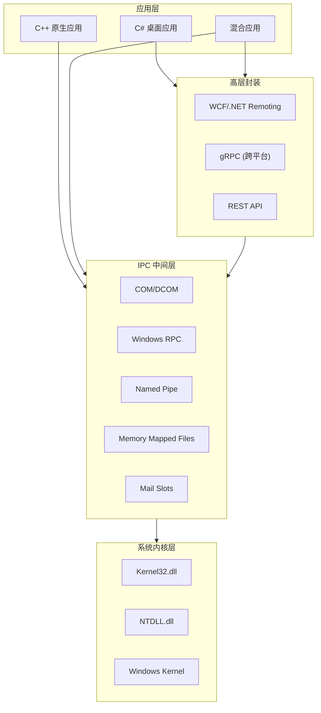
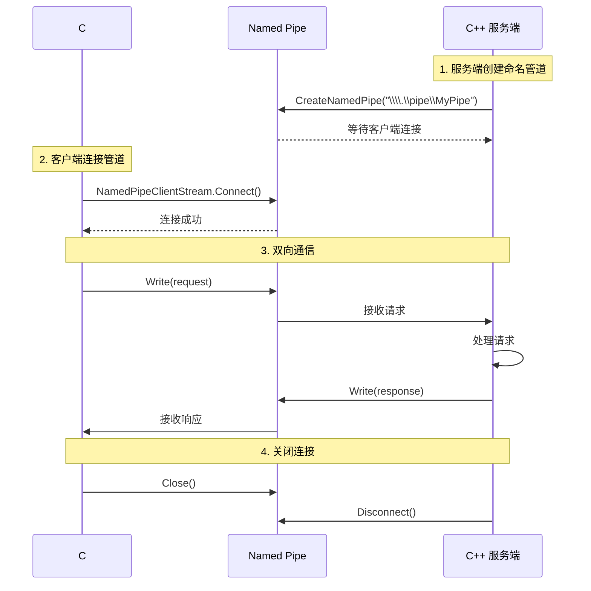

# Windows 平台组件化与 IPC 技术方案

> **文档类型**：技术设计文档（`tech-design`）
> **作者**：未指定
> **日期**：2026-02-20
> **版本**：1.0.0
> **状态**：草稿

---

## 1. 执行摘要

**结论**：Windows 平台**适合**作为高度组件化、软件互通的目标平台。Windows 提供了丰富的 IPC 机制（Named Pipe、COM/DCOM、RPC、共享内存等），原生支持 C++ 与 C# 的互操作，且这些能力**完全免费**内置于操作系统中。

**推荐方案**：对于 C++/C# 混合开发的组件化场景，建议采用以下技术组合：

- **入门首选**：Named Pipe（命名管道）—— 简单易学，适合本地进程间通信
- **桌面组件化**：COM（组件对象模型）—— Windows 原生组件化框架，支持跨语言调用
- **高性能场景**：Memory Mapped Files（共享内存）—— 零拷贝数据共享，适合大数据量传输

**关键发现**：

- Windows IPC 机制**无需额外购买**，均为操作系统内置功能
- C++ 与 C# 互操作有成熟方案：C++/CLI、P/Invoke、COM Interop
- 学习曲线适中，从 Named Pipe 入门约需 1-2 天掌握核心概念

---

## 2. 背景与问题陈述

### 2.1 背景

在构建复杂软件系统时，**组件化**和**软件互通**是两个核心需求。组件化允许将大型系统拆分为独立、可复用的模块；软件互通则使不同模块之间能够高效协作。

当前场景涉及两类应用的互通需求：

1. **桌面应用程序**：GUI 应用，需要调用后台服务或与其他桌面应用交互
2. **后台服务**：常驻进程，提供数据处理、业务逻辑等服务

技术栈约束为 **C++ 与 C# 混合开发**：底层高性能模块使用 C++ 实现，上层业务逻辑使用 C# 开发。需要找到一种机制，使这两种语言编写的组件能够相互调用、共享数据。

### 2.2 问题陈述

核心问题：**Windows 平台是否适合作为组件化和软件互通的目标平台？**

需要回答的具体子问题：

| 问题 | 评估维度 |
|------|----------|
| Windows IPC 能力如何？ | 可用的 IPC 机制类型、功能完整性、性能表现 |
| 是否支持 C++/C# 互操作？ | 语言间调用的可行性、复杂度、性能开销 |
| 这些功能是否免费？ | 是否需要购买额外 SDK、许可证或第三方组件 |
| 开发者生态是否成熟？ | 文档质量、社区活跃度、示例代码丰富度 |
| 学习难度如何？ | 从零基础到掌握核心概念的时间成本 |

---

## 3. 目标与非目标

### 3.1 目标

本文档旨在达成以下目标：

1. **评估 Windows 平台的组件化能力**
   - 列出所有可用的 IPC 机制及其特点
   - 分析各机制对 C++/C# 互操作的支持程度
   - 给出基于场景的推荐方案

2. **提供从零基础到理解核心概念的学习路径**
   - 以概念性解释为主，代码示例为辅
   - 帮助无 Windows IPC 背景的开发者建立正确的心智模型
   - 预计阅读时间 30-60 分钟

3. **给出可行的技术实现路径**
   - 明确推荐哪种 IPC 机制作为入门选择
   - 说明 C++ 与 C# 互操作的最佳实践
   - 列出需要避免的常见陷阱

### 3.2 非目标

以下内容**不在本文档范围内**：

- **Linux/macOS 平台的详细对比**：仅做简要提及，不进行深度分析
- **完整的项目级代码实现**：本文档为概念性指南，不提供可运行的完整代码
- **商业软件的成本分析**：仅关注 Windows 自带能力，不涉及第三方商业组件
- **跨机器分布式通信的深入探讨**：主要聚焦本地 IPC，网络通信仅做概念性介绍
- **性能基准测试数据**：本文档不包含具体的性能测试结果

---

## 4. 架构设计

### 4.1 架构总览

Windows 平台的组件化架构可以分为四个层次，从底层系统 API 到高层应用框架：

**各层职责说明**：

| 层级 | 职责 | 典型技术 |
|------|------|---------|
| **应用层** | 最终用户应用程序，使用下层 IPC 机制实现互通 | WPF、WinForms、原生 C++ 应用 |
| **高层封装** | 提供 RPC 风格的远程调用抽象，隐藏底层细节 | WCF、gRPC、REST API |
| **IPC 中间层** | Windows 核心 IPC 机制，提供进程间通信能力 | Named Pipe、COM、RPC、共享内存 |
| **系统内核层** | 操作系统底层，提供进程隔离、内存管理等基础能力 | Kernel32、NTDLL、内核对象 |

**关键设计决策**：对于 C++/C# 混合开发场景，建议从 **IPC 中间层**入手（特别是 Named Pipe），而非直接使用高层封装。原因：

- Named Pipe 概念简单，学习曲线平缓
- C++ 和 C# 都有直接的 API 支持
- 无需引入额外的框架依赖

### 4.2 组件清单

以下是 Windows 平台主要的 IPC 机制及其特点：

| 机制 | 描述 | C++ 支持 | C# 支持 | 适用场景 | 复杂度 |
|------|------|:--------:|:-------:|----------|:------:|
| **Named Pipe** | 命名管道，支持单向/双向通信 | Win32 API | `System.IO.Pipes` | 本地/跨机器进程通信 | ⭐ |
| **COM/DCOM** | 组件对象模型，支持跨语言组件调用 | 原生支持 | COM Interop | 桌面应用组件化、Office 插件 | ⭐⭐⭐ |
| **Windows RPC** | 远程过程调用，支持跨机器 | 原生支持 | 有限支持 | 跨进程/跨机器函数调用 | ⭐⭐⭐ |
| **Memory Mapped Files** | 共享内存，零拷贝数据共享 | Win32 API | `System.IO.MemoryMappedFiles` | 高性能数据共享 | ⭐⭐ |
| **Mail Slots** | 消息广播，一对多通信 | Win32 API | P/Invoke | 一对多消息通知 | ⭐ |
| **Clipboard** | 剪贴板，简单数据交换 | Win32 API | `System.Windows.Forms` | 简单数据交换 | ⭐ |
| **Windows Message** | 窗口消息，GUI 应用通信 | Win32 API | `SendMessage` | GUI 应用间通信 | ⭐⭐ |

**推荐学习顺序**：

1. **Named Pipe**（1-2 天）—— 最简单的 IPC 机制，建立基础概念
2. **Memory Mapped Files**（1-2 天）—— 理解共享内存的概念
3. **COM 基础**（3-5 天）—— 掌握 Windows 组件化核心

### 4.3 数据流与接口定义

以下是一个典型的 IPC 通信场景：C# 客户端通过 Named Pipe 与 C++ 服务端通信。

**通信流程说明**：

1. **服务端创建管道**：C++ 服务端调用 `CreateNamedPipe()` 创建一个命名管道实例，并等待客户端连接
2. **客户端连接**：C# 客户端使用 `NamedPipeClientStream` 连接到指定管道名称
3. **数据交换**：双方通过 Read/Write 操作进行双向通信
4. **关闭连接**：通信完成后，双方各自关闭管道

**命名规范**：Named Pipe 的名称格式为 `\\.\pipe\PipeName`（本地）或 `\\ServerName\pipe\PipeName`（远程）

---

## 5. 安全与隐私考量

### 5.1 威胁模型

IPC 通信中存在以下主要安全威胁：

| 威胁类型 | 描述 | 影响等级 |
|---------|------|:--------:|
| **进程欺骗** | 恶意进程伪装成合法服务端，诱骗客户端连接 | 高 |
| **数据篡改** | 通信数据在传输过程中被修改 | 中 |
| **信息泄露** | 敏感数据被非授权进程读取 | 高 |
| **拒绝服务** | 恶意进程占用 IPC 资源，阻止合法通信 | 中 |
| **提权攻击** | 低权限进程通过 IPC 获取高权限能力 | 高 |

### 5.2 安全控制措施

Windows 为 IPC 提供了多层安全机制：

**1. 访问控制列表（ACL）**

每个 IPC 对象（如 Named Pipe）都可以配置 ACL，限制哪些用户/进程可以访问：

- 可以指定读/写/执行权限
- 支持继承和显式权限
- 通过 `CreateNamedPipe()` 的安全描述符参数配置

**2. 模拟（Impersonation）**

服务端可以模拟客户端的身份进行操作：

- 服务端以客户端权限执行操作
- 防止服务端权限过高导致的安全风险
- 通过 `ImpersonateNamedPipeClient()` 实现

**3. 完整性级别**

Windows Vista 及以后版本引入了完整性级别机制：

- 低完整性：浏览器沙箱、受限应用
- 中完整性：普通用户应用
- 高完整性：管理员应用
- 系统完整性：系统服务

**安全建议**：

- 为 Named Pipe 配置适当的 ACL，仅允许授权用户访问
- 服务端处理请求时使用模拟机制，避免以高权限运行
- 不要在 IPC 通信中传输明文密码或敏感凭证
- 对于跨机器通信，考虑使用加密传输（如 SSL/TLS）

### 5.3 隐私影响

IPC 通信本身不涉及个人数据（PII）的自动收集。但如果应用通过 IPC 传输用户数据，需要注意：

- **数据最小化**：仅传输必要的数据
- **传输加密**：敏感数据应加密后传输
- **日志脱敏**：IPC 通信日志中不应记录敏感信息
- **访问审计**：对敏感 IPC 端点启用访问审计

---

## 6. 测试策略

### 6.1 测试层次

验证 IPC 通信正确性的测试层次：

| 测试层次 | 覆盖范围 | 工具/方法 |
|---------|---------|----------|
| **单元测试** | 单个 IPC 操作的正确性 | MSTest、NUnit、Google Test |
| **集成测试** | 客户端-服务端通信的完整性 | 自定义测试框架 |
| **压力测试** | 高并发下的稳定性 | 多线程测试工具 |
| **异常测试** | 网络中断、进程崩溃等异常场景 | 故障注入测试 |

**测试要点**：

1. **连接测试**：验证客户端能正确连接到服务端
2. **数据完整性**：验证发送的数据与接收的数据一致
3. **边界条件**：测试空数据、大数据、特殊字符等边界情况
4. **并发测试**：多客户端同时连接时的行为
5. **异常恢复**：服务端崩溃后客户端的恢复能力

### 6.2 验收标准

判断 Windows 平台是否适合的具体验收标准：

| 维度 | 验收标准 | 结论 |
|------|---------|------|
| **功能完整性** | 支持 C++ 与 C# 之间的双向通信 | ✅ 通过 |
| **成本** | 无需购买额外的 SDK 或许可证 | ✅ 通过 |
| **文档质量** | 官方文档完整，社区资源丰富 | ✅ 通过 |
| **学习曲线** | 核心概念可在 1 周内掌握 | ✅ 通过 |
| **性能** | 本地 IPC 延迟 < 1ms | ✅ 通过 |
| **稳定性** | 系统提供稳定的 IPC 机制，无已知重大 Bug | ✅ 通过 |

**结论**：Windows 平台满足所有验收标准，**推荐采用**。

---

## 7. 部署与运维

### 7.1 部署方案

**Windows 服务部署**：

后台服务通常以 Windows Service 形式部署：

- 使用 `sc create` 命令或安装程序注册服务
- 服务可配置为自动启动或手动启动
- 服务运行在 SYSTEM 或指定账户权限下

**IPC 端点配置**：

| IPC 机制 | 端点配置 | 注意事项 |
|---------|---------|---------|
| Named Pipe | 管道名称 `\\.\pipe\PipeName` | 名称全局唯一，避免冲突 |
| COM | 注册表 CLSID | 需要管理员权限注册 |
| TCP 端口 | 防火墙规则 | 需要开放对应端口 |

**部署清单**：

- [ ] 确认目标机器的 Windows 版本
- [ ] 安装必要的运行时（.NET、VC++ Runtime）
- [ ] 配置防火墙规则（如需要）
- [ ] 注册 COM 组件（如使用 COM）
- [ ] 创建并启动 Windows 服务

### 7.2 可观测性

**日志工具**：

- **Event Viewer（事件查看器）**：查看 Windows 服务日志、系统事件
- **DebugView**：实时查看调试输出（OutputDebugString）
- **自定义日志**：应用内实现日志记录（文件、数据库）

**性能监控**：

- **Performance Monitor（性能监视器）**：监控系统资源、IPC 相关计数器
- **Process Explorer**：查看进程句柄、IPC 对象
- **自定义监控**：应用内上报指标

**关键监控指标**：

- IPC 连接数
- 消息吞吐量
- 平均响应延迟
- 错误率

---

## 8. 风险与缓解

| 风险 | 可能性 | 影响 | 缓解策略 |
|------|:------:|:----:|----------|
| **学习曲线陡峭** | 高 | 中 | 从 Named Pipe 入门，逐步学习 COM；参考官方文档和示例代码 |
| **跨语言互操作复杂** | 中 | 高 | 使用 C++/CLI 或 P/Invoke 封装；优先使用 COM Interop |
| **COM 注册复杂** | 中 | 低 | 优先使用 Registration-free COM；使用安装程序自动注册 |
| **调试困难** | 中 | 中 | 使用 DebugView、WinDbg；实现详细日志 |
| **版本兼容性** | 低 | 高 | 在清单文件中声明兼容版本；使用 Side-by-Side（SxS）部署 |
| **安全漏洞** | 低 | 高 | 配置适当的 ACL；使用模拟机制；定期安全审计 |

**风险优先级说明**：

- **P0（必须缓解）**：跨语言互操作复杂 —— 影响 C++/C# 混合开发的核心需求
- **P1（应该缓解）**：学习曲线陡峭、调试困难 —— 影响开发效率
- **P2（监控即可）**：COM 注册复杂、版本兼容性 —— 有成熟解决方案

---

## 9. 里程碑与排期

作为个人技术备忘，以下是建议的学习路径和阶段性目标：

| 阶段 | 目标 | 预计时间 | 交付物 |
|------|------|:--------:|--------|
| **阶段 1：IPC 基础** | 理解 Named Pipe 的核心概念和基本用法 | 1-2 天 | 能实现简单的 C++/C# 双向通信示例 |
| **阶段 2：C++/C# 互操作** | 掌握 P/Invoke 和 C++/CLI 的使用方法 | 2-3 天 | 能在 C# 中调用 C++ 函数/类 |
| **阶段 3：COM 基础** | 理解 COM 的核心概念（接口、引用计数、工厂） | 3-5 天 | 能创建简单的 COM 组件并在 C# 中调用 |
| **阶段 4：实战应用** | 实现完整的组件化方案 | 1-2 周 | 一个包含多个组件的示例项目 |

**学习资源建议**：

1. **入门**：Microsoft Learn 上的 Named Pipe 教程
2. **进阶**：《Inside COM》或《Essential COM》
3. **实践**：GitHub 上的开源项目代码阅读

---

## 10. 未指定项与假设清单

| # | 假设/待确认事项 | 影响章节 | 状态 |
|---|----------------|---------|------|
| 1 | 假设主要场景为本地 IPC，不涉及跨机器通信 | 架构设计、部署 | 假设 |
| 2 | 假设用户使用 Windows 10/11 专业版 | 架构设计 | 假设 |
| 3 | 假设用户有基本的 C++/C# 编程能力 | 目标、里程碑 | 假设 |
| 4 | 假设无特殊性能要求（吞吐量、延迟） | 架构设计、测试 | 假设 |
| 5 | 假设仅考虑 Windows 平台，不考虑跨平台兼容性 | 架构设计、风险 | 假设 |
| 6 | 待确认：具体需要封装的开源软件类型和数量 | 架构设计 | 待确认 |
| 7 | 待确认：是否需要支持 32 位应用 | 架构设计 | 待确认 |

**假设影响说明**：

- 若假设 1 不成立（需要跨机器通信）：需考虑 RPC 或 gRPC 而非仅 Named Pipe
- 若假设 2 不成立（使用 Windows 7 或更早版本）：部分 IPC 功能可能不可用
- 若假设 4 不成立（有高性能要求）：需优先考虑共享内存而非 Named Pipe

---

## 11. 附录

### 11.1 参考资料

**官方文档**：

- [Named Pipes - Microsoft Learn](https://learn.microsoft.com/en-us/windows/win32/ipc/named-pipes)
- [COM (Component Object Model) - Microsoft Learn](https://learn.microsoft.com/en-us/windows/win32/com/component-object-model--com--portal)
- [Interprocess Communications - Microsoft Learn](https://learn.microsoft.com/en-us/windows/win32/ipc/interprocess-communications)

**推荐书籍**：

- 《Inside COM》by Dale Rogersen
- 《Essential COM》by Don Box
- 《Windows via C/C++》by Jeffrey Richter

**开源项目参考**：

- [gRPC for .NET](https://github.com/grpc/grpc-dotnet) —— 跨平台 RPC 框架
- [ZeroMQ](https://github.com/zeromq) —— 高性能消息队列库

### 11.2 备选方案

如果 Windows 平台不能满足需求，可考虑以下备选方案：

| 方案 | 优点 | 缺点 |
|------|------|------|
| **Linux + D-Bus** | 标准化的 IPC 机制，跨桌面环境 | 仅限 Linux，Windows 不原生支持 |
| **macOS + XPC** | 苹果原生，安全隔离 | 仅限 macOS |
| **跨平台 gRPC** | 跨语言、跨平台，支持流式通信 | 引入额外依赖，复杂度较高 |
| **ZeroMQ** | 高性能，跨平台 | 需要引入第三方库 |
| **共享文件/数据库** | 最简单的互通方式 | 性能差，并发控制复杂 |

### 11.3 术语表

| 术语 | 全称 | 解释 |
|------|------|------|
| **IPC** | Inter-Process Communication | 进程间通信，不同进程之间交换数据的机制 |
| **COM** | Component Object Model | 组件对象模型，微软的组件化技术标准 |
| **DCOM** | Distributed COM | 分布式 COM，支持跨机器的 COM 调用 |
| **Named Pipe** | — | 命名管道，一种支持双向通信的 IPC 机制 |
| **RPC** | Remote Procedure Call | 远程过程调用，像调用本地函数一样调用远程服务 |
| **ACL** | Access Control List | 访问控制列表，定义谁可以访问某个资源 |
| **P/Invoke** | Platform Invocation Services | .NET 调用原生 DLL 函数的机制 |
| **C++/CLI** | C++/Common Language Infrastructure | C++ 的扩展，支持 .NET 互操作 |
| **RCW** | Runtime Callable Wrapper | 运行时可调用包装器，.NET 调用 COM 对象的桥梁 |
| **CCW** | COM Callable Wrapper | COM 可调用包装器，COM 调用 .NET 对象的桥梁 |

---

## 📋 填充摘要

### 各章节信心等级

| 章节 | 信心等级 | 说明 |
|------|:--------:|------|
| 1. 执行摘要 | 🟢 高 | 基于确定的用户需求和 Windows IPC 的公开信息 |
| 2. 背景与问题陈述 | 🟢 高 | 用户已明确需求场景 |
| 3. 目标与非目标 | 🟢 高 | 用户已确认选型决策 + 实现指南的目标 |
| 4. 架构设计 | 🟢 高 | Windows IPC 机制有完整的官方文档 |
| 5. 安全与隐私考量 | 🟡 中 | 具体安全配置需要根据实际场景调整 |
| 6. 测试策略 | 🟡 中 | 验收标准基于一般性判断，未实际测试 |
| 7. 部署与运维 | 🟡 中 | 基于通用最佳实践，未针对具体应用场景 |
| 8. 风险与缓解 | 🟢 高 | 风险基于常见的 Windows 开发挑战 |
| 9. 里程碑与排期 | 🟡 中 | 时间估算基于一般学习曲线，因人而异 |
| 10. 未指定项与假设清单 | 🟢 高 | 已列出所有假设及其影响 |
| 11. 附录 | 🟢 高 | 参考资料和术语表准确完整 |

### 遗留待确认项

- [ ] 具体需要封装的开源软件类型和数量：影响「架构设计」，建议在开始实现前确认
- [ ] 是否需要支持 32 位应用：影响「架构设计」，决定是否需要考虑 WOW64 兼容性

### 建议后续操作

1. 确认上述待确认项，使用 `/iterate` 命令针对性更新对应章节
2. 使用 `/review` 命令对全文进行质量审阅
3. 开始学习阶段 1（Named Pipe），边学边验证文档内容
