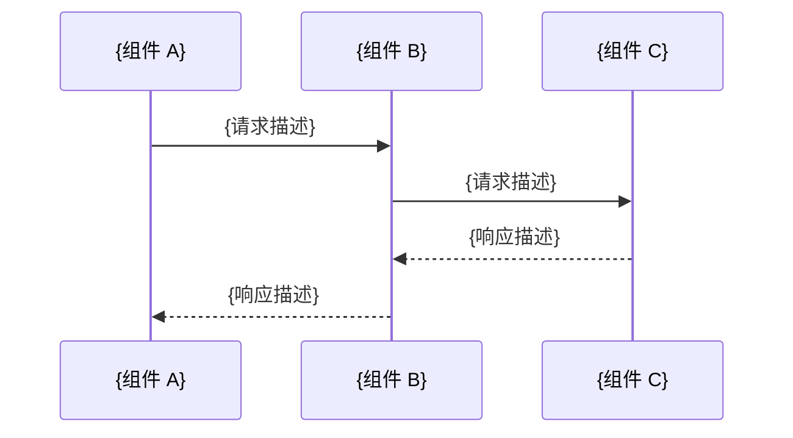

# {{project_name}} 技术设计文档

> **文档类型**：技术设计文档
> **作者**：{{author}}
> **日期**：{{date}}
> **版本**：{{version}}
> **状态**：{{status}}
> **评审人**：{{reviewers}}

---

## 执行摘要

<!-- 必需章节：面向决策者的一页纸摘要。
     用 3-5 句话说清楚：做什么、为什么做、核心方案是什么、预期影响。
     读者无需阅读全文即可做出是否推进的判断。 -->

{用 3-5 句话描述：背景问题 → 本方案的核心思路 → 预期收益/影响}

---

## 背景与问题陈述

<!-- 必需章节：阐明当前状态与期望状态之间的差距，以及不解决该问题的代价 -->

### 背景

<!-- 描述触发本设计的上下文：业务驱动力、现有系统状态、相关历史决策。
     聚焦事实，避免引入解决方案。 -->

{描述现有系统状态、业务背景和触发本次设计的原因}

### 问题陈述

<!-- 用数据或可观察现象定义核心问题。
     格式示例：当前 X 导致 Y，影响范围为 Z。 -->

{用可量化的方式描述核心问题及其影响}

---

## 目标与非目标

<!-- 必需章节：明确划定本方案的边界，防止范围蔓延 -->

### 目标

<!-- 列出本方案要解决的问题和达成的可验证指标。
     每条目标尽量满足 SMART 原则（可量化、有时限）。 -->

- {目标 1：可量化的指标，例如"将 P99 延迟从 500ms 降至 100ms 以内"}
- {目标 2}
- {目标 3}

### 非目标

<!-- 明确列出本方案刻意不解决的问题——与目标同等重要。 -->

- {非目标 1：例如"本方案不涉及旧版客户端的兼容性问题"}
- {非目标 2}

---

## 架构设计

<!-- 必需章节：系统整体架构的结构化描述 -->

### 架构总览

<!-- 必需子章节：用 Mermaid 图展示系统整体结构，优先选择：
     - C4 架构图（系统/容器/组件层次）
     - 分层架构图
     - 序列图（流程为主时）
     图表后附简短文字说明核心设计决策及理由。 -->

```mermaid
graph TB
    subgraph "客户端层"
        A[客户端 A]
        B[客户端 B]
    end

    subgraph "服务层"
        C[{服务 1}]
        D[{服务 2}]
    end

    subgraph "数据层"
        E[{数据存储 1}]
        F[{数据存储 2}]
    end

    A --> C
    B --> C
    C --> D
    C --> E
    D --> F
```

**核心设计决策**：

- {决策 1 及理由}
- {决策 2 及理由}

### 组件清单

<!-- 必需子章节：以表格形式列出所有关键组件 -->

| 组件名称 | 职责描述 | 技术选型 | 依赖组件 |
|---------|---------|---------|---------|
| {组件 1} | {职责描述} | {技术栈} | {依赖列表} |
| {组件 2} | {职责描述} | {技术栈} | {依赖列表} |
| {组件 3} | {职责描述} | {技术栈} | {依赖列表} |

### 数据流与接口定义

<!-- 可选子章节：描述组件间的数据流转和关键接口契约。
     可包含：序列图、API 签名、消息格式、数据库 Schema 要点。 -->

#### 关键流程：{流程名称}



#### 接口定义

```
{接口名称}
  输入：{参数列表及类型}
  输出：{返回值及类型}
  错误码：{可能的错误及含义}
```

---

## 安全与隐私考量

<!-- 必需章节：系统性分析安全风险和隐私影响。
     即使结论是"无新增风险"也需明确写出，不可省略。 -->

### 威胁模型

<!-- 可选子章节：识别主要威胁面。
     可参考 STRIDE 框架：身份欺骗、篡改、否认、信息泄露、拒绝服务、提权。 -->

| 威胁类型 | 场景描述 | 影响等级 | 缓解措施 |
|---------|---------|---------|---------|
| {威胁 1} | {场景} | 高 / 中 / 低 | {缓解措施} |
| {威胁 2} | {场景} | 高 / 中 / 低 | {缓解措施} |

### 安全控制措施

<!-- 必需子章节：列出已设计的安全控制 -->

- **认证与鉴权**：{描述}
- **传输安全**：{描述，如 TLS 版本要求}
- **数据加密**：{描述，区分传输中和静态加密}
- **审计日志**：{描述，记录哪些关键操作}
- **输入验证**：{描述}

### 隐私影响

<!-- 可选子章节：如涉及个人数据（PII）处理，在此描述 -->

- **是否涉及 PII**：{是 / 否}
- **数据类型**：{如涉及，列出数据类型}
- **数据最小化**：{说明只收集必要数据的措施}
- **数据留存**：{留存周期和删除策略}

---

## 测试策略

<!-- 必需章节：定义如何验证方案的正确性和健壮性 -->

### 测试层次

<!-- 描述各层测试的覆盖范围 -->

| 测试类型 | 覆盖范围 | 工具/框架 | 目标覆盖率 |
|---------|---------|---------|---------|
| 单元测试 | {描述} | {工具} | {覆盖率目标} |
| 集成测试 | {描述} | {工具} | {覆盖率目标} |
| 端到端测试 | {描述} | {工具} | 未指定 |
| 性能测试 | {描述} | {工具} | 未指定 |

### 验收标准

<!-- 列出可量化的验收条件。格式：给定 X，当 Y 发生时，系统应 Z。 -->

- [ ] {验收条件 1：例如"给定正常负载，当并发请求达到 1000 QPS 时，P99 延迟应 < 200ms"}
- [ ] {验收条件 2}
- [ ] {验收条件 3}

---

## 部署与运维

<!-- 可选章节：描述系统的部署方式和运维策略 -->

### 部署方案

<!-- 说明部署环境、发布策略、依赖基础设施、配置管理方式 -->

- **部署环境**：{生产/预发/测试环境描述}
- **发布策略**：{蓝绿部署 / 金丝雀发布 / 滚动更新}
- **基础设施依赖**：{列出依赖的云服务、中间件等}
- **配置管理**：{配置中心、环境变量、密钥管理方式}

### 可观测性

<!-- 定义监控指标、告警阈值、日志结构 -->

| 指标名称 | 类型 | 告警阈值 | 说明 |
|---------|------|---------|------|
| {指标 1} | SLI / SLO | {阈值} | {说明} |
| {指标 2} | 告警 | {阈值} | {说明} |

**日志结构**：采用结构化 JSON 日志，必含字段：`timestamp`、`level`、`trace_id`、`service`、`message`。

### 回滚方案

<!-- 描述出现问题时的回滚触发条件和步骤 -->

- **回滚触发条件**：{错误率 > X% 或 P99 > Y ms 等}
- **回滚步骤**：{描述操作步骤}
- **预计恢复时间（RTO）**：{未指定}

---

## 风险与缓解

<!-- 必需章节：系统性识别技术、工程、组织层面的风险
     建议以风险矩阵形式组织（可能性 × 影响） -->

| 风险描述 | 可能性 | 影响 | 优先级 | 缓解/接受策略 |
|---------|--------|------|--------|-------------|
| {风险 1：如"依赖的第三方服务 SLA 不达标"} | 高/中/低 | 高/中/低 | P0/P1/P2 | {缓解措施} |
| {风险 2} | 高/中/低 | 高/中/低 | P0/P1/P2 | {缓解措施} |
| {风险 3} | 高/中/低 | 高/中/低 | P0/P1/P2 | {缓解措施} |

---

## 里程碑与排期

<!-- 可选章节：将方案分解为阶段性里程碑。信息未知时标注为"未指定"。 -->

| 里程碑 | 交付物 | 目标日期 | 负责人 | 状态 |
|--------|--------|---------|--------|------|
| {里程碑 1：如"完成核心接口设计"} | {交付物} | 未指定 | 未指定 | 待启动 |
| {里程碑 2：如"完成开发与单元测试"} | {交付物} | 未指定 | 未指定 | 待启动 |
| {里程碑 3：如"完成集成测试与上线"} | {交付物} | 未指定 | 未指定 | 待启动 |

---

## 未指定项与假设清单

<!-- 必需章节：集中列出所有待确认的假设、未决策的技术选项、需要外部输入的信息。
     这是本文档的"TODO"跟踪器，评审时重点关注。 -->

### 假设

以下假设在本文档中作为既定条件，若假设不成立，设计需要重新评估：

| 编号 | 假设内容 | 验证方式 | 影响评估 |
|------|---------|---------|---------|
| A1 | {假设内容，例如"现有数据库能支撑预期的读写 QPS"} | {如何验证} | {若假设错误的影响} |
| A2 | {假设内容} | {如何验证} | {影响} |

### 待决策项

以下问题尚未有明确结论，需要在评审或实现前确认：

| 编号 | 待决策问题 | 候选选项 | 决策负责人 | 截止日期 |
|------|----------|---------|----------|---------|
| D1 | {问题，例如"是否需要支持多租户？"} | {候选选项} | 未指定 | 未指定 |
| D2 | {问题} | {候选选项} | 未指定 | 未指定 |

### 待补充信息

| 编号 | 缺失信息 | 来源 | 优先级 |
|------|---------|------|--------|
| I1 | {例如"需要 DBA 提供当前数据库的 QPS 基线数据"} | {负责人/团队} | 高/中/低 |
| I2 | {缺失信息} | {来源} | 高/中/低 |

---

## 附录

<!-- 可选章节 -->

### 参考资料

<!-- 列出本文档引用的外部资料 -->

- [{参考资料名称}]({URL})

### 备选方案

<!-- 记录已评估但未采用的方案及其放弃原因，作为决策历史留存 -->

#### 备选方案 A：{方案名称}

**描述**：{简要描述}

**优点**：{列出}

**缺点/放弃原因**：{列出}

#### 备选方案 B：{方案名称}

**描述**：{简要描述}

**优点**：{列出}

**缺点/放弃原因**：{列出}

### 术语表

<!-- 定义文档中使用的专业术语或缩写 -->

| 术语 | 定义 |
|------|------|
| {术语 1} | {定义 1} |
| {术语 2} | {定义 2} |
