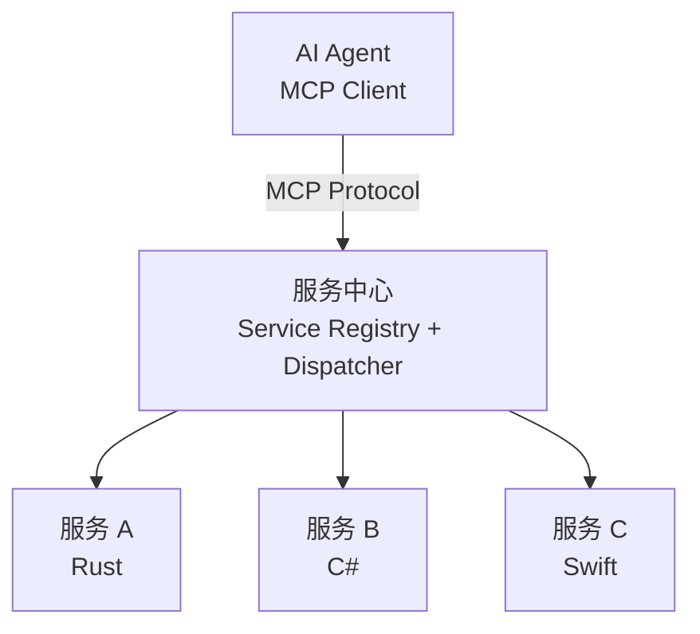

# 跨平台个人生产力系统技术概览

> **文档类型**：技术方案设计
> **作者**：未指定
> **日期**：2026-02-20
> **版本**：1.0.0
> **状态**：填充中...

---

## 1. 概述

本文档描述一套**跨平台个人生产力系统**的技术架构设计。该系统旨在为个人用户提供一个高度可定制、AI 原生、跨技术栈的生产力基础设施，整合文件管理、数据存储、服务集成和用户界面四大核心能力。

### 1.1 系统定位

**一句话定义**：一个以文件为中心、数据库驱动的个人数字基础设施，通过服务中心打通跨技术栈调用，以组件化 GUI 呈现，并深度集成 AI Agent 能力。

**核心价值主张**：

- **文件语义解耦**：通过 UUID + Sidecar 机制，让文件名与内容语义分离，支持任意重命名而不丢失元信息
- **灵活数据建模**：采用 EAV 架构，支持动态扩展实体属性，适应个人数据的多样性
- **跨技术栈整合**：服务中心允许不同技术栈（如 Rust、C#、Swift、Python）实现的服务无缝协作
- **视觉层统一**：组件化 GUI 使用操作系统底层合成能力，实现多技术栈组件的同层渲染
- **AI 原生设计**：系统架构天然与 MCP 协议对齐，AI Agent 可按粒度化权限访问任意服务

### 1.2 目标用户场景

本系统面向**有定制化需求的个人用户**，典型场景包括：

- **知识管理**：管理大量文档、笔记、代码片段，支持复杂的标签、关联和检索需求
- **自动化工作流**：通过 AI Agent 编排跨服务操作，如"监控某个文件夹变化 → 自动提取信息 → 生成摘要"
- **多平台同步**：同一套设计理念在 Windows、macOS、Linux 上运行，数据格式兼容
- **技术实验平台**：尝试新技术、新工具时，无需重构整个系统，只需注册新服务或组件

### 1.3 设计理念

**AI 原生**：从架构层面支持 AI Agent 的深度集成，而非事后挂载。具体体现为：

- 所有服务接口天然可被 AI 调用
- 权限控制从设计之初就考虑 AI 的特殊需求
- 数据模型对 AI 友好（结构化、可查询、可追溯）

**MCP 原生**：系统架构与 Model Context Protocol（MCP）天然对齐，避免为适配 MCP 而增加冗余封装层：

- 服务中心的服务注册信息可直接映射为 MCP Tool Schema
- 权限配置可映射为 MCP 的资源访问控制
- AI Agent 通过 MCP 协议与系统交互

**跨平台策略**：不是"一套代码多处运行"，而是**设计理念统一、实现因地制宜**：

- 核心数据格式跨平台一致（UUID 文件路径、SQLite 数据库）
- 各模块使用各平台的最佳实践技术实现
- 优先利用操作系统原生能力（如 IPC、窗口合成），而非跨平台抽象层

---

## 2. 核心设计原则

### 2.1 跨平台策略：统一理念，因地制宜

本系统的"跨平台"不是追求代码复用，而是追求**设计一致性**和**数据互通性**。

**统一的部分**：

- **数据格式**：文件存储路径规则、Sidecar 文件 Schema、SQLite 数据库结构
- **服务接口定义**：服务注册表的字段、调用的输入输出格式
- **组件通信协议**：组件间的消息格式、事件模型

**因地制宜的部分**：

- **IPC 机制**：Windows 用 COM+/WinRT，macOS 用 XPC/Codable，Linux 用 D-Bus/gRPC
- **窗口合成**：Windows 用 DirectComposition，macOS 用 Core Animation，Linux 用 Wayland subsurfaces
- **文件系统监听**：Windows 用 ReadDirectoryChangesW，macOS 用 FSEvents，Linux 用 inotify

这种策略的优势：

- 每个平台使用最成熟、性能最优的技术
- 避免跨平台抽象层带来的性能损耗和 bug 放大
- 可以利用平台特有的能力（如 Windows 的 WinRT API、macOS 的 SwiftUI）

### 2.2 AI 集成：深度嵌入，权限可控

AI Agent 不是外挂工具，而是**系统的一等公民**。它可以：

- **读**：查询数据库、读取文件元信息、获取服务状态
- **写**：创建/修改文件、更新数据库记录
- **调用**：通过服务中心调用任意已注册服务
- **渲染**：创建 GUI 组件、更新界面状态

**权限控制模型**采用**粒度化配置 + 默认拒绝**策略：

- **全局级**：AI 是否被允许执行写操作（全局开关）
- **服务级**：AI 是否可以调用某个特定服务
- **操作级**：AI 是否可以调用服务的某个特定方法
- **数据级**：AI 是否可以访问/修改特定范围的数据（如某个标签下的文件）

权限配置存储在数据库中，支持动态调整。所有 AI 操作都记录审计日志，便于追溯。

### 2.3 MCP 原生：架构即接口

Model Context Protocol（MCP）是连接 AI 与外部工具的标准协议。本系统设计时遵循以下原则，使架构天然与 MCP 打通：

1. **服务接口即 MCP Tool**：服务中心的服务注册信息包含接口描述（输入参数、输出格式、副作用说明），可直接转换为 MCP Tool Schema
2. **权限即 MCP 资源控制**：系统的粒度化权限配置可直接映射为 MCP 的资源访问策略
3. **无冗余封装**：不需要在现有服务之上再包一层 "MCP 适配器"，服务本身的设计就兼容 MCP 语义



---

## 3. 文件存储系统

文件存储系统是整个基础设施的底层支撑。它采用 **UUID 分层存储 + Sidecar 元信息**的架构，实现文件名与语义的解耦。

### 3.1 核心设计思想

传统文件系统的痛点：

- **文件名承载语义**：重命名会破坏链接、引用和关联关系
- **元信息分散**：EXIF、PDF 元数据、自定义标签等散落在各处，难以统一查询
- **跨应用互通困难**：每个应用维护自己的"库"索引，互不兼容

本系统的解决方案：

- **文件名语义无关**：所有文件以 UUID 命名，语义信息全部外置到 Sidecar 文件
- **统一的元信息层**：Sidecar 文件采用 Markdown 格式，包含结构化 frontmatter 和自由格式的正文
- **数据库镜像**：Sidecar 中的结构化信息自动同步到 SQLite 数据库，支持高效查询

### 3.2 文件路径生成规则

UUID 采用 v4（随机）版本，格式为 36 字符（32 位十六进制 + 4 个连字符）。

**分层映射规则**：将 UUID 的前 4 个字符作为目录层级，实现均匀分布。

```
原始 UUID：a1b2c3d4-e5f6-7890-abcd-ef1234567890.pdf
存储路径：storage/a1/b2/c3/a1b2c3d4-e5f6-7890-abcd-ef1234567890.pdf
Sidecar： storage/a1/b2/c3/a1b2c3d4-e5f6-7890-abcd-ef1234567890.pdf.meta.md
```

**优点**：

- 避免单目录文件数过多（文件系统性能考虑）
- 支持任意深度的文件树逻辑结构（通过数据库关联实现）
- 重命名、移动操作只涉及数据库更新，不涉及物理文件移动

### 3.3 Sidecar 文件格式

Sidecar 文件与原始文件同名，追加 `.meta.md` 后缀。格式为 **YAML frontmatter + Markdown 正文**。

```markdown
---
# 结构化元信息（自动同步到数据库）
uuid: a1b2c3d4-e5f6-7890-abcd-ef1234567890
original_name: 项目计划书.pdf
mime_type: application/pdf
size_bytes: 1048576
created_at: 2026-02-20T10:00:00Z
modified_at: 2026-02-20T15:30:00Z
tags:
  - 工作
  - 项目A
  - 2026Q1
entities:
  - type: project
    name: 项目A
  - type: person
    name: 张三
custom_fields:
  priority: high
  status: draft
---

# 自由格式笔记

这是项目A的计划书初稿，需要在本周五前完成评审。

## 待办

- [ ] 补充预算明细
- [ ] 确认技术方案
- [ ] 发送给李四审核
```

**设计考量**：

- **人类可读可编辑**：用户可以直接编辑 Sidecar 文件，修改会被同步到数据库
- **版本控制友好**：Markdown 格式适合 git diff
- **扩展性强**：`custom_fields` 支持任意键值对，无需修改 Schema

### 3.4 文件操作流程

**创建文件**：

1. 用户或 AI Agent 提交文件内容 + 初始元信息
2. 系统生成 UUID，计算存储路径
3. 写入原始文件，创建 Sidecar 文件
4. 触发同步任务，将 frontmatter 解析并写入数据库

**重命名/移动**：

1. 用户请求将文件从"旧显示名"改为"新显示名"
2. 系统只更新数据库中的 `original_name` 字段和 Sidecar 文件
3. 物理文件路径不变（仍是 UUID 路径）
4. UI 层显示新名称，底层关联关系完整保留

**删除**：

1. 标记为"已删除"（软删除），保留 Sidecar
2. 可选：移动到 `.trash/` 目录
3. 定期清理任务永久删除（可配置保留时长）

### 3.5 并发与冲突处理

**写入锁**：使用文件系统级别的锁（`flock` / `LockFileEx`），确保同一文件的并发写入串行化。

**冲突检测**：Sidecar 文件包含 `version` 字段，每次更新递增。写入时检查版本号，若版本不匹配则拒绝写入，提示用户合并。

**冲突解决策略**：

- 自动合并：对于非冲突字段（如 tags 新增），自动合并
- 人工干预：对于冲突字段（如 `original_name` 改为不同值），保留两份，提示用户选择

---

## 4. 数据库系统

*（填充中...）*

---

## 5. 服务中心系统

*（填充中...）*

---

## 6. 组件化 GUI 系统

*（填充中...）*

---

## 7. AI Agent 集成

*（填充中...）*

---

## 8. 各平台实现策略

*（填充中...）*

---

## 9. 模块间依赖关系

*（填充中...）*

---

## 10. 风险与挑战

*（填充中...）*

---

## 11. 里程碑与演进路线

*（填充中...）*

---

## 假设与待确认事项

| # | 假设/待确认内容 | 影响范围 | 状态 |
|---|----------------|---------|------|
| 1 | 系统暂未命名，文档中用"个人生产力系统"指代 | 全文 | 假设 |
| 2 | 移动端（Android/iOS）的实现策略尚未确定 | 各平台实现策略 | 待确认 |
| 3 | AI 权限默认策略为"默认拒绝" | AI Agent 集成 | 已确认 |
| 4 | 多平台同时考虑，不优先单一平台 | 各平台实现策略 | 已确认 |
| 5 | MCP 协议的具体集成方式需进一步调研 | 服务中心系统 | 待确认 |
