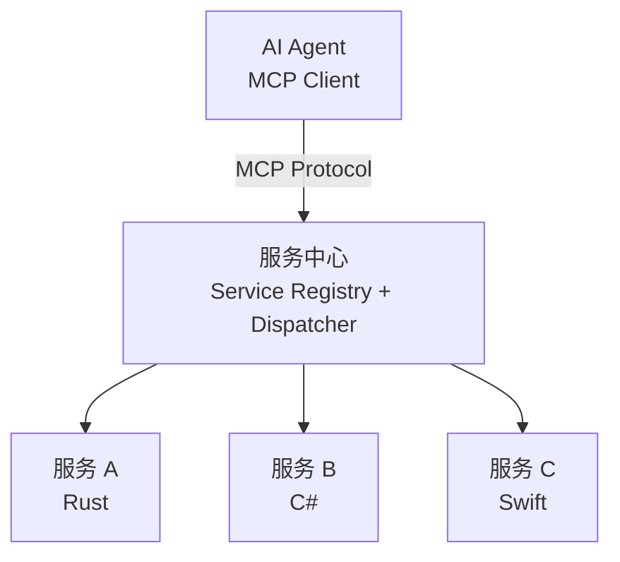
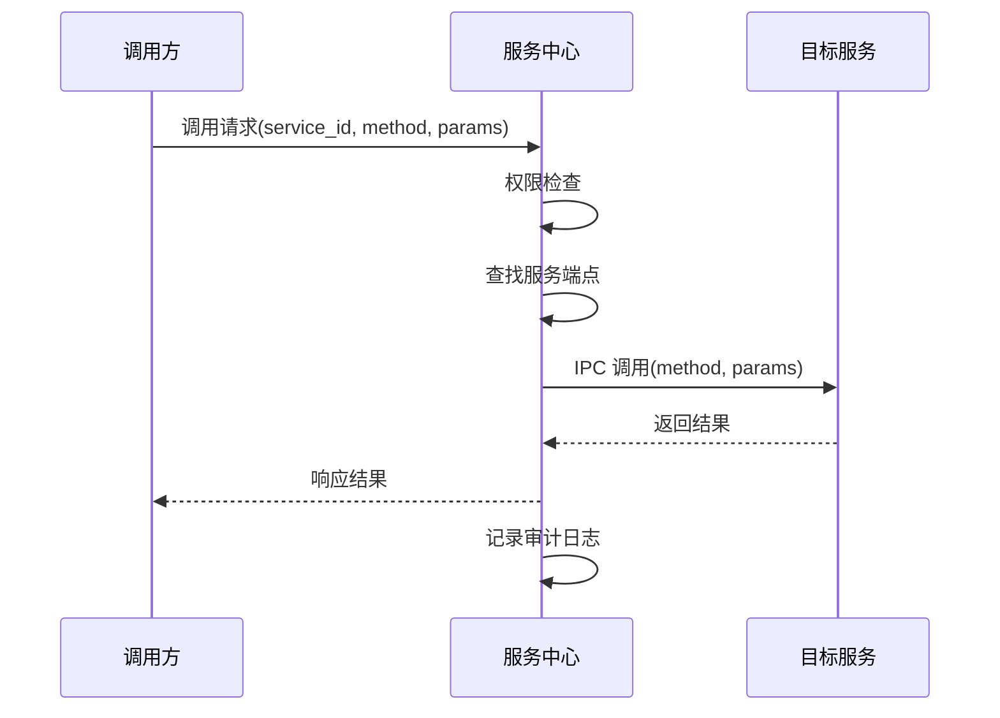
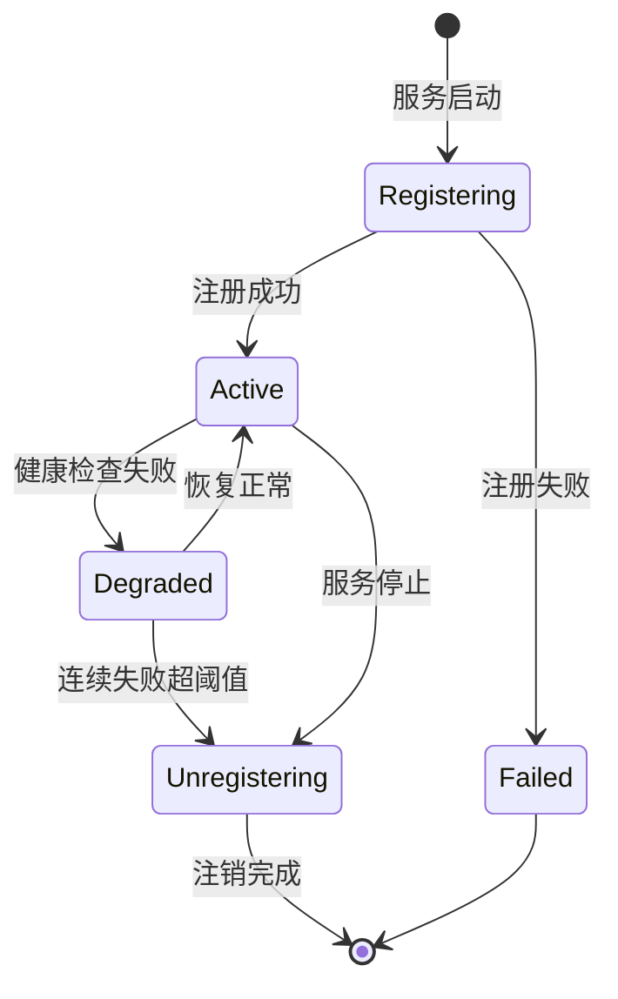
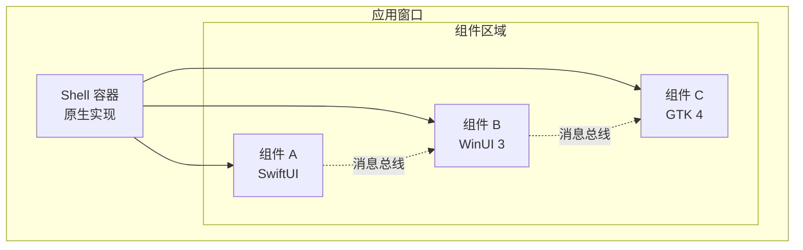
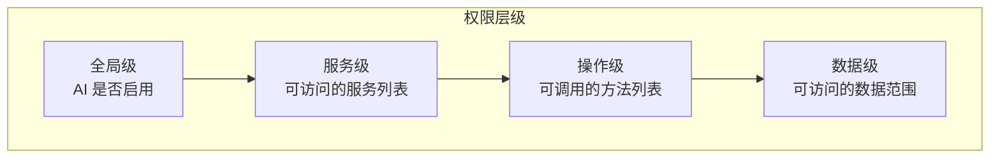
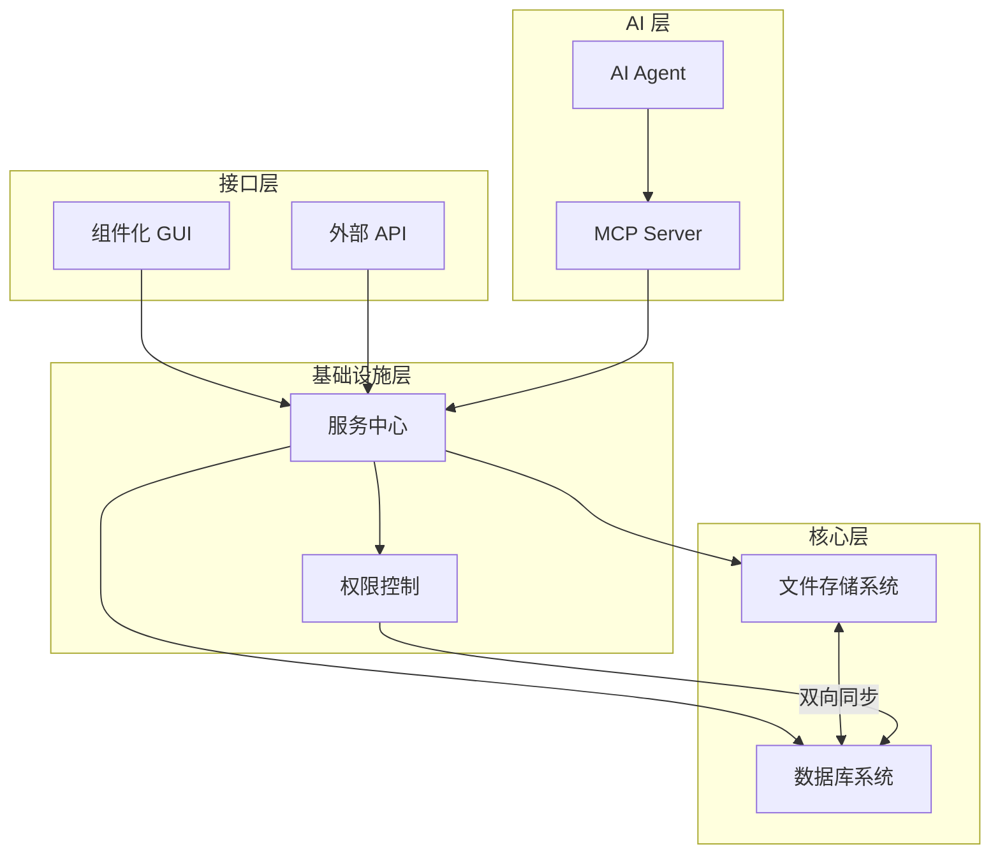

# 跨平台个人生产力系统技术概览

> **文档类型**：技术方案设计
> **作者**：未指定
> **日期**：2026-02-20
> **版本**：1.0.0
> **状态**：草稿

---

## 1. 概述

本文档描述一套**跨平台个人生产力系统**的技术架构设计。该系统旨在为个人用户提供一个高度可定制、AI 原生、跨技术栈的生产力基础设施，整合文件管理、数据存储、服务集成和用户界面四大核心能力。

### 1.1 系统定位

**一句话定义**：一个以文件为中心、数据库驱动的个人数字基础设施，通过服务中心打通跨技术栈调用，以组件化 GUI 呈现，并深度集成 AI Agent 能力。

**核心价值主张**：

- **文件语义解耦**：通过 UUID + Sidecar 机制，让文件名与内容语义分离，支持任意重命名而不丢失元信息
- **灵活数据建模**：采用 EAV 架构，支持动态扩展实体属性，适应个人数据的多样性
- **跨技术栈整合**：服务中心允许不同技术栈（如 Rust、C#、Swift、Python）实现的服务无缝协作
- **视觉层统一**：组件化 GUI 使用操作系统底层合成能力，实现多技术栈组件的同层渲染
- **AI 原生设计**：系统架构天然与 MCP 协议对齐，AI Agent 可按粒度化权限访问任意服务

### 1.2 目标用户场景

本系统面向**有定制化需求的个人用户**，典型场景包括：

- **知识管理**：管理大量文档、笔记、代码片段，支持复杂的标签、关联和检索需求
- **自动化工作流**：通过 AI Agent 编排跨服务操作，如"监控某个文件夹变化 → 自动提取信息 → 生成摘要"
- **多平台同步**：同一套设计理念在 Windows、macOS、Linux 上运行，数据格式兼容
- **技术实验平台**：尝试新技术、新工具时，无需重构整个系统，只需注册新服务或组件

### 1.3 设计理念

**AI 原生**：从架构层面支持 AI Agent 的深度集成，而非事后挂载。具体体现为：

- 所有服务接口天然可被 AI 调用
- 权限控制从设计之初就考虑 AI 的特殊需求
- 数据模型对 AI 友好（结构化、可查询、可追溯）

**MCP 原生**：系统架构与 Model Context Protocol（MCP）天然对齐，避免为适配 MCP 而增加冗余封装层：

- 服务中心的服务注册信息可直接映射为 MCP Tool Schema
- 权限配置可映射为 MCP 的资源访问控制
- AI Agent 通过 MCP 协议与系统交互

**跨平台策略**：不是"一套代码多处运行"，而是**设计理念统一、实现因地制宜**：

- 核心数据格式跨平台一致（UUID 文件路径、SQLite 数据库）
- 各模块使用各平台的最佳实践技术实现
- 优先利用操作系统原生能力（如 IPC、窗口合成），而非跨平台抽象层

---

## 2. 核心设计原则

### 2.1 跨平台策略：统一理念，因地制宜

本系统的"跨平台"不是追求代码复用，而是追求**设计一致性**和**数据互通性**。

**统一的部分**：

- **数据格式**：文件存储路径规则、Sidecar 文件 Schema、SQLite 数据库结构
- **服务接口定义**：服务注册表的字段、调用的输入输出格式
- **组件通信协议**：组件间的消息格式、事件模型

**因地制宜的部分**：

- **IPC 机制**：Windows 用 COM+/WinRT，macOS 用 XPC/Codable，Linux 用 D-Bus/gRPC
- **窗口合成**：Windows 用 DirectComposition，macOS 用 Core Animation，Linux 用 Wayland subsurfaces
- **文件系统监听**：Windows 用 ReadDirectoryChangesW，macOS 用 FSEvents，Linux 用 inotify

这种策略的优势：

- 每个平台使用最成熟、性能最优的技术
- 避免跨平台抽象层带来的性能损耗和 bug 放大
- 可以利用平台特有的能力（如 Windows 的 WinRT API、macOS 的 SwiftUI）

### 2.2 AI 集成：深度嵌入，权限可控

AI Agent 不是外挂工具，而是**系统的一等公民**。它可以：

- **读**：查询数据库、读取文件元信息、获取服务状态
- **写**：创建/修改文件、更新数据库记录
- **调用**：通过服务中心调用任意已注册服务
- **渲染**：创建 GUI 组件、更新界面状态

**权限控制模型**采用**粒度化配置 + 默认拒绝**策略：

- **全局级**：AI 是否被允许执行写操作（全局开关）
- **服务级**：AI 是否可以调用某个特定服务
- **操作级**：AI 是否可以调用服务的某个特定方法
- **数据级**：AI 是否可以访问/修改特定范围的数据（如某个标签下的文件）

权限配置存储在数据库中，支持动态调整。所有 AI 操作都记录审计日志，便于追溯。

### 2.3 MCP 原生：架构即接口

Model Context Protocol（MCP）是连接 AI 与外部工具的标准协议。本系统设计时遵循以下原则，使架构天然与 MCP 打通：

1. **服务接口即 MCP Tool**：服务中心的服务注册信息包含接口描述（输入参数、输出格式、副作用说明），可直接转换为 MCP Tool Schema
2. **权限即 MCP 资源控制**：系统的粒度化权限配置可直接映射为 MCP 的资源访问策略
3. **无冗余封装**：不需要在现有服务之上再包一层 "MCP 适配器"，服务本身的设计就兼容 MCP 语义



---

## 3. 文件存储系统

文件存储系统是整个基础设施的底层支撑。它采用 **UUID 分层存储 + Sidecar 元信息**的架构，实现文件名与语义的解耦。

### 3.1 核心设计思想

传统文件系统的痛点：

- **文件名承载语义**：重命名会破坏链接、引用和关联关系
- **元信息分散**：EXIF、PDF 元数据、自定义标签等散落在各处，难以统一查询
- **跨应用互通困难**：每个应用维护自己的"库"索引，互不兼容

本系统的解决方案：

- **文件名语义无关**：所有文件以 UUID 命名，语义信息全部外置到 Sidecar 文件
- **统一的元信息层**：Sidecar 文件采用 Markdown 格式，包含结构化 frontmatter 和自由格式的正文
- **数据库镜像**：Sidecar 中的结构化信息自动同步到 SQLite 数据库，支持高效查询

### 3.2 文件路径生成规则

UUID 采用 v4（随机）版本，格式为 36 字符（32 位十六进制 + 4 个连字符）。

**分层映射规则**：将 UUID 的前 4 个字符作为目录层级，实现均匀分布。

```
原始 UUID：a1b2c3d4-e5f6-7890-abcd-ef1234567890.pdf
存储路径：storage/a1/b2/c3/a1b2c3d4-e5f6-7890-abcd-ef1234567890.pdf
Sidecar： storage/a1/b2/c3/a1b2c3d4-e5f6-7890-abcd-ef1234567890.pdf.meta.md
```

**优点**：

- 避免单目录文件数过多（文件系统性能考虑）
- 支持任意深度的文件树逻辑结构（通过数据库关联实现）
- 重命名、移动操作只涉及数据库更新，不涉及物理文件移动

### 3.3 Sidecar 文件格式

Sidecar 文件与原始文件同名，追加 `.meta.md` 后缀。格式为 **YAML frontmatter + Markdown 正文**。

```markdown
---
# 结构化元信息（自动同步到数据库）
uuid: a1b2c3d4-e5f6-7890-abcd-ef1234567890
original_name: 项目计划书.pdf
mime_type: application/pdf
size_bytes: 1048576
created_at: 2026-02-20T10:00:00Z
modified_at: 2026-02-20T15:30:00Z
tags:
  - 工作
  - 项目A
  - 2026Q1
entities:
  - type: project
    name: 项目A
  - type: person
    name: 张三
custom_fields:
  priority: high
  status: draft
---

# 自由格式笔记

这是项目A的计划书初稿，需要在本周五前完成评审。

## 待办

- [ ] 补充预算明细
- [ ] 确认技术方案
- [ ] 发送给李四审核
```

**设计考量**：

- **人类可读可编辑**：用户可以直接编辑 Sidecar 文件，修改会被同步到数据库
- **版本控制友好**：Markdown 格式适合 git diff
- **扩展性强**：`custom_fields` 支持任意键值对，无需修改 Schema

### 3.4 文件操作流程

**创建文件**：

1. 用户或 AI Agent 提交文件内容 + 初始元信息
2. 系统生成 UUID，计算存储路径
3. 写入原始文件，创建 Sidecar 文件
4. 触发同步任务，将 frontmatter 解析并写入数据库

**重命名/移动**：

1. 用户请求将文件从"旧显示名"改为"新显示名"
2. 系统只更新数据库中的 `original_name` 字段和 Sidecar 文件
3. 物理文件路径不变（仍是 UUID 路径）
4. UI 层显示新名称，底层关联关系完整保留

**删除**：

1. 标记为"已删除"（软删除），保留 Sidecar
2. 可选：移动到 `.trash/` 目录
3. 定期清理任务永久删除（可配置保留时长）

### 3.5 并发与冲突处理

**写入锁**：使用文件系统级别的锁（`flock` / `LockFileEx`），确保同一文件的并发写入串行化。

**冲突检测**：Sidecar 文件包含 `version` 字段，每次更新递增。写入时检查版本号，若版本不匹配则拒绝写入，提示用户合并。

**冲突解决策略**：

- 自动合并：对于非冲突字段（如 tags 新增），自动合并
- 人工干预：对于冲突字段（如 `original_name` 改为不同值），保留两份，提示用户选择

---

## 4. 数据库系统

数据库系统采用 **SQLite + EAV 架构**，在保证轻量化的同时提供灵活的数据建模能力。所有数据存储在本地，无需网络连接，隐私完全可控。

### 4.1 为什么选择 SQLite

SQLite 是嵌入式关系数据库的事实标准，本系统选择它基于以下考量：

- **零配置**：无需安装、无需服务器进程、无需管理员权限
- **跨平台一致**：数据库文件格式在所有平台上完全相同，可直接复制迁移
- **性能足够**：对于个人数据量（百万级记录以内），读写性能远超需求
- **事务支持**：完整的 ACID 特性，确保数据一致性
- **生态成熟**：几乎所有编程语言都有高质量的 SQLite 绑定

**限制与应对**：

- **并发写入**：SQLite 不支持高并发写入，但个人使用场景下写入频率有限，WAL 模式足以应对
- **单文件限制**：理论上单文件最大 140 TB，实际使用不会触及

### 4.2 EAV 架构设计

实体-属性-值（Entity-Attribute-Value，EAV）架构允许动态扩展实体属性，适应个人数据的多样性。

**核心表结构**：

```sql
-- 实体表：所有实体的基表
CREATE TABLE entities (
    id TEXT PRIMARY KEY,              -- UUID
    type TEXT NOT NULL,               -- 实体类型：file、note、task、project 等
    created_at TEXT NOT NULL,         -- ISO 8601 时间戳
    updated_at TEXT NOT NULL,
    is_deleted INTEGER DEFAULT 0      -- 软删除标记
);

-- 属性定义表：所有可用的属性
CREATE TABLE attributes (
    id TEXT PRIMARY KEY,              -- UUID
    name TEXT NOT NULL UNIQUE,        -- 属性名：priority、due_date、tags 等
    data_type TEXT NOT NULL,          -- 数据类型：string、number、boolean、datetime、json
    applies_to TEXT,                  -- 适用的实体类型（NULL 表示通用）
    validation_rules TEXT             -- JSON 格式的校验规则
);

-- 值表：存储实体的属性值
CREATE TABLE values (
    entity_id TEXT NOT NULL,          -- 关联实体
    attribute_id TEXT NOT NULL,       -- 关联属性
    value_text TEXT,                  -- 字符串值
    value_number REAL,                -- 数值
    value_boolean INTEGER,            -- 布尔值
    value_datetime TEXT,              -- 日期时间
    value_json TEXT,                  -- JSON 复杂值
    PRIMARY KEY (entity_id, attribute_id),
    FOREIGN KEY (entity_id) REFERENCES entities(id),
    FOREIGN KEY (attribute_id) REFERENCES attributes(id)
);
```

**查询优化**：

EAV 架构的痛点是复杂查询性能差。本系统通过以下策略优化：

- **物化视图**：对高频查询模式，自动生成物化视图
- **全文索引**：集成 SQLite FTS5 扩展，支持全文搜索
- **缓存层**：热点数据缓存在内存中，减少数据库访问

### 4.3 与文件系统的联动

数据库是文件元信息的镜像和扩展，两者保持双向同步：

**Sidecar → 数据库**：

1. 文件创建或 Sidecar 更新时，触发同步任务
2. 解析 frontmatter 中的结构化字段
3. 写入 `entities` 表（类型为 `file`）和 `values` 表

**数据库 → Sidecar**：

1. 用户通过 UI 或 API 修改元信息时，更新数据库
2. 异步任务将变更写回 Sidecar 文件的 frontmatter
3. 保留用户在 Sidecar 正文中编辑的自由格式内容

**冲突处理**：

- 以 Sidecar 为准：当检测到冲突时，优先采用 Sidecar 中的值
- 记录审计日志：所有变更操作记录时间戳和来源，便于追溯

### 4.4 数据迁移与版本控制

**Schema 版本控制**：

数据库包含 `schema_version` 表，记录每次 Schema 变更：

```sql
CREATE TABLE schema_version (
    version INTEGER PRIMARY KEY,
    applied_at TEXT NOT NULL,
    description TEXT
);
```

迁移脚本存放在 `migrations/` 目录，按版本号命名（如 `001_initial.sql`、`002_add_tags.sql`）。启动时自动检测并执行未应用的迁移。

**备份策略**：

- **自动备份**：每次关闭时创建增量备份，保留最近 7 天
- **手动导出**：支持导出为 SQL 脚本或 JSON 格式
- **云同步可选**：用户可选择将数据库文件放入云同步目录（如 iCloud、Dropbox）

### 4.5 隐私与安全

- **本地优先**：所有数据存储在本地，无需联网即可使用
- **无遥测**：系统不收集任何使用数据
- **加密可选**：支持对敏感属性值进行加密存储（使用用户提供的密钥）
- **访问日志**：所有数据访问操作记录审计日志，用户可查看

---

## 5. 服务中心系统

服务中心是系统的**神经中枢**，负责服务的注册、发现和调用。它允许不同技术栈实现的服务无缝协作，是跨平台策略的核心基础设施。

### 5.1 核心职责

服务中心承担以下职责：

- **服务注册**：服务启动时向中心注册自身的能力和接口
- **服务发现**：调用方通过中心查找目标服务的地址和接口
- **调用转发**：处理跨进程、跨技术栈的调用请求
- **权限控制**：验证调用方是否有权限访问目标服务
- **健康监测**：监控服务状态，剔除不可用的服务实例

### 5.2 服务注册信息

每个服务注册时需提供以下信息：

```json
{
  "service_id": "file-manager",
  "version": "1.0.0",
  "runtime": "rust",
  "endpoints": [
    {
      "method": "create_file",
      "description": "创建新文件",
      "input_schema": {
        "type": "object",
        "properties": {
          "content": { "type": "string" },
          "metadata": { "type": "object" }
        },
        "required": ["content"]
      },
      "output_schema": {
        "type": "object",
        "properties": {
          "file_id": { "type": "string" },
          "path": { "type": "string" }
        }
      },
      "side_effects": ["filesystem_write"],
      "requires_auth": true
    }
  ],
  "ipc_endpoint": "unix:///tmp/maedoc/file-manager.sock"
}
```

**关键字段说明**：

- `input_schema` / `output_schema`：使用 JSON Schema 描述接口，可直接映射为 MCP Tool Schema
- `side_effects`：声明方法的副作用，用于权限判断和审计
- `requires_auth`：是否需要认证才能调用

### 5.3 跨平台 IPC 机制

服务中心的调用转发层采用**平台原生 IPC**，而非跨平台抽象层。

| 平台 | IPC 机制 | 实现技术 |
|------|---------|---------|
| Windows | Named Pipes / COM+ | `\\.\pipe\maedoc-<service>` |
| macOS | XPC / Unix Domain Socket | `NSXPCConnection` + `Codable` |
| Linux | D-Bus / Unix Domain Socket | `dbus` 或 `.sock` 文件 |

**调用流程**：



### 5.4 与 MCP 协议的对齐

服务中心的设计天然与 Model Context Protocol（MCP）对齐：

**服务注册 → MCP Tool List**：

服务注册信息中的 `endpoints` 可直接转换为 MCP 的 `tools/list` 响应：

```json
{
  "tools": [
    {
      "name": "file-manager_create_file",
      "description": "创建新文件",
      "inputSchema": { ... }
    }
  ]
}
```

**权限配置 → MCP 资源控制**：

服务中心的权限配置可映射为 MCP 的资源访问策略，AI Agent 的权限范围在服务中心统一管理。

**调用 → MCP Tool Call**：

当 AI Agent 通过 MCP 调用工具时，请求被转发到服务中心，由服务中心执行实际的 IPC 调用。

### 5.5 服务生命周期



**健康检查机制**：

- 心跳检测：服务每 30 秒发送心跳，超时 90 秒标记为不健康
- 主动探测：对标记为不健康的服务，每隔 10 秒尝试重连
- 自动恢复：服务恢复后自动重新注册，无需人工干预

### 5.6 错误处理与重试

**错误分类**：

| 错误类型 | 处理策略 |
|---------|---------|
| 服务不存在 | 立即返回错误，不重试 |
| 服务不可用 | 重试 3 次，间隔指数退避 |
| 权限不足 | 立即返回错误，记录审计日志 |
| 调用超时 | 重试 2 次，每次超时 5 秒 |
| 参数校验失败 | 立即返回详细错误信息 |

**熔断机制**：

当某服务连续失败 5 次后，进入熔断状态，直接拒绝后续请求 60 秒，避免级联故障。

---

## 6. 组件化 GUI 系统

GUI 系统采用**组件化架构**，允许不同技术栈实现的组件在同一窗口中渲染。核心设计目标是视觉层的统一呈现，而非代码复用。

### 6.1 设计理念

传统跨平台 GUI 框架的问题：

- **抽象层损耗**：跨平台 UI 框架（如 Electron、Qt）在性能和原生体验上有妥协
- **技术栈锁定**：一旦选定框架，整个应用必须使用同一技术栈
- **平台特性丢失**：抽象层无法利用平台特有的 UI 能力

本系统的解决方案：

- **组件独立进程**：每个 UI 组件是独立进程，可使用任意技术栈实现
- **原生合成**：使用操作系统的窗口合成能力，将多个组件的视觉内容合并到同一窗口
- **协议通信**：组件间通过服务中心定义的消息协议通信，与技术栈无关

### 6.2 窗口合成机制

不同平台使用不同的原生合成技术：

| 平台 | 合成技术 | 实现方式 |
|------|---------|---------|
| Windows | DirectComposition | 视觉树（Visual Tree）+ 交换链 |
| macOS | Core Animation | CALayer 层次结构 + 视图层级 |
| Linux | Wayland Subsurfaces | wl_subsurface 协议 |

**架构示意**：



### 6.3 组件生命周期

每个 UI 组件遵循统一的生命周期：

1. **注册**：组件向服务中心声明自己的 UI 能力
2. **挂载**：Shell 创建组件的渲染区域，组件进程启动
3. **渲染**：组件在分配的区域内绘制内容
4. **交互**：组件接收用户输入，通过消息总线与其他组件通信
5. **更新**：组件响应状态变化，更新渲染内容
6. **卸载**：组件进程退出，释放资源

### 6.4 组件通信协议

组件间通过**消息总线**通信，消息格式统一：

```json
{
  "message_id": "msg-uuid",
  "source": "file-list-component",
  "target": "preview-component",
  "type": "selection_changed",
  "payload": {
    "file_id": "a1b2c3d4-...",
    "display_name": "项目计划书.pdf"
  },
  "timestamp": "2026-02-20T10:30:00Z"
}
```

**消息类型**：

| 类型 | 用途 | 示例 |
|------|------|------|
| `state_update` | 状态同步 | 文件列表选中项变化 |
| `action_request` | 请求执行操作 | 请求打开编辑器 |
| `event_notification` | 事件通知 | 数据库变更通知 |
| `query` | 查询数据 | 查询当前选中文件 |

**消息路由**：

- **点对点**：指定 `target`，消息直达目标组件
- **广播**：`target` 为 `*`，所有订阅该类型的组件都会收到
- **主题订阅**：组件可订阅特定主题，如 `file:*` 接收所有文件相关消息

### 6.5 Shell 容器

Shell 是应用的主框架，负责：

- **窗口管理**：创建、调整、关闭窗口
- **布局引擎**：管理组件的尺寸和位置
- **路由**：处理组件导航和页面切换
- **主题**：提供统一的视觉主题（颜色、字体、间距）

**Shell 与组件的关系**：

- Shell 是**原生实现**，使用平台最优技术（Windows: WinUI 3, macOS: SwiftUI, Linux: GTK 4）
- 组件可以是**任意技术栈**，只需满足渲染协议
- Shell 不参与组件的内部渲染逻辑，只提供渲染区域

### 6.6 示例：文件管理器界面

一个典型的文件管理器界面由以下组件构成：

| 组件 | 技术栈 | 职责 |
|------|--------|------|
| Sidebar | 原生 | 目录树导航 |
| FileList | React | 文件列表展示 |
| Preview | 原生 | 文件预览（PDF、图片等） |
| StatusBar | 原生 | 状态信息显示 |

用户在 FileList 中选择文件时：

1. FileList 发送 `selection_changed` 消息
2. Preview 接收消息，加载并显示文件内容
3. StatusBar 接收消息，更新"选中 1 个文件"状态

### 6.7 性能考量

**渲染性能**：

- 组件独立进程，单个组件卡顿不影响其他组件
- 原生合成避免了跨进程渲染的性能损耗
- 组件可按需加载，不活跃组件可进入休眠状态

**内存占用**：

- 每个组件进程有独立内存空间，隔离性好
- 通过共享内存传递大型数据（如图片），避免重复拷贝
- 轻量级组件可合并到同一进程（可选优化）

**启动时间**：

- Shell 优先启动，提供即时视觉反馈
- 组件按需延迟加载
- 缓存常用组件状态，加速二次启动

---

## 7. AI Agent 集成

AI Agent 是系统的一等公民，可以读取数据、调用服务、操作文件、更新界面。系统从架构层面支持 AI 的深度集成，而非事后挂载。

### 7.1 AI Agent 的能力范围

| 能力 | 说明 | 示例 |
|------|------|------|
| 读取数据 | 查询数据库、读取文件元信息 | "列出所有标记为'重要'的文档" |
| 写入数据 | 创建/修改文件、更新数据库记录 | "把这个文件标记为'已完成'" |
| 调用服务 | 通过服务中心调用任意已注册服务 | "把选中的 PDF 转换为图片" |
| 渲染界面 | 创建 GUI 组件、更新界面状态 | "弹出一个确认对话框" |
| 订阅事件 | 监听系统事件并响应 | "当有新文件添加时通知我" |

### 7.2 权限控制模型

系统采用**粒度化配置 + 默认拒绝**的权限模型：



**权限配置示例**：

```json
{
  "agent_id": "assistant-v1",
  "global_enabled": true,
  "services": {
    "file-manager": {
      "allowed": true,
      "methods": {
        "list_files": { "allowed": true },
        "create_file": { "allowed": true, "require_confirmation": true },
        "delete_file": { "allowed": false }
      }
    },
    "database": {
      "allowed": true,
      "data_scope": {
        "tags": ["工作", "项目"],
        "exclude_tags": ["私密"]
      }
    }
  }
}
```

**关键特性**：

- **默认拒绝**：未明确授权的操作一律拒绝
- **敏感操作确认**：高风险操作（删除、批量修改）需用户确认
- **数据隔离**：可限制 AI 只能访问特定标签或分类的数据
- **动态调整**：权限配置存储在数据库中，可随时修改

### 7.3 与 MCP 协议的集成

Model Context Protocol（MCP）是连接 AI 与外部工具的标准协议。本系统的服务中心天然支持 MCP：

**MCP Server 实现**：

系统提供一个 MCP Server，将服务中心的能力暴露给 MCP Client（如 Claude Desktop）：

```
┌─────────────────┐     MCP Protocol     ┌─────────────────┐
│  MCP Client     │◄────────────────────►│  MCP Server     │
│  (Claude, etc.) │                      │  (内置)         │
└─────────────────┘                      └────────┬────────┘
                                                  │
                                                  ▼
                                         ┌─────────────────┐
                                         │  服务中心       │
                                         └────────┬────────┘
                                                  │
                              ┌───────────────────┼───────────────────┐
                              ▼                   ▼                   ▼
                        ┌──────────┐        ┌──────────┐        ┌──────────┐
                        │ Service A│        │ Service B│        │ Service C│
                        └──────────┘        └──────────┘        └──────────┘
```

**工具映射**：

| MCP Tool | 对应服务方法 | 说明 |
|----------|-------------|------|
| `file_list` | `file-manager.list_files` | 列出文件 |
| `file_create` | `file-manager.create_file` | 创建文件 |
| `db_query` | `database.query` | 查询数据库 |
| `ui_notify` | `ui-service.show_notification` | 显示通知 |

### 7.4 审计日志

所有 AI 操作都记录审计日志，包含：

```json
{
  "log_id": "log-uuid",
  "timestamp": "2026-02-20T10:30:00Z",
  "agent_id": "assistant-v1",
  "action": "service_call",
  "service": "file-manager",
  "method": "create_file",
  "parameters": { "name": "notes.md", "content": "..." },
  "result": "success",
  "file_affected": "a1b2c3d4-..."
}
```

**审计日志用途**：

- **追溯**：查看 AI 在什么时间做了什么操作
- **回滚**：基于日志撤销 AI 的错误操作
- **分析**：统计 AI 的使用模式和效率

### 7.5 人机协作模式

系统支持多种人机协作模式：

**模式一：AI 辅助**

- 用户主导操作，AI 提供建议
- AI 可以读取上下文，但不能主动执行
- 适用于探索性任务

**模式二：AI 执行**

- 用户给出目标，AI 自主规划并执行
- 敏感操作需要用户确认
- 适用于明确目标的生产性任务

**模式三：AI 监控**

- AI 持续监控系统状态
- 满足条件时触发自动化工作流
- 适用于重复性任务

### 7.6 安全边界

**AI 不能做的事情**：

- 修改自身的权限配置
- 访问标记为"私密"的数据
- 执行未授权的服务方法
- 绕过用户确认执行敏感操作
- 修改审计日志

**防护措施**：

- 权限检查在服务中心层面执行，AI 无法绕过
- 敏感数据加密存储，AI 只能看到脱敏版本
- 所有操作可追溯，异常行为可被检测

---

## 8. 各平台实现策略

本系统的跨平台策略是**统一设计理念，因地制宜实现**。各模块在不同平台上使用最适合的技术，通过统一的数据格式和协议实现互通。

### 8.1 Windows 平台

**技术栈选择**：

| 模块 | 技术选择 | 理由 |
|------|---------|------|
| 文件系统服务 | Rust | 性能优先，与 Windows API 交互方便 |
| 数据库服务 | Rust + rusqlite | 跨平台一致性 |
| 服务中心 | C# / WinRT | 与 Windows IPC 原生集成 |
| Shell | WinUI 3 | 微软官方推荐，原生体验 |
| 组件容器 | WinUI 3 / WebView2 | 灵活支持多种渲染技术 |

**平台特性利用**：

- **WinRT API**：使用 `Windows.Storage` 管理文件，获取更好的沙箱兼容性
- **COM+**：服务间通信使用 COM 接口，与系统深度集成
- **DirectComposition**：窗口合成使用 DirectComposition，性能最优
- **Notification API**：系统集成通知

**开发环境**：

- Visual Studio 2022 或更高版本
- Windows SDK 10.0.19041 或更高
- Rust MSVC toolchain

### 8.2 macOS 平台

**技术栈选择**：

| 模块 | 技术选择 | 理由 |
|------|---------|------|
| 文件系统服务 | Swift | 与 Foundation 框架无缝集成 |
| 数据库服务 | Swift + SQLite.swift | Swift 原生体验 |
| 服务中心 | Swift | XPC 原生支持 |
| Shell | SwiftUI | Apple 官方推荐，声明式 UI |
| 组件容器 | SwiftUI / AppKit | 支持混合渲染 |

**平台特性利用**：

- **XPC**：服务间通信使用 XPC，享受系统级安全隔离
- **Core Animation**：窗口合成使用 CALayer，流畅动画
- **Uniform Type Identifiers (UTI)**：文件类型识别
- **User Notifications**：系统集成通知

**开发环境**：

- Xcode 15 或更高版本
- macOS 14 SDK 或更高
- Swift 5.9 或更高

### 8.3 Linux 平台

**技术栈选择**：

| 模块 | 技术选择 | 理由 |
|------|---------|------|
| 文件系统服务 | Rust | 性能优先，inotify 绑定成熟 |
| 数据库服务 | Rust + rusqlite | 与其他平台保持一致 |
| 服务中心 | Rust | D-Bus 绑定质量高 |
| Shell | GTK 4 | Linux 桌面主流选择 |
| 组件容器 | GTK 4 / WebKitGTK | 灵活支持多种渲染技术 |

**平台特性利用**：

- **D-Bus**：服务间通信使用 D-Bus，桌面环境标准
- **inotify**：文件系统监控
- **Wayland / X11**：窗口合成支持两种显示服务器
- **libnotify**：桌面通知

**开发环境**：

- Rust 1.75 或更高
- GTK 4 开发库
- pkg-config

**发行版支持**：

优先支持：Ubuntu 22.04+、Fedora 39+、Arch Linux
理论上支持：所有使用 systemd 和 Wayland/X11 的发行版

### 8.4 共享模块

以下模块在所有平台上使用相同实现：

| 模块 | 语言 | 说明 |
|------|------|------|
| UUID 生成 | Rust | 各平台编译相同代码 |
| Sidecar 解析 | Rust | YAML 解析逻辑一致 |
| 数据库 Schema | SQL | SQLite 跨平台兼容 |
| 服务接口定义 | JSON Schema | 协议层统一 |
| MCP Server | Rust | 通过 FFI 被各平台调用 |

### 8.5 跨平台测试策略

**单元测试**：

- Rust 模块使用 `cargo test`，在 CI 中跨平台运行
- Swift 模块使用 XCTest
- C# 模块使用 xUnit

**集成测试**：

- 使用共享的测试用例文件（JSON 格式）
- 各平台读取相同测试用例，验证行为一致
- 重点测试：文件路径生成、Sidecar 解析、服务调用

**端到端测试**：

- GUI 自动化测试：Windows 使用 Appium，macOS 使用 XCUITest，Linux 使用 Dogtail
- 测试脚本描述用户操作，验证跨平台行为一致

### 8.6 移动端策略 [待确认]

移动端（Android/iOS）的实现策略尚未确定，可能的选项：

1. **仅提供远程访问**：移动端通过 API 访问桌面端数据
2. **轻量级客户端**：移动端实现只读浏览 + 简单编辑
3. **完整移植**：将核心架构移植到移动平台

选择取决于用户需求和技术可行性评估。

---

## 9. 模块间依赖关系

系统的模块设计遵循**高内聚、低耦合**原则，通过服务中心实现松散依赖。

### 9.1 模块依赖图



### 9.2 依赖方向规则

**自上而下依赖**：

- 上层模块可以依赖下层模块
- GUI → 服务中心 → 文件系统/数据库
- AI Agent → MCP Server → 服务中心

**禁止反向依赖**：

- 文件系统不能直接调用 GUI
- 数据库不能直接调用服务中心
- 核心层保持独立，可单独测试

**水平依赖通过服务中心**：

- 同层模块不能直接相互调用
- 必须通过服务中心中转
- 例如：文件系统需要通知 GUI 更新，发送消息到服务中心，由服务中心转发

### 9.3 启动顺序

系统启动遵循严格的依赖顺序：

```
1. 数据库系统
   └── 初始化 Schema、加载配置

2. 权限控制
   └── 依赖数据库存储权限配置

3. 文件存储系统
   └── 独立启动，后台同步到数据库

4. 服务中心
   └── 依赖数据库存储服务注册信息
   └── 加载权限控制模块

5. 核心服务注册
   └── 文件管理、数据库查询等服务向服务中心注册

6. MCP Server
   └── 依赖服务中心提供工具列表

7. GUI Shell
   └── 依赖服务中心获取初始数据

8. 用户组件
   └── 按需加载
```

### 9.4 接口契约

模块间通过**接口契约**通信，不依赖具体实现：

**文件系统接口**：

```typescript
interface FileSystemService {
  create_file(content: Buffer, metadata: FileMetadata): Promise<File>;
  get_file(file_id: string): Promise<File>;
  update_metadata(file_id: string, metadata: Partial<FileMetadata>): Promise<void>;
  delete_file(file_id: string): Promise<void>;
  list_files(query: FileQuery): Promise<File[]>;
}
```

**数据库接口**：

```typescript
interface DatabaseService {
  query(sql: string, params: any[]): Promise<QueryResult>;
  insert(entity: Entity): Promise<string>;
  update(entity_id: string, attributes: Record<string, any>): Promise<void>;
  delete(entity_id: string): Promise<void>;
}
```

**服务中心接口**：

```typescript
interface ServiceHub {
  register(service: ServiceDefinition): Promise<void>;
  unregister(service_id: string): Promise<void>;
  call(service_id: string, method: string, params: any): Promise<any>;
  subscribe(event_type: string, handler: EventHandler): Promise<void>;
}
```

### 9.5 依赖版本管理

当模块接口发生变化时，需遵循以下规则：

- **兼容性变更**：添加可选字段、新增方法 → 直接发布
- **破坏性变更**：删除方法、修改参数类型 → 新版本号，旧版本保留
- **废弃策略**：标记为废弃的接口保留 2 个大版本，之后移除

服务中心维护接口版本映射表，自动路由到正确的服务版本。

### 9.6 循环依赖检测

系统在构建时自动检测循环依赖：

1. 扫描所有模块的导入语句
2. 构建依赖图
3. 使用拓扑排序检测环
4. 发现循环依赖则构建失败，提示开发者修复

常见循环依赖场景及解决方案：

| 场景 | 问题 | 解决方案 |
|------|------|---------|
| A 调 B，B 调 A | 直接循环 | 引入中间层 C，A → C ← B |
| 配置双向引用 | 初始化顺序问题 | 使用延迟加载或依赖注入 |
| 事件回调 | 运行时循环 | 使用消息队列解耦 |

---

## 10. 风险与挑战

本系统在架构上存在若干技术挑战和风险，需要在实现过程中持续关注和解决。

### 10.1 技术风险

| 风险 | 影响程度 | 发生概率 | 缓解措施 |
|------|:--------:|:--------:|---------|
| 跨平台 IPC 不一致 | 高 | 中 | 抽象 IPC 层，每个平台单独适配 |
| 组件渲染同步问题 | 高 | 中 | 使用平台原生合成，避免自定义同步逻辑 |
| EAV 查询性能差 | 中 | 高 | 物化视图 + 缓存 + 预编译查询 |
| SQLite 并发瓶颈 | 中 | 低 | WAL 模式 + 合理的连接池 |
| MCP 协议变更 | 中 | 中 | 版本隔离层，支持多版本 MCP |

### 10.2 架构挑战

**多进程架构的复杂性**

每个组件独立进程带来：
- 进程管理开销
- 进程间通信延迟
- 内存占用增加

**应对策略**：
- 轻量级组件共享进程（可选）
- 使用共享内存传递大数据
- 进程池复用，避免频繁启停

**服务中心的单点风险**

服务中心是所有调用的枢纽，一旦故障，系统瘫痪。

**应对策略**：
- 服务中心使用高可用设计（主备切换）
- 核心服务可直连模式（降级方案）
- 客户端缓存服务注册信息

**数据一致性挑战**

文件系统与数据库的双向同步存在一致性问题。

**应对策略**：
- 最终一致性模型，允许短暂不一致
- 冲突检测和解决机制
- 审计日志支持回滚

### 10.3 AI 集成风险

| 风险 | 说明 | 缓解措施 |
|------|------|---------|
| AI 误操作 | AI 理解错误导致错误操作 | 敏感操作需确认 + 审计日志 + 回滚能力 |
| 权限绕过 | AI 绕过权限控制 | 权限检查在服务中心层面强制执行 |
| 数据泄露 | AI 访问不应访问的数据 | 数据级权限控制 + 敏感数据加密 |
| 资源滥用 | AI 消耗过多系统资源 | 资源配额 + 操作频率限制 |

### 10.4 实现风险

**平台特性差异**

不同平台的文件系统、IPC、窗口合成机制存在差异，可能导致功能不一致或缺失。

**应对策略**：
- 定义核心功能集，确保跨平台一致
- 平台特有功能标注为"仅限某平台"
- 定期跨平台回归测试

**开发资源分散**

支持三个桌面平台意味着三套实现，开发资源分散。

**应对策略**：
- 优先实现一个平台，验证架构
- 共享模块最大化，平台特定代码最小化
- 社区贡献支持其他平台

**技术栈学习成本**

团队需要掌握多种技术栈（Rust、C#、Swift、Python）。

**应对策略**：
- 清晰的接口定义，模块边界明确
- 每个模块专人负责，减少跨栈协作
- 完善的文档和示例

### 10.5 用户体验风险

**首次使用复杂度**

系统功能丰富，初次使用可能感到困惑。

**应对策略**：
- 提供快速入门向导
- 预设常用配置模板
- 渐进式功能展示

**性能感知**

多进程架构可能导致启动时间较长。

**应对策略**：
- Shell 优先启动，即时响应
- 组件延迟加载
- 启动优化和性能监控

### 10.6 风险监控

系统内置风险监控机制：

- **性能指标采集**：响应时间、内存占用、CPU 使用率
- **错误率监控**：服务调用失败率、数据库错误率
- **异常检测**：自动识别异常行为并告警
- **用户反馈渠道**：内置反馈入口，收集使用问题

---

## 11. 里程碑与演进路线

系统采用渐进式开发策略，分阶段交付可用功能，持续迭代完善。

### 11.1 里程碑规划

```mermaid
timeline
    title 系统演进路线
    section M1: 核心验证
        数据库系统 : EAV 架构 + 基础查询
        文件系统 : UUID 存储 + Sidecar
    section M2: 服务框架
        服务中心 : 注册 + 发现 + 调用
        权限控制 : 基础权限模型
    section M3: 用户界面
        Shell : 原生 Shell 实现
        基础组件 : 文件列表 + 预览
    section M4: AI 集成
        MCP Server : 基础工具暴露
        权限增强 : 粒度化权限
    section M5: 跨平台
        平台移植 : Windows / macOS / Linux
        一致性验证 : 跨平台测试
    section M6: 生态建设
        插件系统 : 第三方服务接入
        模板库 : 预设配置模板
```

### 11.2 各里程碑详细目标

#### M1: 核心验证（预计 2-3 个月）

**目标**：验证核心架构可行性

| 功能 | 验收标准 | 优先级 |
|------|---------|:------:|
| 数据库 Schema | 完整 EAV 表结构 + 迁移机制 | P0 |
| UUID 文件存储 | 文件创建、读取、删除正常 | P0 |
| Sidecar 格式 | 解析和生成 Sidecar 文件 | P0 |
| 同步机制 | Sidecar ↔ 数据库双向同步 | P0 |
| CLI 工具 | 命令行操作文件和查询 | P1 |

**交付物**：
- 核心库（可被其他模块引用）
- CLI 工具（开发者验证）
- 单元测试覆盖率 > 80%

#### M2: 服务框架（预计 2 个月）

**目标**：建立服务通信基础设施

| 功能 | 验收标准 | 优先级 |
|------|---------|:------:|
| 服务注册 | 服务启动时自动注册 | P0 |
| 服务发现 | 通过服务中心查找服务 | P0 |
| IPC 调用 | 跨进程调用成功 | P0 |
| 基础权限 | 服务级权限控制 | P1 |
| 健康检查 | 服务状态监控 | P1 |

**交付物**：
- 服务中心运行时
- 服务开发 SDK
- 集成测试套件

#### M3: 用户界面（预计 3 个月）

**目标**：提供可用的图形界面

| 功能 | 验收标准 | 优先级 |
|------|---------|:------:|
| Shell 容器 | 窗口创建和管理 | P0 |
| 文件列表组件 | 显示文件、支持选择 | P0 |
| 预览组件 | 常见格式预览 | P0 |
| 消息总线 | 组件间通信 | P0 |
| 布局系统 | 组件排列和调整 | P1 |

**交付物**：
- 单平台 Shell（优先 macOS 或 Windows）
- 核心组件库
- UI 组件开发指南

#### M4: AI 集成（预计 2 个月）

**目标**：实现 AI Agent 深度集成

| 功能 | 验收标准 | 优先级 |
|------|---------|:------:|
| MCP Server | 暴露核心服务为 MCP 工具 | P0 |
| 粒度化权限 | 操作级权限控制 | P0 |
| 审计日志 | AI 操作完整记录 | P0 |
| 确认机制 | 敏感操作用户确认 | P1 |
| Claude 集成 | 与 Claude Desktop 联调 | P1 |

**交付物**：
- MCP Server 实现
- 权限配置界面
- AI 集成文档

#### M5: 跨平台（预计 3 个月）

**目标**：三大桌面平台全覆盖

| 平台 | 验收标准 | 优先级 |
|------|---------|:------:|
| macOS | 所有功能可用 | P0 |
| Windows | 所有功能可用 | P0 |
| Linux | 核心功能可用 | P1 |
| 跨平台测试 | 自动化测试通过 | P1 |

**交付物**：
- 三平台安装包
- 平台差异文档
- 跨平台测试报告

#### M6: 生态建设（持续）

**目标**：建立可扩展生态

| 功能 | 验收标准 | 优先级 |
|------|---------|:------:|
| 插件系统 | 第三方服务可接入 | P1 |
| 配置模板 | 常用场景预设 | P2 |
| 社区文档 | 完善的开发者文档 | P2 |
| 示例项目 | 3 个以上示例 | P2 |

### 11.3 迭代节奏

- **双周迭代**：每两周一个迭代，发布可用功能
- **月度回顾**：每月回顾进度，调整优先级
- **季度规划**：每季度制定下季度详细计划

### 11.4 优先级调整原则

当资源有限时，按以下原则调整优先级：

1. **核心功能优先**：M1/M2 里程碑不可削减
2. **单平台优先**：先在一个平台验证，再移植
3. **用户价值优先**：优先实现用户直接感知的功能
4. **可降级功能**：AI 集成可后续迭代，不阻塞基础使用

### 11.5 长期愿景

**1 年目标**：

- 三大桌面平台稳定运行
- AI Agent 集成成熟
- 基础生态建立

**2 年目标**：

- 移动端支持（方式待定）
- 云同步功能（可选）
- 企业级功能（团队协作）

**3 年目标**：

- 开放平台，支持第三方开发
- 多语言 SDK
- 社区驱动的插件市场

---

## 假设与待确认事项

| # | 假设/待确认内容 | 影响范围 | 状态 |
|---|----------------|---------|------|
| 1 | 系统暂未命名，文档中用"个人生产力系统"指代 | 全文 | 假设 |
| 2 | 移动端（Android/iOS）的实现策略尚未确定 | 各平台实现策略 | 待确认 |
| 3 | AI 权限默认策略为"默认拒绝" | AI Agent 集成 | 已确认 |
| 4 | 多平台同时考虑，不优先单一平台 | 各平台实现策略 | 已确认 |
| 5 | MCP 协议的具体集成方式需进一步调研 | 服务中心系统 | 待确认 |
