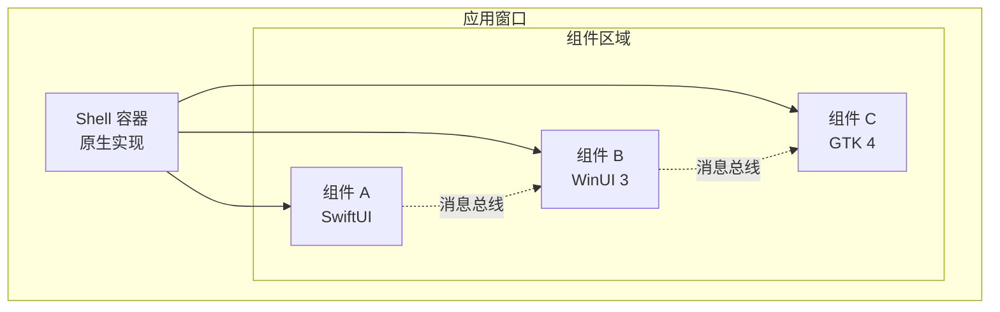

# 组件化 GUI 系统

> **文档类型**：技术方案设计
> **日期**：2026-02-20

---

GUI 系统采用**组件化架构**，允许不同技术栈实现的组件在同一窗口中渲染。核心设计目标是视觉层的统一呈现，而非代码复用。

---

## 6.1 设计理念

传统跨平台 GUI 框架的问题：

- **抽象层损耗**：跨平台 UI 框架（如 Electron、Qt）在性能和原生体验上有妥协
- **技术栈锁定**：一旦选定框架，整个应用必须使用同一技术栈
- **平台特性丢失**：抽象层无法利用平台特有的 UI 能力

本系统的解决方案：

- **组件独立进程**：每个 UI 组件是独立进程，可使用任意技术栈实现
- **原生合成**：使用操作系统的窗口合成能力，将多个组件的视觉内容合并到同一窗口
- **协议通信**：组件间通过服务中心定义的消息协议通信，与技术栈无关

---

## 6.2 窗口合成机制

不同平台使用不同的原生合成技术：

| 平台 | 合成技术 | 实现方式 |
|------|---------|---------|
| Windows | DirectComposition | 视觉树（Visual Tree）+ 交换链 |
| macOS | Core Animation | CALayer 层次结构 + 视图层级 |
| Linux | Wayland Subsurfaces | wl_subsurface 协议 |

**架构示意**：



---

## 6.3 组件生命周期

每个 UI 组件遵循统一的生命周期：

1. **注册**：组件向服务中心声明自己的 UI 能力
2. **挂载**：Shell 创建组件的渲染区域，组件进程启动
3. **渲染**：组件在分配的区域内绘制内容
4. **交互**：组件接收用户输入，通过消息总线与其他组件通信
5. **更新**：组件响应状态变化，更新渲染内容
6. **卸载**：组件进程退出，释放资源

---

## 6.4 组件通信协议

组件间通过**消息总线**通信，消息格式统一：

```json
{
  "message_id": "msg-uuid",
  "source": "file-list-component",
  "target": "preview-component",
  "type": "selection_changed",
  "payload": {
    "file_id": "a1b2c3d4-...",
    "display_name": "项目计划书.pdf"
  },
  "timestamp": "2026-02-20T10:30:00Z"
}
```

**消息类型**：

| 类型 | 用途 | 示例 |
|------|------|------|
| `state_update` | 状态同步 | 文件列表选中项变化 |
| `action_request` | 请求执行操作 | 请求打开编辑器 |
| `event_notification` | 事件通知 | 数据库变更通知 |
| `query` | 查询数据 | 查询当前选中文件 |

**消息路由**：

- **点对点**：指定 `target`，消息直达目标组件
- **广播**：`target` 为 `*`，所有订阅该类型的组件都会收到
- **主题订阅**：组件可订阅特定主题，如 `file:*` 接收所有文件相关消息

---

## 6.5 Shell 容器

Shell 是应用的主框架，负责：

- **窗口管理**：创建、调整、关闭窗口
- **布局引擎**：管理组件的尺寸和位置
- **路由**：处理组件导航和页面切换
- **主题**：提供统一的视觉主题（颜色、字体、间距）

**Shell 与组件的关系**：

- Shell 是**原生实现**，使用平台最优技术（Windows: WinUI 3, macOS: SwiftUI, Linux: GTK 4）
- 组件可以是**任意技术栈**，只需满足渲染协议
- Shell 不参与组件的内部渲染逻辑，只提供渲染区域

---

## 6.6 示例：文件管理器界面

一个典型的文件管理器界面由以下组件构成：

| 组件 | 技术栈 | 职责 |
|------|--------|------|
| Sidebar | 原生 | 目录树导航 |
| FileList | React | 文件列表展示 |
| Preview | 原生 | 文件预览（PDF、图片等） |
| StatusBar | 原生 | 状态信息显示 |

用户在 FileList 中选择文件时：

1. FileList 发送 `selection_changed` 消息
2. Preview 接收消息，加载并显示文件内容
3. StatusBar 接收消息，更新"选中 1 个文件"状态

---

## 6.7 性能考量

**渲染性能**：

- 组件独立进程，单个组件卡顿不影响其他组件
- 原生合成避免了跨进程渲染的性能损耗
- 组件可按需加载，不活跃组件可进入休眠状态

**内存占用**：

- 每个组件进程有独立内存空间，隔离性好
- 通过共享内存传递大型数据（如图片），避免重复拷贝
- 轻量级组件可合并到同一进程（可选优化）

**启动时间**：

- Shell 优先启动，提供即时视觉反馈
- 组件按需延迟加载
- 缓存常用组件状态，加速二次启动

---

*本文档是个人数据与能力总线设计系列的一部分。其他相关文档：[服务中心系统](./service-hub.md)、[各平台实现策略](../platform/overview.md)、[模块间依赖关系](../system-design/module-dependencies.md)*
