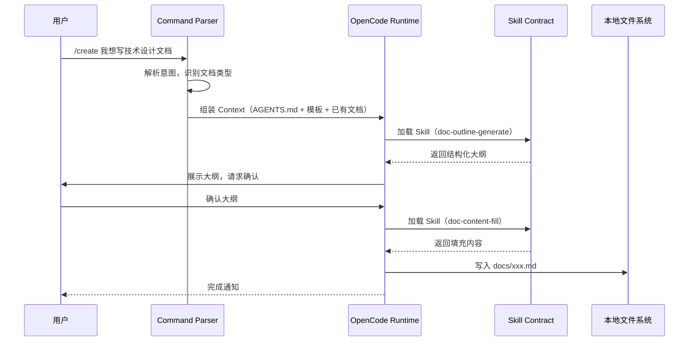

# MaeDoc 核心架构设计

> **版本**：1.0.0
> **最后更新**：2026-02-21
> **适用读者**：想深入理解 MaeDoc 设计原理的开发者

---

## 概述

本文档描述 MaeDoc 的核心架构设计，重点说明**边界**和**契约**——而非实现细节。

**设计理念**：Maeiee 的技术品味决定了以下架构选择：
- **本地优先**：所有敏感操作在本地完成
- **契约驱动**：AI 能力通过 Schema 定义边界
- **流水线胜于对话框**：结构化工作流替代自由对话

---

## 1. 系统全景

MaeDoc 由三层组成：

```
┌─────────────────────────────────────────────────────────────┐
│                        用户层                                │
│   用户输入 → /create /iterate /review 等命令                │
└─────────────────────────────────────────────────────────────┘
                              │
                              ▼
┌─────────────────────────────────────────────────────────────┐
│                     OpenCode 运行时                          │
│   ┌──────────────┐  ┌──────────────┐  ┌──────────────┐      │
│   │   Commands   │  │    Skills    │  │   Templates  │      │
│   │  /create 等  │  │  AI 写作能力  │  │  文档类型模板 │      │
│   └──────────────┘  └──────────────┘  └──────────────┘      │
└─────────────────────────────────────────────────────────────┘
                              │
                              ▼
┌─────────────────────────────────────────────────────────────┐
│                      本地文件系统                            │
│   docs/           .opencode/        .docforge/              │
│   输出文档        Skills/Commands   远程桥接工作区            │
└─────────────────────────────────────────────────────────────┘
```

**关键边界**：
- OpenCode 运行时与外部网络**隔离**（除非用户主动使用 `/escalate`）
- 所有上下文组装和安全校验均在**本地**完成
- 文档输出直接落盘到 `docs/`，不经过远程服务

---

## 2. 核心数据流

一次写作命令的完整生命周期：



**数据流特点**：
- 每一步都有**明确的输入输出**（由 Schema 定义）
- 用户确认点嵌入关键节点（大纲确认、写入确认）
- 错误可追溯：每个 Skill 的输出都是可检查的文本

---

## 3. Skill 契约设计

### 3.1 Skill 的唯一要素

每个 Skill 由单一文件组成：

```
.opencode/skills/my-skill/
└── SKILL.md        # 全大写，唯一必需文件
```

**SKILL.md 结构**：
- **frontmatter**：包含 `name`（Skill 名称）和 `description`（功能描述）
- **Markdown 正文**：任务说明，定义 AI 的输入、处理方式和输出格式约定

**设计原则**：通过结构化的 Prompt 格式约定规范 Skill 的行为，让 AI 的创造力在可预测的工作流上运行。

### 3.2 Skill 分类

| 类型 | 说明 | 示例 |
|------|------|------|
| **生成型** | 依赖 LLM 生成内容 | `doc-outline-generate` |
| **审阅型** | 对已有内容进行评估和反馈 | `doc-review` |
| **操作型** | 对文档结构进行修改和整理 | `doc-content-fill` |

### 3.3 为什么是结构化 Prompt 而非自由对话？

**Maeiee 的判断**：让大模型自由决定调用什么能力，会导致系统**不可靠**。

**解决方案**：通过 SKILL.md 中的结构化 Prompt 格式约定规范 Skill 的输入输出——明确说明接收什么、如何处理、输出什么格式，让 AI 的创造力在可预测的工作流上运行。

**权衡**：Prompt 约定没有强类型校验，依赖约定而非机制，但实现简单、维护成本低。

---

## 4. 命令分发机制

### 4.1 命令与 Skill 的关系

```
Command                      Skill Chain
─────────────────────────────────────────────
/create    ───────────────► doc-outline-generate
                               │
                               ▼ (用户确认大纲)
                            doc-content-fill
                               │
                               ▼
                            doc-format-normalize

/review    ───────────────► doc-review
                               │
                               ▼ (可选)
                            doc-quality-score

/iterate   ───────────────► doc-iterate

/evolve    ───────────────► doc-tree-evolve
                               │
                               ▼
                            doc-format-normalize
```

### 4.2 命令解析流程

1. **意图识别**：从用户输入中提取命令类型和参数
2. **上下文组装**：加载 AGENTS.md、相关模板、已有文档
3. **Skill 调度**：按预定义的 Skill Chain 依次调用
4. **用户交互**：在关键节点请求确认（大纲、写入）
5. **输出生成**：将最终结果写入本地文件

---

## 5. 扩展机制

### 5.1 新增文档类型

在 `docs/_templates/` 下创建类型目录：

```
docs/_templates/my-type/
├── type.json       # 类型定义（章节结构、必需字段）
├── template.md     # 内容模板（示例章节内容）
└── guidelines.md   # 类型专属写作规范
```

`type.json` 示例：

```json
{
  "type_id": "my-type",
  "name": "我的文档类型",
  "description": "用于...",
  "sections": [
    { "id": "summary", "name": "摘要", "required": true },
    { "id": "details", "name": "详情", "required": true }
  ]
}
```

### 5.2 新增 Skill

在 `.opencode/skills/` 下创建 Skill 目录，目录中只需一个文件：

```
.opencode/skills/my-skill/
└── SKILL.md        # 全大写，唯一必需文件
```

`SKILL.md` 包含：
- frontmatter：`name` 和 `description`
- 正文：任务描述、输入格式说明、输出格式约定

### 5.3 新增 Command

在 `.opencode/commands/` 下创建命令文件：

```
.opencode/commands/my-command.md
```

命令文件描述：
- 命令用法和参数
- 执行流程
- 调用的 Skill Chain

---

## 6. 安全边界

| 层级 | 安全措施 |
|------|---------|
| **文件访问** | 禁止访问 `.env`、`credentials` 等敏感文件（AGENTS.md 定义） |
| **外部请求** | 仅 `/escalate` 可生成外发请求，且需经过敏感信息扫描 |
| **写入确认** | 任何覆盖操作必须经过用户显式确认 |
| **审计日志** | `.docforge/` 记录所有远程交互（可选启用） |

---

## 参考资料

- [AGENTS.md](../AGENTS.md) — AI Agent 行为准则
- [通用写作规范](../maedoc/writing-guidelines.md)
- [设计反思](./retrospect/design-reflections/index.md) — 架构决策的反思与演进

---

*本文档由 `/create` 命令生成，作为 MaeDoc 架构的官方说明。*
