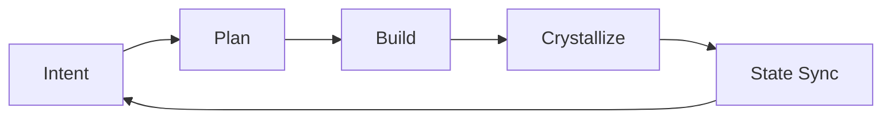

# 伴侣模式架构

> **所属系列**：[MaeDoc 核心架构设计](./index.md)
> **最后更新**：2026-02-22

---

## 设计目标

MaeDoc 从“文档生成器”升级为“写作伴侣”后，核心目标变为：

- 用户不需要逐段参与写作
- MaeDoc 主动管理整个 `docs/` 文档库
- 支持跨主题探索与快速焦点切换
- 在变化中沉淀可复用真知

---

## 核心闭环

- `Plan`：探索主题图谱并生成执行计划
- `Build`：自动执行低/中风险文档操作
- `Crystallize`：提炼知识晶体
- `State Sync`：同步焦点、主题图谱、会话续航

---

## 新增组件

### 命令层

| 命令 | 作用 |
|------|------|
| `/companion` | 高自治入口，执行全库闭环 |
| `/focus` | 快速切换探索焦点 |

### SubAgent 层

| Agent | 作用 |
|------|------|
| `doc-explorer` | 生成主题图谱与焦点迁移建议 |
| `doc-companion-planner` | 生成可执行计划与风险边界 |
| `knowledge-synthesizer` | 提炼知识晶体 |

### Skill 层

| Skill | 作用 |
|------|------|
| `doc-focus-map` | 全库主题分析 |
| `knowledge-crystallize` | 真知提炼 |
| `companion-state-sync` | 控制平面状态同步 |

### 插件层

| Plugin | 作用 |
|------|------|
| `maedoc-guardian` | docs 写入后自动提醒治理收尾 |

---

## 控制平面

伴侣模式引入 `docs/companion/` 作为运行状态层：

- `current-focus.md`：当前目标与边界
- `theme-map.md`：主题状态与覆盖率
- `knowledge-crystals.md`：可复用真知
- `session-brief.md`：会话续航摘要

这些文件让 MaeDoc 在长周期探索中保持连贯，不因会话中断丢失上下文。

---

## 风险治理

- 低风险：默认自动执行
- 中风险：默认自动执行，可按批次确认
- 高风险：必须确认（归档、删除、大规模重组、外发）

> 与旧架构相比，交互从“每步确认”升级为“风险驱动确认”。

---

## 与旧流程兼容

- `/create`、`/iterate`、`/evolve` 仍可单独使用
- `/companion` 会按需编排这些能力，而不是替代它们
- 质量门与 TODO 机制保持不变

---

## 适用场景

- 主题不断变化的长期知识探索
- 需要“边做边沉淀”而非一次性写完
- 需要跨文档保持定义一致、导航一致、状态一致
