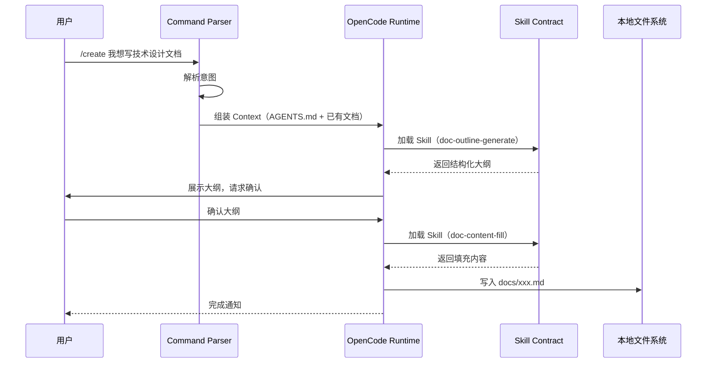

# 核心数据流

> **所属系列**：[MaeDoc 核心架构设计](./index.md)
> **最后更新**：2026-02-22

---

## 一次写作命令的完整生命周期

---

## 数据流特点

### 明确的输入输出

每一步都有**明确的输入输出**（由 Schema 定义）：

| 阶段 | 输入 | 输出 |
|------|------|------|
| 意图解析 | 用户命令 | 命令类型 + 参数 |
| 上下文组装 | AGENTS.md + 已有文档 | 组装后的 Context |
| Skill 执行 | Context + Skill 定义 | 结构化输出 |
| 文档写入 | 结构化内容 | 文件系统中的文档 |

### 用户确认点

- 大纲生成后，系统会请求用户确认
- 用户可以修改大纲后再继续
- 确保用户对输出内容有控制权

### 可追溯性

- 每个阶段的输出都是结构化的
- 便于调试和问题定位
- 支持中间结果的检查和干预

---

## 相关文档

- [命令分发机制](./command-dispatch.md) — 了解命令如何映射到 Skill Chain
- [Skill 契约设计](./skill-contract.md) — 了解 Skill 的输入输出定义
