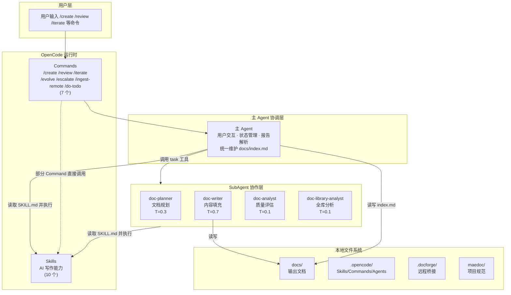

# 系统全景

> **所属系列**：[MaeDoc 核心架构设计](./index.md)
> **最后更新**：2026-02-22

---

## 四层架构

MaeDoc 由四层组成：



**关键数据流说明**：
- **主 Agent（协调者）** 是用户与 SubAgent 之间的桥梁，负责解析 SubAgent 报告、与用户交互、统一维护 `docs/index.md`
- SubAgent **读取 SKILL.md 并按步骤执行**，而非通过接口调用
- 只有 `doc-writer` 有写权限，其他 3 个 SubAgent 只产出文本报告
- 部分 Commands（如 `/evolve` Phase 2）直接调用 Skills，不经过 SubAgent

---

## 核心组件

### Commands（7 个）

| 命令 | 功能 |
|------|------|
| `/create` | 一键创建新文档（意图 → 大纲 → 内容 → 质量门） |
| `/review` | 只读质量审阅（调用 doc-analyst，输出评分报告） |
| `/iterate` | 基于反馈迭代文档（智能追问 + 质量门） |
| `/evolve` | 文档树结构演进 |
| `/escalate` | 打包上下文发给外部 AI |
| `/ingest-remote` | 导入外部 AI 回答 |
| `/do-todo` | 处理待办事项 |

### Skills（10 个）

| Skill | 功能 |
|-------|------|
| `doc-outline-generate` | 生成结构化大纲 |
| `doc-content-fill` | 逐章节填充内容 |
| `doc-evaluate` | 统一质量评估：7 维度评分 + P0/P1/P2 问题清单 + 结构合规 |
| `doc-format-normalize` | Markdown 格式规范化 |
| `doc-iterate` | 基于反馈定向修改 |
| `doc-translate` | 多语言翻译 |
| `doc-tree-fill` | 多文件文档树填充 |
| `doc-tree-evolve` | 文档树结构演进 |
| `hardness-classify` | 六维硬度评估 |
| `todo-append` | TODO 追加机制 |

> 另有 `quality-gate` Skill 作为可复用的质量门循环逻辑，由 `/create` 和 `/iterate` 共享调用。

### SubAgents（4 个）

| Agent | Temperature | 职责 | 调用 Skills |
|-------|:-----------:|------|------------|
| `doc-planner` | 0.3 | 文档规划、大纲生成 | `doc-outline-generate` |
| `doc-writer` | 0.7 | 内容填充、格式化 | `doc-content-fill`, `doc-format-normalize`, `doc-tree-fill` |
| `doc-analyst` | 0.1 | 质量评估（7 维度） | `doc-evaluate` |
| `doc-library-analyst` | 0.1 | 全库扫描、知识图谱 | `doc-evaluate` |

> **详细协作架构**：见 [maedoc/agent-architecture.md](../../maedoc/agent-architecture.md)

---

## 关键架构特征

### 质量门反馈循环

```
[doc-writer 写入] → [doc-analyst 独立评分] → PASS(>=70)? → 继续
                                             → FAIL(<70)? → [doc-iterate 改进] → 重新评分（最多 3 次）
```

doc-analyst 在独立上下文中评分，避免"自说自话"偏差。

### Temperature 分层策略

分析任务（doc-analyst、doc-library-analyst）使用低温度 0.1 确保评分一致性；规划任务（doc-planner）使用中温度 0.3；创作任务（doc-writer）使用高温度 0.7 激发创意。

### 无状态 Prompt 原则

SubAgent 无法访问主 Agent 对话历史。每次调用的 prompt 必须自给自足——显式传入文件路径、约束、期望输出格式。

### 主 Agent 作为协调者

主 Agent 负责用户交互、解析 SubAgent 报告、管理状态变量、统一维护 `docs/index.md`。SubAgent 不直接与用户交互。

---

## 关键边界

### OpenCode 运行时与外部网络隔离

- 默认与外部网络**隔离**
- 外发请求通过 `/escalate` 命令或 `hardness-classify` HIGH 级别自动触发
- 外发数据写入 `.docforge/outbox/`，由用户手动复制到外部 AI
- 安全检查由主 Agent 在外发前内联执行（手动检查敏感信息）

### 文档输出直接落盘

- 文档输出到 `docs/`，不经过远程服务
- 用户对输出内容拥有完全控制权

### 主动求助机制

- 遇到疑难决策时，`hardness-classify` Skill 自动评估问题硬度
- HIGH 级别问题停止作答，生成外部求助包到 `.docforge/outbox/`

---

## 目录结构

| 目录 | 用途 |
|------|------|
| `docs/` | 输出文档存放位置 |
| `.opencode/` | Skills、Commands、Agents 定义 |
| `.docforge/` | 远程桥接工作区 |
| `maedoc/` | 项目自身规范与迭代计划 |

---

## 相关文档

- [核心数据流](./data-flow.md) — 数据如何在各层流转
- [安全边界](./security-boundary.md) — 各层安全措施
- [SubAgent 协作架构](../../maedoc/agent-architecture.md) — 详细的 SubAgent 设计
- [AGENTS.md](../../AGENTS.md) — 完整 Agent 行为准则
