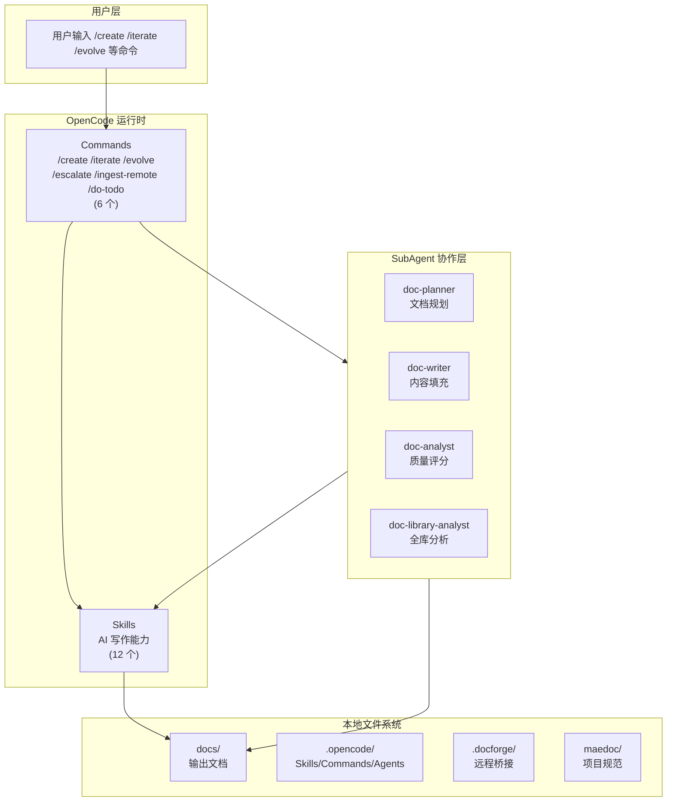

# 系统全景

> **所属系列**：[MaeDoc 核心架构设计](./index.md)
> **最后更新**：2026-02-22

---

## 四层架构

MaeDoc 由四层组成：

---

## 核心组件

### Commands（6 个）

| 命令 | 功能 |
|------|------|
| `/create` | 一键创建新文档（意图 → 大纲 → 内容 → 质量门） |
| `/iterate` | 基于反馈迭代文档 |
| `/evolve` | 文档树结构演进 |
| `/escalate` | 打包上下文发给外部 AI |
| `/ingest-remote` | 导入外部 AI 回答 |
| `/do-todo` | 处理待办事项 |

### Skills（12 个）

| Skill | 功能 |
|-------|------|
| `doc-outline-generate` | 生成结构化大纲 |
| `doc-content-fill` | 逐章节填充内容 |
| `doc-review` | 多维度文档审阅 |
| `doc-format-normalize` | Markdown 格式规范化 |
| `doc-structure-audit` | 检查文档结构完整性 |
| `doc-quality-score` | 量化质量评分（0-100） |
| `doc-iterate` | 基于反馈定向修改 |
| `doc-translate` | 多语言翻译 |
| `doc-tree-fill` | 多文件文档树填充 |
| `doc-tree-evolve` | 文档树结构演进 |
| `hardness-classify` | 六维硬度评估 |
| `todo-append` | TODO 追加机制 |

### SubAgents（4 个）

| Agent | Temperature | 职责 | 调用 Skills |
|-------|:-----------:|------|------------|
| `doc-planner` | 0.3 | 文档规划、大纲生成 | `doc-outline-generate` |
| `doc-writer` | 0.7 | 内容填充、格式化 | `doc-content-fill`, `doc-format-normalize` |
| `doc-analyst` | 0.1 | 质量评分、问题审阅 | `doc-quality-score`, `doc-review` |
| `doc-library-analyst` | 0.1 | 全库扫描、知识图谱 | `doc-structure-audit`, `doc-tree-evolve` |

> **设计原理**：SubAgent 拥有独立上下文窗口，隔离复杂任务的上下文压力，实现「写→诊断→调整」反馈循环。详见 [AGENTS.md §6.5](../../AGENTS.md)。

---

## 关键边界

### OpenCode 运行时与外部网络隔离

- 默认与外部网络**隔离**
- 仅 `/escalate` 命令生成外发请求
- 上下文组装和安全校验均在**本地**完成

### 文档输出直接落盘

- 文档输出到 `docs/`，不经过远程服务
- 用户对输出内容拥有完全控制权

### 主动求助机制

- 遇到疑难决策时，`hardness-classify` Skill 自动评估问题硬度
- HIGH 级别问题停止作答，生成外部求助包到 `.docforge/outbox/`

---

## 目录结构

| 目录 | 用途 |
|------|------|
| `docs/` | 输出文档存放位置 |
| `.opencode/` | Skills、Commands、Agents 定义 |
| `.docforge/` | 远程桥接工作区 |
| `maedoc/` | 项目自身规范与迭代计划 |
| `third_party/` | 第三方文档引用 |

---

## 相关文档

- [核心数据流](./data-flow.md) — 数据如何在各层流转
- [安全边界](./security-boundary.md) — 各层安全措施
- [AGENTS.md](../../AGENTS.md) — 完整 Agent 行为准则
