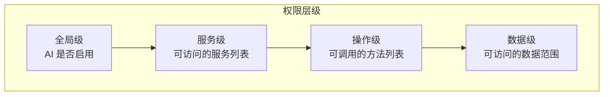

# AI Agent 集成

> **文档类型**：技术方案设计
> **来源**：从 [跨平台个人生产力系统技术概览](../cross-platform-setup/personal-productivity-system-overview.md) 拆分
> **日期**：2026-02-20

---

AI Agent 是系统的一等公民，可以读取数据、调用服务、操作文件、更新界面。系统从架构层面支持 AI 的深度集成，而非事后挂载。

---

## 7.1 AI Agent 的能力范围

| 能力 | 说明 | 示例 |
|------|------|------|
| 读取数据 | 查询数据库、读取文件元信息 | "列出所有标记为'重要'的文档" |
| 写入数据 | 创建/修改文件、更新数据库记录 | "把这个文件标记为'已完成'" |
| 调用服务 | 通过服务中心调用任意已注册服务 | "把选中的 PDF 转换为图片" |
| 渲染界面 | 创建 GUI 组件、更新界面状态 | "弹出一个确认对话框" |
| 订阅事件 | 监听系统事件并响应 | "当有新文件添加时通知我" |

---

## 7.2 权限控制模型

系统采用**粒度化配置 + 默认拒绝**的权限模型：



**权限配置示例**：

```json
{
  "agent_id": "assistant-v1",
  "global_enabled": true,
  "services": {
    "file-manager": {
      "allowed": true,
      "methods": {
        "list_files": { "allowed": true },
        "create_file": { "allowed": true, "require_confirmation": true },
        "delete_file": { "allowed": false }
      }
    },
    "database": {
      "allowed": true,
      "data_scope": {
        "tags": ["工作", "项目"],
        "exclude_tags": ["私密"]
      }
    }
  }
}
```

**关键特性**：

- **默认拒绝**：未明确授权的操作一律拒绝
- **敏感操作确认**：高风险操作（删除、批量修改）需用户确认
- **数据隔离**：可限制 AI 只能访问特定标签或分类的数据
- **动态调整**：权限配置存储在数据库中，可随时修改

---

## 7.3 与 MCP 协议的集成

Model Context Protocol（MCP）是连接 AI 与外部工具的标准协议。本系统的服务中心天然支持 MCP：

**MCP Server 实现**：

系统提供一个 MCP Server，将服务中心的能力暴露给 MCP Client（如 Claude Desktop）：

```
┌─────────────────┐     MCP Protocol     ┌─────────────────┐
│  MCP Client     │◄────────────────────►│  MCP Server     │
│  (Claude, etc.) │                      │  (内置)         │
└─────────────────┘                      └────────┬────────┘
                                                   │
                                                   ▼
                                          ┌─────────────────┐
                                          │  服务中心       │
                                          └────────┬────────┘
                                                   │
                               ┌───────────────────┼───────────────────┐
                               ▼                   ▼                   ▼
                         ┌──────────┐        ┌──────────┐        ┌──────────┐
                         │ Service A│        │ Service B│        │ Service C│
                         └──────────┘        └──────────┘        └──────────┘
```

**工具映射**：

| MCP Tool | 对应服务方法 | 说明 |
|----------|-------------|------|
| `file_list` | `file-manager.list_files` | 列出文件 |
| `file_create` | `file-manager.create_file` | 创建文件 |
| `db_query` | `database.query` | 查询数据库 |
| `ui_notify` | `ui-service.show_notification` | 显示通知 |

---

## 7.4 审计日志

所有 AI 操作都记录审计日志，包含：

```json
{
  "log_id": "log-uuid",
  "timestamp": "2026-02-20T10:30:00Z",
  "agent_id": "assistant-v1",
  "action": "service_call",
  "service": "file-manager",
  "method": "create_file",
  "parameters": { "name": "notes.md", "content": "..." },
  "result": "success",
  "file_affected": "a1b2c3d4-..."
}
```

**审计日志用途**：

- **追溯**：查看 AI 在什么时间做了什么操作
- **回滚**：基于日志撤销 AI 的错误操作
- **分析**：统计 AI 的使用模式和效率

---

## 7.5 人机协作模式

系统支持多种人机协作模式：

**模式一：AI 辅助**

- 用户主导操作，AI 提供建议
- AI 可以读取上下文，但不能主动执行
- 适用于探索性任务

**模式二：AI 执行**

- 用户给出目标，AI 自主规划并执行
- 敏感操作需要用户确认
- 适用于明确目标的生产性任务

**模式三：AI 监控**

- AI 持续监控系统状态
- 满足条件时触发自动化工作流
- 适用于重复性任务

---

## 7.6 安全边界

**AI 不能做的事情**：

- 修改自身的权限配置
- 访问标记为"私密"的数据
- 执行未授权的服务方法
- 绕过用户确认执行敏感操作
- 修改审计日志

**防护措施**：

- 权限检查在服务中心层面执行，AI 无法绕过
- 敏感数据加密存储，AI 只能看到脱敏版本
- 所有操作可追溯，异常行为可被检测

---

*本文档是跨平台个人生产力系统设计系列的一部分。其他相关文档：[核心设计原则](../system-design/core-principles.md)、[服务中心系统](./service-hub.md)、[风险与挑战](../system-design/risks-challenges.md)*
