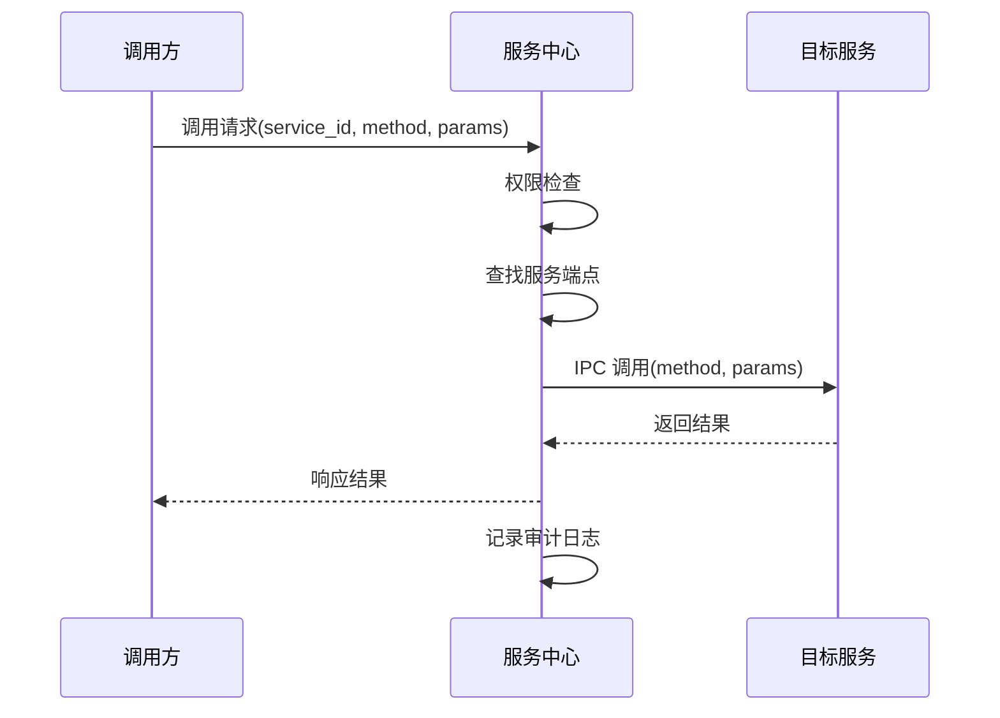
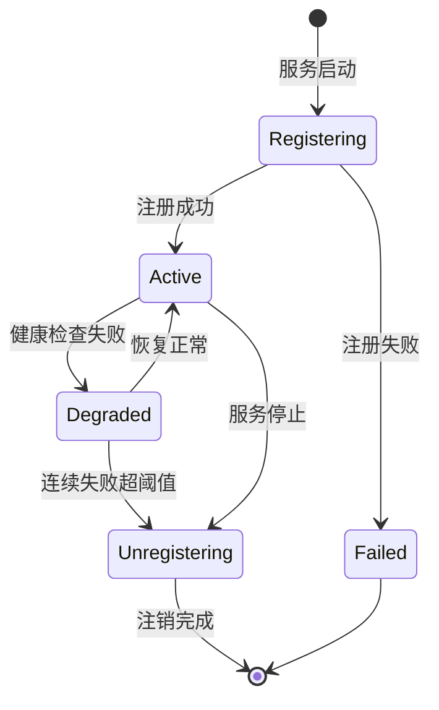

# 服务中心系统

> **文档类型**：技术方案设计
> **来源**：从 [跨平台个人生产力系统技术概览](../cross-platform-setup/personal-productivity-system-overview.md) 拆分
> **日期**：2026-02-20

---

服务中心是系统的**神经中枢**，负责服务的注册、发现和调用。它允许不同技术栈实现的服务无缝协作，是跨平台策略的核心基础设施。

---

## 5.1 核心职责

服务中心承担以下职责：

- **服务注册**：服务启动时向中心注册自身的能力和接口
- **服务发现**：调用方通过中心查找目标服务的地址和接口
- **调用转发**：处理跨进程、跨技术栈的调用请求
- **权限控制**：验证调用方是否有权限访问目标服务
- **健康监测**：监控服务状态，剔除不可用的服务实例

---

## 5.2 服务注册信息

每个服务注册时需提供以下信息：

```json
{
  "service_id": "file-manager",
  "version": "1.0.0",
  "runtime": "rust",
  "endpoints": [
    {
      "method": "create_file",
      "description": "创建新文件",
      "input_schema": {
        "type": "object",
        "properties": {
          "content": { "type": "string" },
          "metadata": { "type": "object" }
        },
        "required": ["content"]
      },
      "output_schema": {
        "type": "object",
        "properties": {
          "file_id": { "type": "string" },
          "path": { "type": "string" }
        }
      },
      "side_effects": ["filesystem_write"],
      "requires_auth": true
    }
  ],
  "ipc_endpoint": "unix:///tmp/maedoc/file-manager.sock"
}
```

**关键字段说明**：

- `input_schema` / `output_schema`：使用 JSON Schema 描述接口，可直接映射为 MCP Tool Schema
- `side_effects`：声明方法的副作用，用于权限判断和审计
- `requires_auth`：是否需要认证才能调用

---

## 5.3 跨平台 IPC 机制

服务中心的调用转发层采用**平台原生 IPC**，而非跨平台抽象层。

| 平台 | IPC 机制 | 实现技术 |
|------|---------|---------|
| Windows | Named Pipes / COM+ | `\\.\pipe\maedoc-<service>` |
| macOS | XPC / Unix Domain Socket | `NSXPCConnection` + `Codable` |
| Linux | D-Bus / Unix Domain Socket | `dbus` 或 `.sock` 文件 |

**调用流程**：



---

## 5.4 与 MCP 协议的对齐

服务中心的设计天然与 Model Context Protocol（MCP）对齐：

**服务注册 → MCP Tool List**：

服务注册信息中的 `endpoints` 可直接转换为 MCP 的 `tools/list` 响应：

```json
{
  "tools": [
    {
      "name": "file-manager_create_file",
      "description": "创建新文件",
      "inputSchema": { ... }
    }
  ]
}
```

**权限配置 → MCP 资源控制**：

服务中心的权限配置可映射为 MCP 的资源访问策略，AI Agent 的权限范围在服务中心统一管理。

**调用 → MCP Tool Call**：

当 AI Agent 通过 MCP 调用工具时，请求被转发到服务中心，由服务中心执行实际的 IPC 调用。

---

## 5.5 服务生命周期



**健康检查机制**：

- 心跳检测：服务每 30 秒发送心跳，超时 90 秒标记为不健康
- 主动探测：对标记为不健康的服务，每隔 10 秒尝试重连
- 自动恢复：服务恢复后自动重新注册，无需人工干预

---

## 5.6 错误处理与重试

**错误分类**：

| 错误类型 | 处理策略 |
|---------|---------|
| 服务不存在 | 立即返回错误，不重试 |
| 服务不可用 | 重试 3 次，间隔指数退避 |
| 权限不足 | 立即返回错误，记录审计日志 |
| 调用超时 | 重试 2 次，每次超时 5 秒 |
| 参数校验失败 | 立即返回详细错误信息 |

**熔断机制**：

当某服务连续失败 5 次后，进入熔断状态，直接拒绝后续请求 60 秒，避免级联故障。

---

*本文档是跨平台个人生产力系统设计系列的一部分。其他相关文档：[核心设计原则](../system-design/core-principles.md)、[AI Agent 集成](./ai-integration.md)、[模块间依赖关系](../system-design/module-dependencies.md)*
