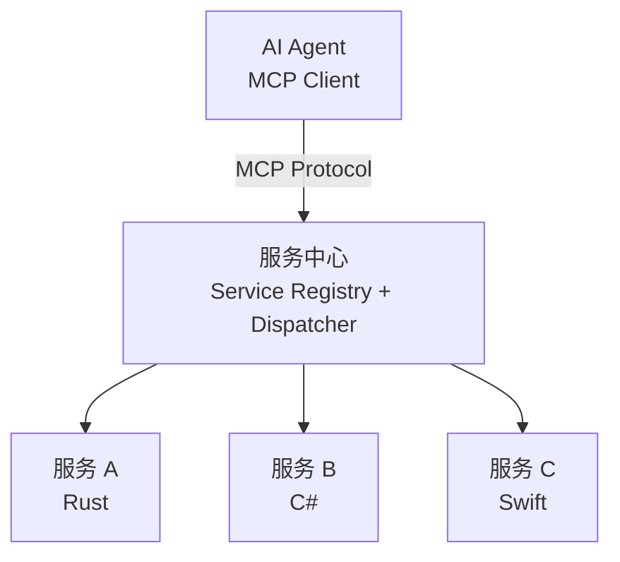

# 核心设计原则

> **文档类型**：技术方案设计
> **来源**：从 [跨平台个人生产力系统技术概览](../cross-platform-setup/personal-productivity-system-overview.md) 拆分
> **日期**：2026-02-20

---

本文档阐述跨平台个人生产力系统的三大核心设计原则：跨平台策略、AI 集成策略和 MCP 原生设计。

---

## 2.1 跨平台策略：统一理念，因地制宜

本系统的"跨平台"不是追求代码复用，而是追求**设计一致性**和**数据互通性**。

**统一的部分**：

- **数据格式**：文件存储路径规则、Sidecar 文件 Schema、SQLite 数据库结构
- **服务接口定义**：服务注册表的字段、调用的输入输出格式
- **组件通信协议**：组件间的消息格式、事件模型

**因地制宜的部分**：

- **IPC 机制**：Windows 用 COM+/WinRT，macOS 用 XPC/Codable，Linux 用 D-Bus/gRPC
- **窗口合成**：Windows 用 DirectComposition，macOS 用 Core Animation，Linux 用 Wayland subsurfaces
- **文件系统监听**：Windows 用 ReadDirectoryChangesW，macOS 用 FSEvents，Linux 用 inotify

这种策略的优势：

- 每个平台使用最成熟、性能最优的技术
- 避免跨平台抽象层带来的性能损耗和 bug 放大
- 可以利用平台特有的能力（如 Windows 的 WinRT API、macOS 的 SwiftUI）

---

## 2.2 AI 集成：深度嵌入，权限可控

AI Agent 不是外挂工具，而是**系统的一等公民**。它可以：

- **读**：查询数据库、读取文件元信息、获取服务状态
- **写**：创建/修改文件、更新数据库记录
- **调用**：通过服务中心调用任意已注册服务
- **渲染**：创建 GUI 组件、更新界面状态

**权限控制模型**采用**粒度化配置 + 默认拒绝**策略：

- **全局级**：AI 是否被允许执行写操作（全局开关）
- **服务级**：AI 是否可以调用某个特定服务
- **操作级**：AI 是否可以调用服务的某个特定方法
- **数据级**：AI 是否可以访问/修改特定范围的数据（如某个标签下的文件）

权限配置存储在数据库中，支持动态调整。所有 AI 操作都记录审计日志，便于追溯。

---

## 2.3 MCP 原生：架构即接口

Model Context Protocol（MCP）是连接 AI 与外部工具的标准协议。本系统设计时遵循以下原则，使架构天然与 MCP 打通：

1. **服务接口即 MCP Tool**：服务中心的服务注册信息包含接口描述（输入参数、输出格式、副作用说明），可直接转换为 MCP Tool Schema
2. **权限即 MCP 资源控制**：系统的粒度化权限配置可直接映射为 MCP 的资源访问策略
3. **无冗余封装**：不需要在现有服务之上再包一层 "MCP 适配器"，服务本身的设计就兼容 MCP 语义

---

*本文档是跨平台个人生产力系统设计系列的一部分。其他相关文档：[系统概述](./overview.md)、[AI Agent 集成](../shared-modules/ai-integration.md)、[服务中心系统](../shared-modules/service-hub.md)*
