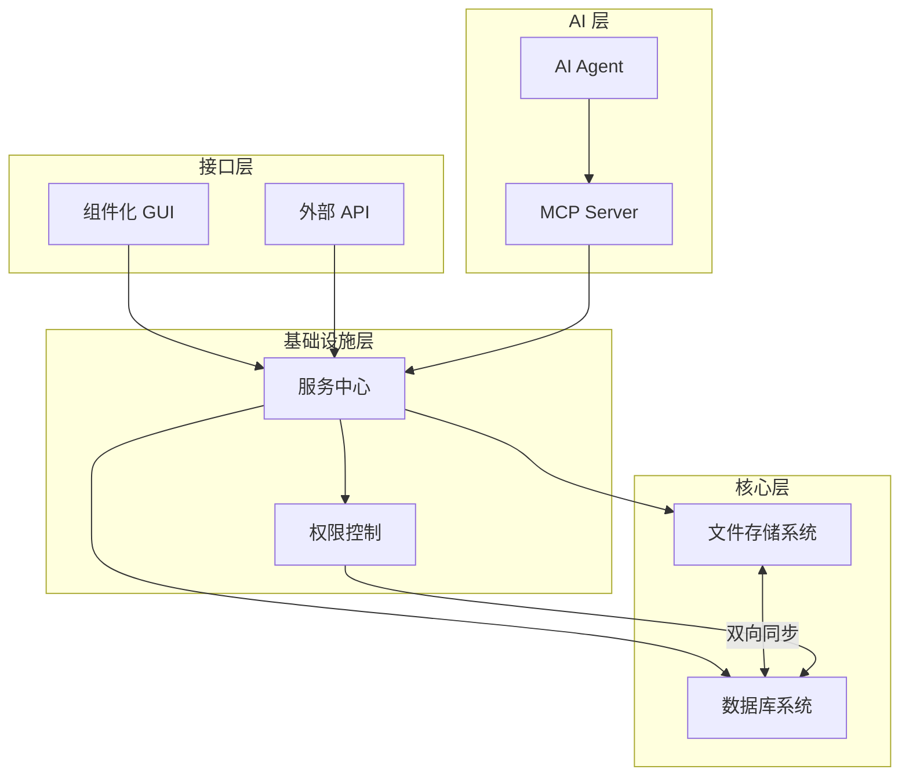

# 模块间依赖关系

> **文档类型**：技术方案设计
> **来源**：从 [跨平台个人生产力系统技术概览](../cross-platform-setup/personal-productivity-system-overview.md) 拆分
> **日期**：2026-02-20

---

系统的模块设计遵循**高内聚、低耦合**原则，通过服务中心实现松散依赖。

---

## 9.1 模块依赖图



---

## 9.2 依赖方向规则

**自上而下依赖**：

- 上层模块可以依赖下层模块
- GUI → 服务中心 → 文件系统/数据库
- AI Agent → MCP Server → 服务中心

**禁止反向依赖**：

- 文件系统不能直接调用 GUI
- 数据库不能直接调用服务中心
- 核心层保持独立，可单独测试

**水平依赖通过服务中心**：

- 同层模块不能直接相互调用
- 必须通过服务中心中转
- 例如：文件系统需要通知 GUI 更新，发送消息到服务中心，由服务中心转发

---

## 9.3 启动顺序

系统启动遵循严格的依赖顺序：

```
1. 数据库系统
   └── 初始化 Schema、加载配置

2. 权限控制
   └── 依赖数据库存储权限配置

3. 文件存储系统
   └── 独立启动，后台同步到数据库

4. 服务中心
   └── 依赖数据库存储服务注册信息
   └── 加载权限控制模块

5. 核心服务注册
   └── 文件管理、数据库查询等服务向服务中心注册

6. MCP Server
   └── 依赖服务中心提供工具列表

7. GUI Shell
   └── 依赖服务中心获取初始数据

8. 用户组件
   └── 按需加载
```

---

## 9.4 接口契约

模块间通过**接口契约**通信，不依赖具体实现：

**文件系统接口**：

```typescript
interface FileSystemService {
  create_file(content: Buffer, metadata: FileMetadata): Promise<File>;
  get_file(file_id: string): Promise<File>;
  update_metadata(file_id: string, metadata: Partial<FileMetadata>): Promise<void>;
  delete_file(file_id: string): Promise<void>;
  list_files(query: FileQuery): Promise<File[]>;
}
```

**数据库接口**：

```typescript
interface DatabaseService {
  query(sql: string, params: any[]): Promise<QueryResult>;
  insert(entity: Entity): Promise<string>;
  update(entity_id: string, attributes: Record<string, any>): Promise<void>;
  delete(entity_id: string): Promise<void>;
}
```

**服务中心接口**：

```typescript
interface ServiceHub {
  register(service: ServiceDefinition): Promise<void>;
  unregister(service_id: string): Promise<void>;
  call(service_id: string, method: string, params: any): Promise<any>;
  subscribe(event_type: string, handler: EventHandler): Promise<void>;
}
```

---

## 9.5 依赖版本管理

当模块接口发生变化时，需遵循以下规则：

- **兼容性变更**：添加可选字段、新增方法 → 直接发布
- **破坏性变更**：删除方法、修改参数类型 → 新版本号，旧版本保留
- **废弃策略**：标记为废弃的接口保留 2 个大版本，之后移除

服务中心维护接口版本映射表，自动路由到正确的服务版本。

---

## 9.6 循环依赖检测

系统在构建时自动检测循环依赖：

1. 扫描所有模块的导入语句
2. 构建依赖图
3. 使用拓扑排序检测环
4. 发现循环依赖则构建失败，提示开发者修复

常见循环依赖场景及解决方案：

| 场景 | 问题 | 解决方案 |
|------|------|---------|
| A 调 B，B 调 A | 直接循环 | 引入中间层 C，A → C ← B |
| 配置双向引用 | 初始化顺序问题 | 使用延迟加载或依赖注入 |
| 事件回调 | 运行时循环 | 使用消息队列解耦 |

---

*本文档是跨平台个人生产力系统设计系列的一部分。其他相关文档：[系统概述](./overview.md)、[服务中心系统](../shared-modules/service-hub.md)、[风险与挑战](./risks-challenges.md)*
