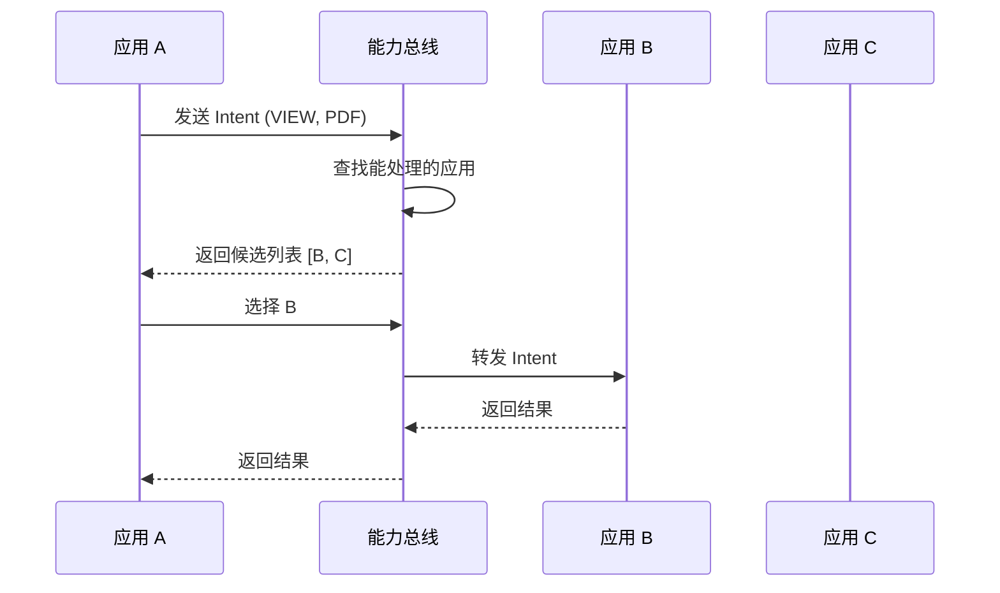
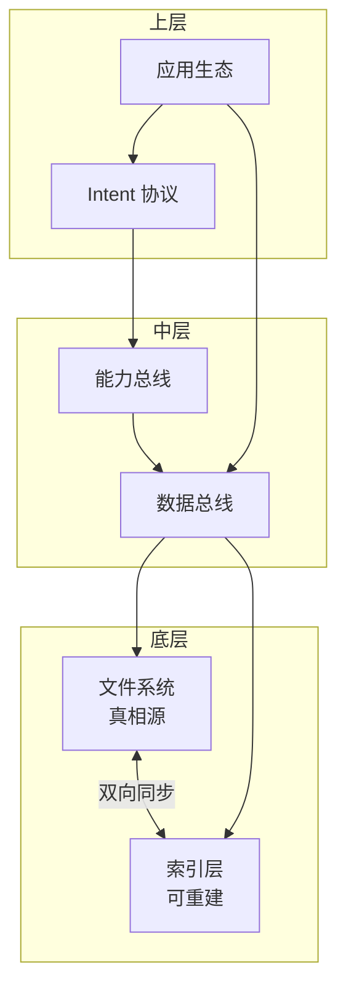

# 核心概念

> **文档类型**：概念设计
> **日期**：2026-02-20

---

本文档定义个人数据与能力总线系统的核心概念。这些概念是整个架构设计的基石。

---

## 1. 数据总线

### 定义

数据总线是一个以**文件为真相源**的数据管理基础设施。它提供：

- 统一的文件存储和元信息管理
- 可选的索引层（SQLite），可从文件重建
- 跨设备同步的基础能力

### 核心原则

| 原则 | 说明 |
|------|------|
| **文件即真相** | 所有数据的最终形式是文件；数据库只是派生视图 |
| **可重建性** | 删除数据库后，可从文件重建完整索引 |
| **人类可读** | 元信息使用 Markdown/YAML，可直接编辑 |
| **同步无关** | 同步机制是外挂的，可以是 git、Syncthing、云盘或 None |

### 与传统方案的区别

```
传统方案：
应用 → 专有数据库 → 云同步

数据总线：
文件（真相源） ← 索引层（可重建） ← 应用层
     ↑
   同步层（外挂，可选）
```

### 待确认事项

- [ ] 文件冲突解决策略
- [ ] 大文件处理方案（是否切分）
- [ ] 历史版本管理

---

## 2. 能力总线

### 定义

能力总线是一个**统一的服务注册与发现**机制。它让不同技术栈实现的应用能够：

- 声明自己提供的能力
- 发现其他应用提供的能力
- 跨进程、跨技术栈调用能力

### 核心概念

**能力（Capability）**：
- 一个可被调用的操作
- 有明确的输入输出 Schema
- 可以声明副作用（读/写/网络等）

**服务（Service）**：
- 一组相关能力的集合
- 有独立的进程生命周期
- 可以用任意技术栈实现

**服务中心（Service Hub）**：
- 能力注册表
- 调用路由器
- 权限检查点

### 与微服务的区别

| 维度 | 微服务 | 能力总线 |
|------|--------|---------|
| 规模 | 企业级，分布式 | 个人级，单机 |
| 网络 | 跨网络调用 | 本地 IPC |
| 复杂度 | 需要服务网格等 | 轻量级，无额外依赖 |
| 目标 | 可扩展性 | 可组合性 |

---

## 3. Intent 协议

### 定义

Intent 协议是一个**标准化的意图表达机制**，让应用之间能够通过"意图"而非"具体调用"进行互操作。

### 核心思想

**传统方式**（硬编码）：
```
App A: "我要调用 App B 的 PDF 预览功能"
→ App A 需要知道 App B 的存在和接口
```

**Intent 方式**（解耦）：
```
App A: "我想预览一个 PDF"（发送 Intent）
→ 系统找到能处理的应用（可能是 B、C 或 D）
```

### Intent 结构

```json
{
  "action": "view",
  "type": "application/pdf",
  "data": "file:///path/to/document.pdf",
  "extras": {
    "page": 1,
    "highlight_search": "关键词"
  }
}
```

### Intent 类型

| 类型 | 说明 | 示例 |
|------|------|------|
| `VIEW` | 查看某类型内容 | 打开 PDF、播放视频 |
| `EDIT` | 编辑某类型内容 | 编辑图片、修改文档 |
| `SHARE` | 分享内容 | 发送到其他应用 |
| `PICK` | 选择某类型内容 | 选择图片、选择文件 |
| `PROCESS` | 处理数据 | 翻译文本、压缩图片 |

### Intent 解析流程



### 与 Android Intent 的关系

借鉴了 Android Intent 的思想，但：

- 更轻量（无 Activity 概念）
- 更跨平台（不依赖 Android 运行时）
- 更开放（任何桌面应用都可以参与）

### 待确认事项

- [ ] Intent 的优先级和冲突解决
- [ ] 是否支持 Intent 链（多个 Intent 组合）
- [ ] Intent 的版本兼容性

---

## 4. 积木式组装

### 定义

积木式组装是一种应用设计哲学：每个应用**小而专注**，通过协议与其他应用组合，产生复杂行为。

### 核心原则

**单一职责**：
- 一个应用只做一件事
- 不要"顺便"加功能

**协议优先**：
- 应用之间通过协议通信
- 不直接依赖具体实现

**可替换性**：
- 任何组件都可以被替换
- 用户有权选择工具

### 示例场景

**场景：管理项目文档**

传统方式（超级 App）：
```
一个应用包含：文件管理 + PDF 预览 + Markdown 编辑 + 标签系统 + 搜索 + ...
```

积木式：
```
文件管理器（负责文件操作）
    ↓ Intent: VIEW PDF
PDF 预览器（专注 PDF 渲染）
    ↓ Intent: EDIT MARKDOWN
Markdown 编辑器（专注文本编辑）
    ↓ Intent: PROCESS TEXT
标签服务（专注元信息管理）
    ↓ 调用
搜索服务（专注索引和检索）
```

### 组合的价值

| 组合模式 | 价值 |
|---------|------|
| 文件管理器 + 预览器 | 快速浏览 |
| 文件管理器 + 编辑器 + Git | 版本控制 |
| 标签服务 + 搜索服务 | 知识管理 |
| AI Agent + 所有服务 | 自动化工作流 |

---

## 5. 概念关系图



---

## 6. 术语表

| 术语 | 英文 | 定义 |
|------|------|------|
| 数据总线 | Data Bus | 以文件为真相源的数据管理基础设施 |
| 能力总线 | Capability Bus | 统一的服务注册与发现机制 |
| Intent | Intent | 标准化的意图表达，用于应用间互操作 |
| 真相源 | Source of Truth | 数据的权威来源，其他都是派生 |
| 服务 | Service | 一组相关能力的集合，独立进程 |
| 能力 | Capability | 一个可被调用的操作 |

---

*相关文档：[总愿景](./overview.md)、[项目拆分](./projects.md)*
