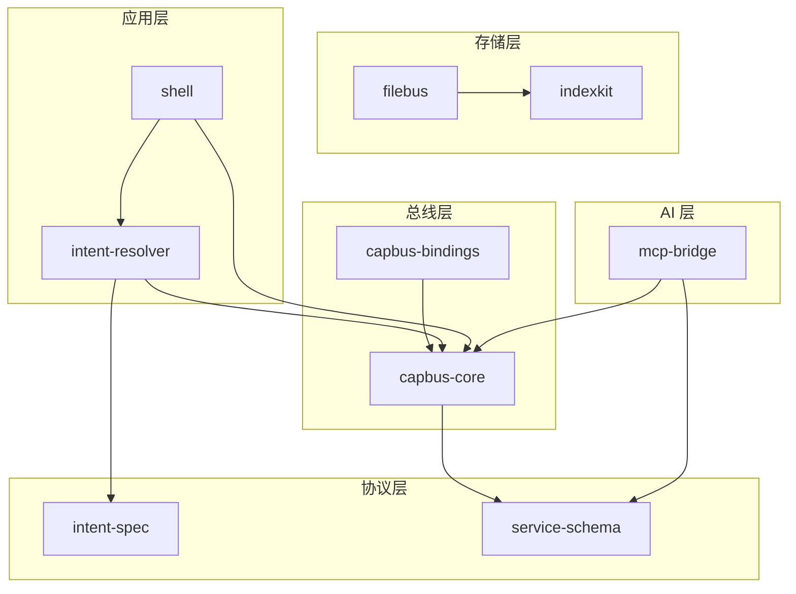

# 项目拆分

> **文档类型**：规划文档
> **日期**：2026-02-20
> **状态**：草案

---

本文档探索如何将"个人数据与能力总线"拆解为一系列可复用的、颗粒度较小的开源项目。

---

## 设计原则

### 1. 独立价值

每个项目**独立存在就有价值**，不依赖于整体生态。

### 2. 最小依赖

项目之间的依赖关系尽量少，降低组合复杂度。

### 3. 协议优先

项目之间通过协议协作，而非直接依赖实现。

### 4. 渐进采用

用户可以只使用其中一个项目，也可以组合使用多个。

---

## 建议的项目拆分

### Layer 0：协议层

| 项目 | 说明 | 独立价值 |
|------|------|---------|
| **intent-spec** | Intent 协议规范 + JSON Schema | 任何想做应用间互操作的项目都可以用 |
| **service-schema** | 服务描述 Schema（能力声明格式） | 可用于任何微服务/插件系统 |

### Layer 1：存储层

| 项目 | 说明 | 独立价值 |
|------|------|---------|
| **filebus** | 文件存储 + UUID 路径 + Sidecar 元信息 | 任何需要文件语义解耦的项目 |
| **indexkit** | SQLite + EAV 架构 + 文件同步 | 任何需要灵活数据建模的本地应用 |

### Layer 2：总线层

| 项目 | 说明 | 独立价值 |
|------|------|---------|
| **capbus-core** | 能力总线的核心实现（注册 + 发现 + 调用） | 任何需要跨进程服务协作的项目 |
| **capbus-bindings** | 多语言绑定（Rust/Swift/C#/Python） | 让不同技术栈都能接入 |

### Layer 3：应用层

| 项目 | 说明 | 独立价值 |
|------|------|---------|
| **shell** | GUI Shell 容器 | 作为桌面应用的启动器 |
| **intent-resolver** | Intent 解析器 | 任何需要 Intent 分发的应用 |

### Layer 4：AI 层

| 项目 | 说明 | 独立价值 |
|------|------|---------|
| **mcp-bridge** | 能力总线 ↔ MCP 协议桥接 | 让 AI Agent 能力接入 |

---

## 项目依赖关系

---

## 各项目详细规划

### intent-spec

**定位**：Intent 协议的规范定义

**包含内容**：
- Intent JSON Schema
- Action 类型枚举
- 常见 Intent 模板
- 解析和验证库（多语言）

**独立使用场景**：
- 其他桌面应用生态
- 浏览器扩展
- CLI 工具互操作

**技术栈**：Rust（核心）+ 多语言绑定

---

### filebus

**定位**：以文件为真相源的存储基础设施

**包含内容**：
- UUID 路径生成器
- Sidecar 文件读写
- 文件操作 API
- 元信息同步机制

**独立使用场景**：
- 个人笔记系统
- 知识管理工具
- 文件归档工具

**技术栈**：Rust

---

### indexkit

**定位**：SQLite + EAV 的灵活数据建模层

**包含内容**：
- EAV 表结构
- 迁移系统
- 查询优化器
- 与 filebus 的双向同步

**独立使用场景**：
- 任何需要灵活 Schema 的本地应用
- 个人 CRM
- 任务管理系统

**技术栈**：Rust + SQLite

---

### capbus-core

**定位**：能力总线的核心实现

**包含内容**：
- 服务注册表
- 调用路由
- 权限检查
- 健康监测

**独立使用场景**：
- 任何需要插件系统的应用
- 多进程应用架构
- 微服务本地开发

**技术栈**：Rust

---

### capbus-bindings

**定位**：多语言 SDK

**包含内容**：
- Swift 绑定（macOS/iOS）
- C# 绑定（Windows）
- Python 绑定（脚本/ML）
- FFI 头文件

**独立使用场景**：
- 让各技术栈应用接入 capbus

**技术栈**：Rust FFI + 各语言

---

### mcp-bridge

**定位**：能力总线 ↔ MCP 协议桥接

**包含内容**：
- MCP Server 实现
- 服务 → MCP Tool 映射
- 权限配置转换

**独立使用场景**：
- 让任何 capbus 生态的应用能被 AI Agent 调用
- 可单独用于其他 MCP 集成

**技术栈**：Rust

---

## 发布策略

### 版本协调

- 协议层（intent-spec、service-schema）：语义化版本，稳定优先
- 存储层、总线层：跟随协议版本
- 应用层、AI 层：可更快迭代

### 发布节奏

| 层级 | 节奏 |
|------|------|
| 协议层 | 每季度最多一次大版本 |
| 存储层 | 每月一次小版本 |
| 总线层 | 每两周一次 |
| 应用层 | 随时 |

---

## 优先级建议

### 第一阶段（核心验证）

1. **intent-spec** — 定义协议，其他项目依赖
2. **filebus** — 存储基础
3. **capbus-core** — 总线基础

### 第二阶段（生态扩展）

4. **indexkit** — 数据建模
5. **capbus-bindings** — 多语言支持

### 第三阶段（应用落地）

6. **shell** — GUI 入口
7. **intent-resolver** — Intent 分发
8. **mcp-bridge** — AI 集成

---

## 待确认事项

- [ ] 是否需要统一的 monorepo 还是各自独立仓库？
- [ ] 各项目的命名是否合适？
- [ ] 是否遗漏了重要的独立项目？
- [ ] 依赖关系是否有循环风险？

---

*相关文档：[总愿景](./overview.md)、[核心概念](./concepts.md)*
