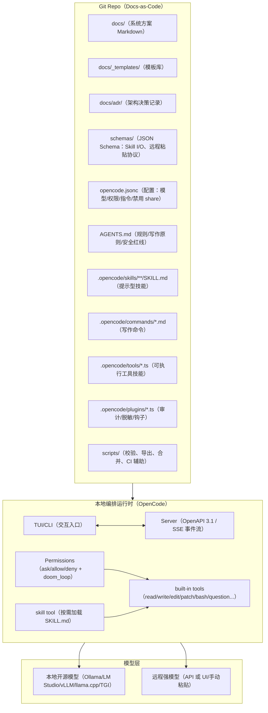
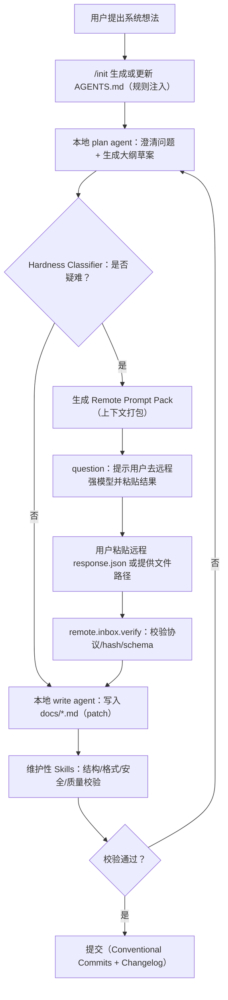

## 执行摘要

你要创建的 Git Repo，本质是一个“文档即系统（Docs-as-the-System）”的工程：Repo 里以 Markdown 作为复杂系统的设计文档（系统说明书/方案书/ADR/威胁模型/测试策略等），并用一套可复用、可插拔、可审计的 Skills（既包含“提示/流程化技能”，也包含“可执行工具技能”）来驱动从 0 到 1 的系统设计写作与持续迭代。

为把这件事做“工程化”，本报告主张把 **OpenCode** 作为本地主编排内核：用它的 Rules（AGENTS.md）、Agent/Commands、Agent Skills（SKILL.md）、Permissions、安全模式、以及 Server/SDK/插件与自定义工具体系，把“写文档”变成可重复、可控制、可回滚的流水线。

关键设计决策如下：

- **本地优先 + 远程增强**：默认走本地开源模型（通过 Ollama/LM Studio/本地 OpenAI-compatible Serving），遇到“疑难问题”再切换到更强远程模型。OpenCode 本身支持本地模型与 75+ 提供方（基于 AI SDK/Models.dev），便于统一编排与切换。
- **强制“可验证输出”**：所有关键 Skills 都要求输出结构化 JSON（带 JSON Schema），或输出可应用的统一 diff（patch），并配套校验与审计日志。OpenCode SDK 与 Server/Tools 体系为“结构化输出 + 事件流 + 会话导出”提供了可落地接口。
- **手动粘贴远程回答的交互协议**：当无法/不愿直接用远程 API（隐私、合规、成本或账号限制）时，采用“Remote Prompt Pack（上下文打包）→ 用户粘贴远程结果 → 本地校验与合并”的协议；通过 OpenCode 的 `question` 工具等待用户输入，并用本地校验器确保远程回答可控可追踪。
- **安全与隐私默认收紧**：启用 Permissions 的 `ask/deny` 策略、禁用（或手动）分享、对敏感文件（尤其 `.env`）默认拒绝读取、对外部目录访问默认询问；并以 OWASP LLM Top 10 与 NIST AI RMF 为安全评估框架。

本报告给出：系统架构（含 Mermaid）、组件清单、Skill 规范与接口、提示生成器设计、迭代写作工作流、≥10 个维护性 Skills（含优先级）、测试与验证方案、端到端用户操作示例、Git Repo 目录结构建议，以及 CI/CD（GitHub Actions）与自动化脚本示例。

## 需求边界与关键假设

本报告按你给定的默认假设与“未指定”约束处理：

- 本地环境假设：Linux x86_64，Python 3.10+，Docker 可用（若不符，按“未指定”处理，方案保持可迁移）。  
- Repo 目标：**以 Markdown 为主**，但允许加入少量配置文件（`opencode.jsonc`、`.opencode/` 目录）与必要脚本（CI、校验器、生成器）。OpenCode 支持项目级 `.opencode/` 目录承载 Agents/Commands/Plugins/Tools/Skills，因此无需引入重型框架即可落地。
- 远程模型交互：你明确要求“需要用户手动粘贴远程模型回答并继续流程”；因此本报告把“远程模型”同时覆盖两类：  
  - **API 直连**（可自动化）：OpenAI/Claude/Gemini/AWS Bedrock/Azure 等；  
  - **UI/人工复制粘贴**（需协议化）：ChatGPT/Claude/其他网页或桌面端。  
- 团队规模、预算、时间线未指定：本报告给出低/中/高三档实施建议与粗略工作量估算（偏保守）。  
- 合规未指定：本报告给出通用建议与“最小化暴露”策略；若涉及行业监管或跨境数据，需按组织合规进一步裁剪（尤其是把“远程 UI 粘贴”视为潜在数据外发）。

## OpenCode 能力盘点与在本方案中的角色

OpenCode 在本方案中承担“本地编排/Skill 管理/交互入口/审计与权限控制”的核心角色，原因是它同时具备：可配置 Agents、可复用 Skills、可定义 Commands、可扩展 Tools（含 MCP 与自定义工具）、可控 Permissions、以及可编程的 Server/SDK。

OpenCode 的关键机制与可直接复用点如下：

- **运行架构（TUI + Server）**：运行 `opencode` 会启动一个 TUI 客户端和一个 Server；Server 暴露 OpenAPI 3.1 规范（`/doc`）并可用 `opencode serve` 以无界面方式独立启动。Server 可用 HTTP Basic Auth 保护（`OPENCODE_SERVER_PASSWORD`，用户名默认 `opencode`）。
- **配置与合并优先级**：OpenCode 配置支持 JSON/JSONC；配置来源按“远程组织默认（`.well-known/opencode`）→ 全局 → 项目 → `.opencode` 目录 → 运行时覆盖”合并，而非整体替换；适合做团队级基线与项目级覆盖。
- **Rules（AGENTS.md + instructions）**：  
  - `AGENTS.md` 会被注入模型上下文；`/init` 可扫描项目生成/更新该文件，并建议提交到 Git。
  - `instructions` 字段可把多个文件/Glob/远程 URL 作为额外规则注入，并说明远程指令有超时限制（5 秒）。这非常适合把“写作规范/架构模板/安全红线”作为可版本化规则复用。
- **Agent Skills（SKILL.md）**：Skills 是可被发现、可按需加载的可复用指令模块；OpenCode 会在项目 `.opencode/skills/<name>/SKILL.md`（或全局 `~/.config/opencode/skills/`）发现它们，并通过原生 `skill` 工具按需注入到会话；每个 Skill 需 YAML frontmatter（`name/description/license/compatibility/metadata` 等），并有命名与长度约束。
- **Commands（可复用命令模板）**：可通过 `.opencode/commands/*.md` 定义命令（frontmatter + 模板正文），支持 `$ARGUMENTS`、位置参数、`!` 执行命令注入 shell 输出、`@file` 引用文件内容等；适合把“生成某类文档/刷新某章节/执行校验”等流程固化为一条命令。
- **Tools 与 Permissions**：  
  - Tools 默认全开，但可通过 `permission` 改为 `ask/allow/deny`；并能对子工具/模式做更细配置。
  - `.env` 等敏感文件默认拒读（安全默认值），外部目录访问可默认 `ask`。citeturn6view0  
  - `doom_loop` 权限用于检测“同一工具调用 3 次完全相同输入”的循环风险（对 Agent 调试与自动升级到“疑难问题”判定非常有用）。citeturn6view0  
  - `question` 工具可在执行中向用户提问/请求决策/收集输入，可作为“等待用户粘贴远程回答”的交互钩子。citeturn23search3turn39search10  
- **自定义工具与插件扩展**：  
  - 自定义工具可放在 `.opencode/tools/`（项目级）或 `~/.config/opencode/tools/`（全局），用 `@opencode-ai/plugin` 的 `tool()` + Zod 定义参数，并在 `execute` 中调用任意语言脚本（示例包含调用 Python）。
  - 插件可放在 `.opencode/plugins/` 或全局目录，也可通过 npm 包加载；OpenCode 会按固定顺序加载，并提供大量事件钩子（含 permission 事件、session 事件、tool 事件），适合做审计、脱敏、自动化写作流水线。
- **模型与提供方**：OpenCode 基于 AI SDK/Models.dev，支持 75+ 提供方且支持本地模型；Providers 文档提供 LM Studio/Ollama 的 OpenAI-compatible 配置范式；Ollama 官方甚至提供 `ollama launch opencode` 快速配置方式，并建议至少 64k 上下文窗口。

最后，需要强调 OpenCode 自身的数据路径：Enterprise 文档明确说明 OpenCode 不存储代码/上下文数据，处理发生在本地或直接调用你信任的 AI provider；但 `/share` 会把会话与数据发送到 opencode.ai 托管页面，建议在敏感环境中禁用。

## 系统架构设计与组件清单

本方案把 Repo 构建成一个“系统设计文档工厂”，其运行时由 OpenCode 驱动；写作目标是持续产出/更新 Markdown 设计文档，并保持可追溯、可验证、可回滚。
### 架构总览


OpenCode Server 的接口与能力使其既可用于交互式写作（TUI），也可用于 CI/脚本自动化（`opencode run`、`export`、以及 Server API）。

### 组件清单

| 组件                              | 责任边界                                | 关键输入                       | 关键输出                 | 推荐实现                                          |
| ------------------------------- | ----------------------------------- | -------------------------- | -------------------- | --------------------------------------------- |
| 文档工作区                           | 承载系统方案 Markdown、模板、ADR、检查清单         | 需求想法、既有内容、变更记录             | 结构化系统方案、可追溯 ADR      | `docs/` + MkDocs（可选）                          |
| Rules（AGENTS.md + instructions） | 定义写作风格、工程约束、安全红线、外部文件加载规范           | 项目结构扫描、团队规范                | 注入上下文的规则文本           | `/init` + `instructions`                      |
| Agents（plan/write/review 等）     | 把“写作阶段”分配到不同权限/模型/工具集               | 当前任务                       | 受控的推理与写作行为           | `opencode agent create` 或 `.opencode/agents/` |
| Commands（写作命令）                  | 将写作流程固化：生成大纲/刷新章节/生成 ADR/运行校验       | `$ARGUMENTS`、文件引用、shell 输出 | 标准化提示模板              | `.opencode/commands/*.md`                     |
| Skills（提示型）                     | 可复用的“写作技能/检查清单/方法论”，按需加载            | 任务上下文                      | 可读的指导与约束             | `.opencode/skills/**/SKILL.md`                |
| Skills（可执行工具型）                  | 对 Repo 执行确定性操作：校验、索引、生成 diff、合并远程结果 | JSON 入参、工作区上下文             | JSON/patch/日志        | `.opencode/tools/*.ts` + Zod                  |
| 远程增强桥接（Remote Bridge）           | 何时判定疑难、如何打包上下文、如何等待粘贴、如何合并          | Prompt Pack、粘贴结果           | 可验证 JSON + 可应用 patch | `question` + 本地校验器                            |
| 审计与事件流                          | 记录工具调用、权限响应、文档变更、远程粘贴来源             | OpenCode 事件流、会话导出          | 审计日志、追溯链             | Plugins + `export` + Server SSE               |
### “疑难问题”自动判定策略

你的要求是：明确何时自动判断为“疑难问题”。本报告给出一个可工程化的判定器（Hardness Classifier），它不依赖模型主观自评，而是组合客观信号：

1) **循环/停滞信号**：触发 `doom_loop`（同一工具调用 3 次相同输入）或连续多轮“无进展”（例如多次 rewrite 仍无法满足结构化输出校验）。
2) **结构化输出失败**：本地技能要求 JSON Schema 输出，但校验失败超过阈值（例如 2 次重试）；OpenCode SDK 对结构化输出失败会返回 `StructuredOutputError` 之类的错误信息，适合做自动升级。
3) **上下文/能力边界**：任务需要超长上下文或强工具调用一致性，而本地模型不稳定（例如上下文不足导致频繁遗忘）；Ollama 的 OpenCode 集成文档明确建议至少 64k token 上下文窗口，也提示工具调用问题可通过增大上下文参数缓解，说明上下文是关键约束。
4) **高风险决策**：涉及安全、隐私、合规、财务成本等“错误代价高”的章节（威胁模型、数据流、权限边界），默认升级为“需要远程强模型复核”或至少“第二模型交叉审查”（即使本地模型给出答案也要复核）。该策略与 OWASP LLM Top 10（强调提示注入、数据泄露等风险）与 NIST AI RMF（强调风险治理）一致。

## Skill 规范与接口定义

本方案把 Skill 分成两层，并用统一“Skill Contract”管理：

- **提示型 Skill（Instruction Skill）**：用 OpenCode 原生 SKILL.md 表达“方法论/检查清单/写作规范/输出格式约束”。它的“执行”是通过 `skill` 工具把内容注入上下文，让 Agent 在后续写作/工具调用中遵循。
- **工具型 Skill（Executable Skill）**：用 `.opencode/tools/*.ts`（或插件注入工具）表达“可执行动作”，输入输出必须是结构化 JSON（或输出 patch），以保证可测试与可审计。
### Skill Contract（统一规范）

建议在 `schemas/skill.contract.v1.json` 定义统一 Skill 元数据与 I/O 约束（JSON Schema Draft 2020-12），并要求每个工具型 Skill 提供对应的 schema。

**Skill 元数据（建议字段）**  
- `skill_id`：如 `doc.outline.generate`（稳定、可版本化）  
- `skill_version`：遵循语义化版本（SemVer），并配套变更日志（Keep a Changelog）与约定式提交（Conventional Commits）。
- `skill_type`：`instruction` / `tool` / `hybrid`  
- `owner`：维护者/团队  
- `permissions_required`：映射到 OpenCode `permission`（例如 `edit`、`bash`、`webfetch`、`external_directory`、`doom_loop` 等）。
- `data_classification`：对输入数据分级（public/internal/confidential/secret），决定是否允许进入远程 Prompt Pack。此策略属于工程治理建议，建议写入 AGENTS.md 并由工具强制执行。

**错误处理（建议统一结构）**  
- 任何工具型 Skill 失败都返回可解析 JSON（或抛出工具错误），至少包含：  
  - `error.code`（如 `VALIDATION_FAILED` / `PERMISSION_DENIED` / `IO_ERROR` / `CONFLICT`）  
  - `error.message`（对人可读）  
  - `error.hint`（下一步建议）  
  - `trace_id`（审计追踪）  

### OpenCode Skill（SKILL.md）模板示例

下面模板遵循 OpenCode Skills 文档：Skill 必须在 `SKILL.md` 中用 frontmatter 定义 `name/description/license/compatibility/metadata`，并存放在项目 `.opencode/skills/<name>/SKILL.md`（或全局路径）。

```markdown
---
name: doc.outline.generate
description: 生成系统方案文档的标准大纲，并绑定章节“完成定义（DoD）”。
license: MIT
compatibility: ">=1.0.0"
metadata:
  version: "1.0.0"
  owner: "docforge"
  data_classification: "internal"
---
# 目标
把用户的系统想法转换为可执行的系统方案大纲（Markdown），并为每个章节附带“所需输入”“产出物”“验收清单”。
# 输入期望
- 当前 docs/ 目录结构（如已存在）
- 用户的目标/非目标、约束、风险偏好
- 任何已确认的技术栈（未指定则显式标注“未指定”）
# 输出格式（强约束）
输出一个 Markdown 大纲，包含：
- 背景/目标/范围
- 架构图（mermaid）
- 组件清单
- 数据流与安全边界
- 测试与验证
- 运维与演进
# DoD
- 明确哪些信息未指定并列出假设
- 对每一节给出“需要用户确认的问题”
```

### OpenCode 自定义工具（工具型 Skill）示例

OpenCode 自定义工具放在 `.opencode/tools/`，使用 `@opencode-ai/plugin` 的 `tool()` 辅助函数，参数用 Zod（`tool.schema`）定义；工具执行时可以访问上下文（agent/sessionID/directory/worktree 等），并可调用 Python 等脚本。

示例：`remote_prompt_pack`（把“疑难问题”上下文打包成 Remote Prompt Pack JSON，并写入 outbox 文件）
```ts
// .opencode/tools/remote_prompt_pack.ts
import { tool } from "@opencode-ai/plugin"
import path from "path"
export default tool({
  description: "生成 Remote Prompt Pack（用于粘贴到远程强模型）并写入 .docforge/outbox/",
  args: {
    task_id: tool.schema.string().describe("任务唯一ID，例如 RFC-2026-0001"),
    question: tool.schema.string().describe("要向远程模型请教的具体问题"),
    context_paths: tool.schema.array(tool.schema.string()).describe("需要打包的文件路径列表（相对 repo root）"),
    redaction_mode: tool.schema.enum(["none", "basic", "strict"]).describe("脱敏模式"),
  },
  async execute(args, ctx) {
    const outDir = path.join(ctx.worktree, ".docforge/outbox")
    await Bun.$`mkdir -p ${outDir}`
    // 真实实现建议：读取文件、做脱敏、生成摘要、计算哈希、写 JSON
    const payload = {
      protocol: "docforge.remote.v1",
      task_id: args.task_id,
      question: args.question,
      context_paths: args.context_paths,
      redaction_mode: args.redaction_mode,
      created_at: new Date().toISOString(),
    }
    const outFile = path.join(outDir, `${args.task_id}.request.json`)
    await Bun.write(outFile, JSON.stringify(payload, null, 2))
    return JSON.stringify({ ok: true, outFile }, null, 2)
  },
})
```
### 可插拔接口示例（API / CLI / 文件协议）

本方案建议每个“工具型 Skill”至少提供一种可插拔调用方式：
- **API（OpenCode Server）**：通过 `POST /session/:id/message` 驱动会话，`parts` 传入文本/文件；也可用 `GET /global/event` 订阅 SSE 事件流用于审计。
- **CLI（OpenCode run/export）**：`opencode run` 支持 `--agent/--model/--format json/--attach`，`opencode export` 输出会话 JSON，便于外部流水线消费。
- **文件协议（Outbox/Inbox）**：`.docforge/outbox/*.request.json` 与 `.docforge/inbox/*.response.json` 作为人工粘贴/离线传递的载体，配套 JSON Schema 校验与 hash 校验，避免误合并。该协议为本报告设计建议，落地时推荐用 OpenCode `question` 引导用户填写 inbox 文件路径或直接粘贴内容。

### 维护性 Skills 列表（≥10，含实现要点与优先级）

下表给出 12 个维护性 Skills（可全部实现为“工具型 Skill”，并配套同名提示型 Skill 说明使用场景）。优先级定义：P0（必须尽快做）、P1（强烈建议）、P2（可延后）。

| Skill ID                     | 作用                                   | 关键输入→输出                                               | 错误处理要点                             | 权限/安全考虑                                                               | 优先级 |
| ---------------------------- | ------------------------------------ | ----------------------------------------------------- | ---------------------------------- | --------------------------------------------------------------------- | --- |
| `doc.format.normalize`       | 统一 Markdown 格式/标题层级/表格               | `docs/**/*.md` → 规范化后的文件 diff                         | 输出 patch；冲突时 `CONFLICT` 并给出最小化变更建议 | 需要 `edit`；建议默认 `ask`                                                  | P0  |
| `doc.structure.audit`        | 检查文档是否缺关键章节、是否存在“未指定假设”清单            | `docs/` → JSON 报告（缺失项/重复项/断链）                         | `VALIDATION_FAILED` 时输出定位（文件+行）    | 只读；允许 `read`                                                          | P0  |
| `doc.changelog.generate`     | 生成/更新 CHANGELOG.md（Keep a Changelog） | git 变更/版本号 → CHANGELOG.md 草案                          | 若 commit 不符合规范给出 remediation       | 需读 git log（可用命令注入）；不需写文件可先 dry-run                                    | P0  |
| `skill.registry.build`       | 生成 Skills 清单索引（用于发现/文档化/版本锁定）        | `.opencode/skills/**` → `docs/skills/index.md`        | 遇到 meta 缺失则标红并返回失败码                | 只读；可自动生成索引文件需 `write/edit`                                            | P0  |
| `skill.schema.validate`      | 校验工具型 Skill 的输入输出 JSON Schema        | `schemas/*.json` → 校验报告                               | 失败时输出 schema path 与原因              | 只读；CI 必跑                                                              | P0  |
| `remote.inbox.verify`        | 校验用户粘贴的远程回答（协议版本/hash/schema）        | inbox JSON → 通过/拒绝 + 原因                               | 严格：任何缺字段/哈希不符拒绝                    | 只读；拒绝时不得写入 docs                                                       | P0  |
| `doc.quality.score`          | 对文档做质量评分（可用规则/检查清单）                  | 文档内容 → 分数 + 改进建议                                      | 分数低于阈值在 CI fail                    | 不外发内容；避免把机密发到外部评估器                                                    | P1  |
| `sec.secret.scan`            | 检测敏感信息（token/密钥/PII）                 | repo diff → 命中项清单                                     | 命中即 fail，并输出撤回/轮换建议                | 防止 `.env`/密钥进入 Prompt Pack；结合默认拒读策略 citeturn6view0                 | P1  |
| `sec.prompt_injection.check` | 针对外部内容（网页/需求文本）做注入风险检查               | 外部输入→ 过滤/标注风险                                         | 标注风险等级与隔离策略                        | 对 `webfetch/websearch` 输出做隔离；依据 OWASP LLM Top 10 citeturn21search3 | P1  |
| `test.case.generate`         | 基于设计文档生成测试用例骨架（功能/非功能）               | `docs/system_design.md` → `tests/*.md` 或 `tests/*.py` | 若文档缺关键约束则返回 “need_more_info”       | 写入 tests 需 `write`; 建议先生成到草稿区                                         | P1  |
| `doc.drift.detect`           | 设计文档 vs 实现的漂移检测（适用于后续有代码时）           | repo（代码+docs）→ 漂移报告                                   | 输出证据（文件引用、差异段落）                    | 只读；适合 CI 周期执行                                                         | P2  |
| `ops.rollback.plan`          | 生成回滚计划（针对设计变更、接口变更）                  | 变更 diff/ADR → 回滚步骤文档                                  | 不可回滚项要标示风险与旁路                      | 输出到 ADR/Runbook；避免自动执行                                                | P2  |

上述 Skill 的工程化前提，是把“写作”变成可验证产物、把“改动”变成可审计 diff，并把安全红线前置到权限系统与校验器中。OpenCode 的 Permissions（ask/deny）、默认敏感文件保护、以及可扩展 tools/plugins，为这些维护性 Skills 提供了可落地的运行环境与治理入口。citeturn6view0turn18view0turn10view0turn28view0  

## 本地模型与远程强模型的交互流程、提示生成器与迭代写作工作流

本节给出你要求的“必须包含”的三部分：  
1）本地开源模型↔远程强模型交互流程（含疑难判定、上下文 Prompt、等待粘贴协议与 JSON 示例）；  
2）提示生成器设计；  
3）用户操作示例：从想法到生成/更新 Markdown 的小步迭代（含命令示例、提示模板、粘贴远程回答继续流程）。

### 交互流程（含“疑难问题→远程粘贴”）



OpenCode 已提供关键支撑点：`/init` 生成 AGENTS.md 并建议提交到 Git；`question` 工具用于收集用户输入；而 `doom_loop`/permissions 可作为停滞信号触发升级；`opencode run --format json` 与 `export` 可用于把整个过程自动化与审计化。
### 提示生成器设计（Prompt Pack Builder）

Prompt Pack Builder 的目标是：当升级到远程强模型时，自动生成“完整上下文 Prompt”，确保远程模型能够在一次回答中给出可被本地合并的结果。

建议 Prompt Pack 由 6 个区块组成（按固定顺序，便于 diff 与复用）：
1) **任务元信息**：task_id、协议版本、截止日期、参与模型信息（仅用于人读）  
2) **强约束输出格式**：要求远程模型输出严格 JSON（或至少输出 JSON + patch），并附 JSON Schema（精简版）  
3) **项目规则**：摘录 AGENTS.md 中与本次任务相关的规则（最少必要原则），以及 instructions 引入的写作规范要点  
4) **当前文档状态**：需要被更新的目标文件片段（只给相关段落），以及“缺口清单（unknowns）”  
5) **问题列表**：本次向远程强模型请教的“疑难问题”与候选方案权衡点  
6) **敏感信息声明**：明确要求远程模型忽略任何看似机密的数据，不要要求额外泄露

OpenCode 的 `instructions` 支持把规范文件作为可复用规则注入、支持远程 URL 注入并有超时；而 `compaction` 允许配置自动压缩与保留 token buffer，有利于在本地会话中保留足够上下文用于生成 Prompt Pack。

### “等待用户粘贴远程回答”的交互协议与示例 JSON（必含）

本方案定义协议 `docforge.remote.v1`：用 outbox/inbox 文件或直接粘贴的方式传递远程答案；本地必须校验 schema 与上下文哈希，避免把不匹配的远程回答误合并。
**Request（outbox）示例：` .docforge/outbox/RFC-2026-0001.request.json`**
```json
{
  "protocol": "docforge.remote.v1",
  "task_id": "RFC-2026-0001",
  "created_at": "2026-02-19T10:15:00+08:00",
  "hardness_reasons": [
    "STRUCTURED_OUTPUT_FAILED",
    "HIGH_RISK_SECURITY_SECTION"
  ],
  "context_digest": {
    "repo": "my-docforge-repo",
    "git_head": "3f2c1a9",
    "files": {
      "docs/system_design.md": "sha256:9ec1...c0a",
      "docs/adr/0001-foo.md": "sha256:11ab...9fd"
    }
  },
  "question": "请对系统架构的安全边界与数据流进行审阅：找出最脆弱的边界、给出最小改动的加固方案，并提供可直接应用到 docs/system_design.md 的统一 diff。",
  "constraints": {
    "language": "zh-CN",
    "must_return": ["patches", "risk_register", "assumptions"],
    "no_secrets": true
  },
  "context_snippets": [
    {
      "path": "docs/system_design.md",
      "excerpt": "（此处放入被审阅章节的关键片段……）"
    }
  ],
  "output_schema_ref": "schemas/docforge.remote.response.v1.json"
}
```
**Response（inbox）示例：` .docforge/inbox/RFC-2026-0001.response.json`**
```json
{
  "protocol": "docforge.remote.v1",
  "task_id": "RFC-2026-0001",
  "source": {
    "provider": "remote-ui",
    "model_hint": "unknown",
    "captured_at": "2026-02-19T10:45:00+08:00"
  },
  "context_digest": {
    "git_head": "3f2c1a9",
    "files": {
      "docs/system_design.md": "sha256:9ec1...c0a"
    }
  },
  "assumptions": [
    "未指定认证方式，默认使用短期 token + 轮换策略"
  ],
  "risk_register": [
    {
      "id": "R-01",
      "title": "外部目录读取导致敏感信息外泄",
      "severity": "high",
      "mitigation": "默认 external_directory=ask；对 .env 永久 deny"
    }
  ],
  "patches": [
    {
      "path": "docs/system_design.md",
      "patch_unified": "*** Begin Patch\n*** Update File: docs/system_design.md\n@@\n ...\n*** End Patch"
    }
  ],
  "notes": "已尽量以最小改动补齐数据流与权限边界说明。"
}
```
**等待粘贴的交互方式（在 OpenCode 内）**  
- Agent 触发 `question`：提示用户“请把远程模型输出粘贴为 JSON”或“提供 inbox 文件路径”。OpenCode `question` 工具的用途正是执行中向用户提问、澄清或让用户做决策。
- 之后调用 `remote.inbox.verify`：校验协议版本、task_id、context_digest、JSON Schema，校验通过才允许进入 `patch` 应用阶段（需要 `edit` 权限，建议 `ask`）。OpenCode 的权限系统支持把 `edit` 设为 `ask`，降低“自动写入”风险。

### 用户操作示例：从想法到生成/更新 Markdown 的小步迭代（必含）
下面给出一个最小可行的“日常使用脚本化流程”，完全符合你的“手动粘贴远程回答继续流程”要求。

**步骤一：初始化 Repo 与 OpenCode 规则**
```bash
# 1) 安装 OpenCode（官方安装脚本）
curl -fsSL https://opencode.ai/install | bash
# 2) 初始化你的文档仓库
mkdir my-docforge-repo && cd my-docforge-repo
git init
mkdir -p docs docs/adr docs/_templates .opencode/skills .opencode/commands .opencode/tools .docforge/inbox .docforge/outbox
```
OpenCode 官方提供 curl 安装方式；并支持在 CLI 不带参数时启动 TUI。citeturn27view0turn40view0  

**步骤二：写入最小配置（本地优先、收紧权限、禁用 share）**
OpenCode 支持 JSONC 配置、支持 `share` 设为 `disabled`、支持 `permission` 把 `edit/bash` 等设为 `ask`，并支持 `compaction` 控制上下文压缩。citeturn37view0turn28view0  
```jsonc
// opencode.jsonc
{
  "$schema": "https://opencode.ai/config.json",
  "share": "disabled",
  "permission": {
    "edit": "ask",
    "bash": "ask",
    "webfetch": "ask",
    "external_directory": "ask",
    "doom_loop": "ask"
  },
  "compaction": {
    "auto": true,
    "prune": true,
    "reserved": 10000
  },
  "instructions": [
    "docs/_templates/writing-guidelines.md"
  ],
  "default_agent": "plan"
}
```

**步骤三：生成 AGENTS.md（项目规则）并提交**
```bash
opencode
# 在 TUI 中执行：
# /init
# （生成/更新 AGENTS.md，按提示确认）
```

OpenCode 文档说明 `/init` 会扫描项目生成 `AGENTS.md`，并建议提交到 Git；规则文件还有多级位置与优先级。
```bash
git add AGENTS.md opencode.jsonc docs/_templates
git commit -m "chore(docs): bootstrap rules and config"
```

约定式提交与语义化版本/更新日志协同，是推荐的工程化策略。

**步骤四：创建写作命令（Commands）与 Skills**

例如创建一个命令 `/design`，它把“想法→大纲→填充章节”的写作流程固化。OpenCode Commands 支持 frontmatter、支持 `$ARGUMENTS`、支持 `@file` 引用文件内容、支持 `!` 注入命令输出。citeturn41view0  
```markdown
<!-- .opencode/commands/design.md -->
---
description: 从想法生成系统设计文档（迭代式）
agent: plan
---
你是系统架构师与技术写作者。
目标：把用户输入的想法，生成 docs/system_design.md 的初稿。
强要求：
- 列出未指定项与假设
- 输出必须包含 mermaid 架构图与数据流图
- 在最后给出“需要用户确认的问题清单”
用户想法：
$ARGUMENTS
```

**步骤五：本地迭代写作（小步）**
```bash
# 非交互快速跑一轮（可脚本化）
opencode run --agent plan "/design 我想做一个基于事件的订单系统，需要支持幂等、审计、回滚" 
```

OpenCode `opencode run` 支持非交互模式，并可通过 `--agent/--model/--format json` 等用于自动化。citeturn40view0  

**步骤六：触发“疑难问题→远程粘贴”流程**
当本地模型触发 hardness（例如安全章节高风险或结构化输出失败），执行：
```bash
# 由 Agent 调用 remote_prompt_pack 工具后，会把 request.json 写入 .docforge/outbox/
# 你把 outbox 里的内容复制到远程强模型（网页/桌面端）去问
# 接着把远程回答粘贴为 .docforge/inbox/RFC-2026-0001.response.json
# 再让 Agent 继续（可定义一个命令 /ingest-remote）
```

等待粘贴阶段由 `question` 完成：让用户选择“直接粘贴 JSON”或“提供 inbox 文件路径”。citeturn23search3turn39search10  

**步骤七：合并远程结果并继续本地写作**
1) `remote.inbox.verify` 校验通过  
2) 应用 `patches`（需要 `edit` 权限，推荐 `ask`）  
3) 运行维护性 Skills（格式化/结构检查/secret scan/质量评分）  
4) 提交变更 + 更新 CHANGELOG.md

OpenCode 配置允许将 `edit` 设置为 `ask`；Permissions 文档也强调 `.env` 默认拒绝与 ask/always/once 的交互模式，有利于把“手动确认点”制度化。citeturn37view0turn6view0  

## 测试与验证方案、CI/CD 与安全隐私策略
本节同时覆盖：测试与验证方案、CI/CD/自动化示例、安全与隐私（含数据流、审计日志、用户确认与合规建议），并提供你要求的“本地模型 vs 远程服务”对比表。

### 测试与验证方案
**核心原则**：文档生成是“可回归”的。每个关键 Skill 都必须有测试与验收标准，重点是结构化输出与变更可控。
1) **Schema 驱动验证**：  
   - 所有工具型 Skill 的输入输出都用 JSON Schema 校验（Draft 2020-12）。citeturn20search3turn20search7  
   - 远程粘贴协议也必须 schema 校验 + hash 校验。  
2) **单元测试（pytest）**：对校验器、diff 合并器、脱敏器做单测；pytest 适合小而可读的测试并可扩展到复杂测试。citeturn21search1turn21search5  
3) **Golden Tests（黄金样例）**：为固定输入（给定需求 + 固定上下文摘要）保存期望的结构（章节列表、必须字段），允许文本内容漂移但结构必须稳定。  
4) **安全回归**：按 OWASP LLM Top 10 风险（提示注入、数据泄露等）构造恶意输入样例，确保脱敏与隔离策略生效。citeturn21search3turn21search19  
5) **评测与质量门禁（可选）**：  
   - 若你使用 OpenAI API，可用其 Evals API/框架对“结构化输出/工具使用/写作质量”做自动评分回归。citeturn22search3turn22search9turn19search13  

### CI/CD 与自动化脚本示例
#### 推荐的 Repo 目录结构
该结构把“文档产物”“OpenCode 编排资产”“协议与 schema”“自动化脚本”分离，便于维护与审计：
```text
.
├── AGENTS.md
├── opencode.jsonc
├── docs/
│   ├── system_design.md
│   ├── adr/
│   │   └── 0001-template.md
│   └── _templates/
│       ├── system_design.template.md
│       └── writing-guidelines.md
├── schemas/
│   ├── docforge.remote.response.v1.json
│   └── skill.contract.v1.json
├── .opencode/
│   ├── agents/
│   │   ├── docforge-plan.md
│   │   ├── docforge-write.md
│   │   └── docforge-review.md
│   ├── commands/
│   │   ├── design.md
│   │   ├── refresh-section.md
│   │   └── ingest-remote.md
│   ├── skills/
│   │   └── doc.outline.generate/
│   │       └── SKILL.md
│   ├── tools/
│   │   ├── remote_prompt_pack.ts
│   │   └── remote_inbox_verify.ts
│   └── plugins/
│       ├── audit-log.ts
│       └── env-protection.ts
├── .docforge/
│   ├── outbox/
│   └── inbox/
├── scripts/
│   ├── validate_schemas.py
│   ├── audit_redact.py
│   └── doc_quality_gate.py
└── .github/
    └── workflows/
        ├── docs-ci.yml
        └── security.yml
```
OpenCode 文档明确 `commands/`、`skills/`、`tools/`、`plugins/` 均支持 project-level `.opencode/`；且 config 的 precedence 也提到 `.opencode` 目录会成为 agents/commands/plugins 的来源。

#### GitHub Actions（CI）示例：文档构建 + Schema 校验 + 质量门禁
GitHub Actions 的 workflow 存放在 `.github/workflows`，使用 YAML 定义。citeturn33search15turn33search0  
```yaml
# .github/workflows/docs-ci.yml
name: docs-ci
on:
  pull_request:
  push:
    branches: [ main ]
permissions:
  contents: read
jobs:
  validate:
    runs-on: ubuntu-latest
    steps:
      - name: Checkout
        uses: actions/checkout@v4
      - name: Set up Python
        uses: actions/setup-python@v5
        with:
          python-version: "3.10"
      - name: Cache pip
        uses: actions/cache@v4
        with:
          path: ~/.cache/pip
          key: pip-${{ runner.os }}-${{ hashFiles('**/requirements.txt') }}
      - name: Install deps
        run: |
          python -m pip install -U pip
          pip install -r requirements.txt
      - name: Validate JSON Schemas
        run: |
          python scripts/validate_schemas.py
      - name: Doc quality gate
        run: |
          python scripts/doc_quality_gate.py --min-score 80
      - name: Build MkDocs (optional)
        run: |
          mkdocs build --strict
```
上例引用了 `actions/checkout`（把仓库检出到 runner）与 `actions/cache`（缓存依赖）；GitHub 官方文档分别说明了 checkout 行为与缓存机制。

**安全注意**：GitHub 官方安全指南强调要谨慎使用第三方 actions、谨慎处理 secrets，并认识到 runner 一旦被攻破可能导致 secrets 外泄。你的方案中若未来引入“在 CI 中自动跑 OpenCode/调用模型”，必须把 secrets 与日志做严格隔离。citeturn33search3turn33search7  
#### pre-commit（提交前本地门禁）示例
pre-commit 是多语言 pre-commit hooks 管理器，可在每次 commit 前自动运行检查（无需 root）。citeturn21search0  
```yaml
# .pre-commit-config.yaml
repos:
  - repo: https://github.com/pre-commit/pre-commit-hooks
    rev: v5.0.0
    hooks:
      - id: end-of-file-fixer
      - id: trailing-whitespace
      - id: check-merge-conflict
```
### 安全与隐私：本地与远程数据流、审计、用户确认与合规建议
#### 本地与远程数据流策略
- **OpenCode 本地数据策略**：Enterprise 文档说明 OpenCode 不存储代码/上下文数据；处理发生在本地或你选择的 AI provider 直连；但 `/share` 会把会话数据发送到 opencode.ai 托管，建议在敏感仓库禁用 share（`"share":"disabled"`）。citeturn28view0turn37view0  
- **远程 API 直连的隐私差异**（必须显式写入 AGENTS.md 的安全红线）：  
  - entity["company","OpenAI","ai company"]：OpenAI 平台文档说明，自 2023-03-01 起 API 数据默认不用于训练，除非你显式 opt-in。citeturn15search3  
  - entity["company","Anthropic","ai company"]：隐私中心说明商业产品（含 Anthropic API）默认不使用输入/输出训练模型；与消费者产品的数据策略区分明显。citeturn16search5  
  - entity["company","Google","technology company"]：Gemini API 定价页明确区分 Free Tier 与 Paid Tier，并在“Used to improve our products”列给出差异（Free=Yes，Paid=No）。citeturn16search2  
  - entity["company","Amazon Web Services","cloud provider"]：Amazon Bedrock 数据保护文档明确：不存储或记录 prompts/completions，不用于训练 AWS 模型，也不分发给第三方。citeturn16search3  
  - entity["company","Microsoft","technology company"]：Azure 的相关文档说明 Azure Direct Models（含 Azure OpenAI）对数据处理/存储/监控有明确说明，并强调企业级隔离（具体条款以所选服务文档为准）。citeturn17search1turn17search2  
  - entity["company","Alibaba Cloud","cloud provider"]：Model Studio 文档提供模型列表与部分数据驻留模式说明（如 US vs Mainland China 的接入点与数据存储位置），并提供监控数据默认保留期等信息；若涉及敏感数据外发，应对接其 Trust Center/条款与组织合规流程。citeturn36search3turn36search1turn36search4turn36search17  
#### “远程 UI/复制粘贴”场景的额外风险与用户确认步骤
复制粘贴到消费者产品 UI（或不受控第三方）通常风险更高：你可能无法保证数据不被用于训练或长期保留。以 ChatGPT 为例，其帮助中心说明用户可在设置中关闭“用于训练”的开关；但这属于产品设置与条款治理，不应替代组织级合规审查。citeturn15search11  
因此，本方案要求 Remote Bridge 在每次生成 Prompt Pack 时强制执行：
1) **敏感信息扫描与脱敏**（P0）：命中即阻断外发；  
2) **用户二次确认（question）**：提示将要外发的上下文摘要、数据分类等级、远程目标（API/UI）、以及“最小必要原则”；  
3) **审计记录**：记录 task_id、context_digest、外发摘要、用户确认时间，不记录原始敏感内容。OpenCode 插件体系支持在 permission/tool 事件上做审计钩子。citeturn10view0turn6view0turn23search3  
#### 合规建议（通用）
- 采用 entity["organization","OWASP","security nonprofit"] Top 10 for LLM Applications 作为生成式 AI 应用的威胁清单与控制建议来源，重点关注提示注入、数据泄露、供应链与过度权限等风险。citeturn21search3turn21search19  
- 采用 entity["organization","NIST","us standards institute"] AI RMF 1.0 作为风险治理框架，把“风险识别→评估→控制→监控”写入你的 ADR/运维章节，并把“远程外发”视为高风险控制点。citeturn22search0turn22search4  
### 本地模型选项与远程服务选项对比表（必含）
#### 本地常见开源模型（未指定时的候选清单）

| 模型（开源权重） | 能力/特点（概要） | 延迟/成本（相对） | 隐私 | 易用性/集成 | 参考 |
|---|---|---|---|---|---|
| entity["company","Meta","technology company"] Llama 3.1 | 官方博客强调 128K 上下文等改进（以发布说明为准） | 低到中（取决于硬件） | 高（本地） | 可通过 vLLM/Ollama/llama.cpp 等 OpenAI-compatible 接入 | citeturn14search0turn15search0turn23search2turn12view0 |
| entity["company","Mistral AI","ai company"] Mistral 7B | 文档给出 32k 上下文等参数（不同版本不同） | 低 | 高（本地） | 可通过多种本地 serving 接入 | citeturn14search1turn14search5 |
| Qwen2.5 | 技术报告描述训练数据规模与系列化开源权重 | 中 | 高（本地） | 可本地部署或用云服务（取决于版本） | citeturn14search2turn14search10 |
| Gemma 3 | 模型卡强调适合本地/资源受限部署等定位 | 低到中 | 高（本地） | 可与本地推理服务结合 | citeturn14search3turn14search11 |
| Phi-3 | 技术报告强调小模型但能力强、可在设备侧部署等 | 低 | 高（本地） | 适合轻量写作/检查类任务 | citeturn23search1 |
| DeepSeek-R1 | 官方仓库说明其推理能力与开源蒸馏模型等 | 中到高 | 高（本地） | 适合疑难推理，但部署成本更高 | citeturn23search0 |
本地部署/Serving 推荐优先选 OpenAI-compatible 方案以便统一接入：vLLM 提供 OpenAI-compatible HTTP server；TGI 提供与 OpenAI Chat Completion 兼容的 Messages API；llama-cpp-python 也提供 OpenAI-compatible web server。citeturn15search0turn15search1turn23search2  
#### 远程主流云/API 服务（未指定时的候选清单）

| 服务 | 能力（概要） | 延迟 | 成本 | 隐私/数据使用 | 易用性/集成难度 |
|---|---|---|---|---|---|
| entity["company","OpenAI","ai company"] API | Responses API + Structured Outputs 等能力 | 中 | 有公开定价（示例见官网）citeturn19search0turn19search3 | API 数据默认不用于训练（除非 opt-in）citeturn15search3 | 易（生态成熟，OpenAI-compatible 也利于迁移）citeturn15search2turn19search2 |
| entity["company","Anthropic","ai company"] API | Messages API/Structured outputs 等 | 中 | 有公开定价（消费与工具另计）citeturn35view0 | 商业产品默认不用于训练citeturn16search5 | 中（模型能力强，协议清晰）citeturn16search4turn16search8 |
| entity["company","Google","technology company"] Gemini API | 支持多模型档位 | 中 | 定价表明确区分 free/paid，并标注“是否用于改进产品”citeturn16search2 | Free Tier=用于改进产品；Paid Tier=不用于改进产品（以其页面为准）citeturn16search2turn16search6 | 中（需理解 tier 与隐私差异） |
| entity["company","Amazon Web Services","cloud provider"] Bedrock | 多家模型聚合、企业集成 | 中 | 有公开 pricing 页面（按模型/区域）citeturn34search2 | 不存储 prompts/completions，不用于训练citeturn16search3 | 中到高（IAM/网络/区域配置） |
| entity["company","Microsoft","technology company"] Azure OpenAI | 企业隔离、Responses API 等 | 中 | Azure 定价页（按模型）citeturn34search3 | 数据处理/隐私说明见官方文档citeturn17search1turn17search2 | 中到高（部署/配额/网络） |
| entity["company","Alibaba Cloud","cloud provider"] Model Studio（Qwen） | 文档说明支持 OpenAI Chat Completion 与 OpenAI Responses 接口 | 中 | 模型列表页给出成本与上下文窗口信息（按部署模式）citeturn36search3 | 需结合其数据驻留/条款/信任中心做合规评估citeturn36search4turn36search17 | 中（如走 OpenAI-compatible 接口可降低迁移成本）citeturn17search7turn36search2 |
### 低/中/高三档实施建议与估算
- **低配（单人，1–2 周）**：只做提示型 Skills + Commands + 最小校验器；本地模型用 Ollama/LM Studio 接入 OpenCode；远程通过“手动粘贴协议”偶尔增强；CI 只跑 schema 校验与基本格式化。
- **中配（1–3 人，3–6 周）**：补齐≥10 维护性 Skills、加入插件审计/脱敏、建立黄金样例测试与质量门禁；支持 `opencode serve` + `opencode run --attach` 做半自动流水线；逐步引入远程 API（在合规前提下）。
- **高配（团队/组织，6–12 周）**：引入组织级远程 config（`.well-known/opencode`）与内部 AI gateway，统一身份认证与 provider 白名单；强制禁用 share；将审计、数据分类、外发审批整合到权限与插件；对外部工具/Actions 做供应链安全治理。