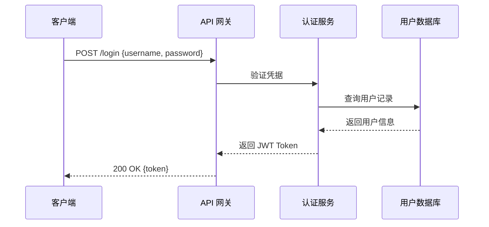

# MaeDoc 通用写作规范

> 本文档是跨所有文档类型的写作基线约束。所有 MaeDoc AI Agent 生成的文档，以及人工撰写的文档，均应遵循本规范。

---

## 1. Markdown 格式规范

### 1.1 标题层级

- 文档使用唯一的 `# H1` 作为文档标题，**每篇文档只允许一个 H1**
- 主要章节使用 `## H2`，子章节使用 `### H3`，深层细节使用 `#### H4`
- **禁止跳级**：不得从 H2 直接跳到 H4，层级必须连续
- 标题不加句号，不使用加粗（标题本身已有视觉权重）
- 标题与正文之间必须有一个空行

```markdown
# 文档标题

## 主要章节

### 子章节

正文内容...
```

### 1.2 列表

- **无序列表**：使用 `-` 符号，不使用 `*` 或 `+`
- **有序列表**：仅在步骤有严格顺序时使用，其他场景优先使用无序列表
- 列表项末尾不加句号（完整句子除外）
- 列表嵌套不超过 **3 层**；超过 3 层时考虑拆分为子章节或表格
- 列表项之间通常不加空行；若列表项包含多段内容，则在项间加空行

```markdown
- 第一项
- 第二项
  - 子项 A
  - 子项 B
- 第三项
```

### 1.3 代码块

- 所有代码块**必须标注语言**，哪怕是纯文本也写 `text`
- 行内代码（`` `code` ``）用于：命令名、文件路径、变量名、配置键
- 代码块与上下文之间各留一个空行
- 代码示例应可独立运行，或注明前置依赖

````markdown
```python
def hello(name: str) -> str:
    return f"Hello, {name}!"
```
````

**语言标识参考**：

| 场景 | 标识 |
|------|------|
| Shell 命令 | `bash` 或 `sh` |
| JSON 配置 | `json` |
| YAML 配置 | `yaml` |
| TypeScript | `typescript` 或 `ts` |
| 纯文本/伪代码 | `text` |

### 1.4 表格

- 表格用于展示**结构化的对比信息**，不用于展示流水文字
- 每列必须有标题行
- 对齐符号（`:`）规则：左对齐 `:---`，居中 `:---:`，右对齐 `---:`
- 表格与上下文之间各留一个空行
- 单元格内容过长时，考虑改用列表或子章节

```markdown
| 字段 | 类型 | 必填 | 说明 |
|------|------|:----:|------|
| id   | string | ✓ | 唯一标识符 |
| name | string | ✓ | 显示名称 |
```

### 1.5 强调与引用

- **加粗**（`**text**`）：用于关键术语首次出现、重要警告、操作结论
- *斜体*（`*text*`）：用于书名、外来词、轻度强调，中文文档中慎用
- `> 引用块`：用于重要提示、注意事项、摘录原文
- **禁止**在正文中滥用加粗（每段不超过 1-2 处）

---

## 2. 语言风格指南

### 2.1 简洁原则

- **一句话一个意思**：避免用"同时、并且、另外"连接多个独立信息
- **主动语态优先**：写"系统返回错误"而非"错误被系统返回"
- **删除废话词**：避免"需要注意的是"、"值得一提的是"、"众所周知"等开场白
- **量化代替模糊**：写"响应时间 < 200ms"而非"响应很快"

**反例 → 正例**：

| 反例 | 正例 |
|------|------|
| 由于种种原因，该功能目前暂时不可用 | 该功能因 X 原因暂不可用 |
| 在这里我们可以看到... | （直接陈述结论） |
| 非常重要的一点是... | **注意**：（用强调格式） |

### 2.2 准确原则

- 技术术语在文档内**保持一致**，首次出现时可附原文：`消息队列（Message Queue）`
- 数字单位明确：写 `100 MB`（有空格），不写 `100mb`
- 时间表述明确：写 `2024-01-15`（ISO 8601），不写"上个月"、"最近"
- 涉及外部系统时，注明版本号或日期，避免信息过时

### 2.3 避免废话

以下表达模式应当删除或替换：

- **冗余开场**：删除"本文将介绍……"，直接进入主题
- **填充词**：删除"其实"、"基本上"、"总的来说"
- **重复解释**：说一次，不要在正文说完后又在总结重复相同内容
- **空洞结论**：写"因此，我们应该 X"而非"因此，这是非常重要的"

---

## 3. 结构化写作原则

### 3.1 每段一个主题

- 每个段落只表达**一个中心思想**
- 段落首句即主题句（概括本段核心）
- 段落长度建议 3-6 句，超过 8 句考虑拆分

### 3.2 先结论后展开（Pyramid Principle）

- **章节级别**：章节首段给出本章结论，后续段落提供支撑细节
- **文档级别**：执行摘要（如有）呈现全文结论，正文展开论证
- **列表级别**：列表标题是结论，列表项是依据

```markdown
## 推荐使用 PostgreSQL

本系统选用 PostgreSQL 作为主数据库，原因如下：

- **事务完整性**：支持完整的 ACID 事务，满足金融级一致性要求
- **JSON 支持**：原生 JSONB 类型，兼顾结构化与半结构化数据
- **生态成熟**：活跃的社区和丰富的扩展生态（PostGIS、TimescaleDB 等）
```

### 3.3 章节结构规范

- 每个章节至少包含 **2 个子节**，或不拆分（避免孤立子节）
- 平级章节的信息粒度应相近
- 章节末尾可用一句话过渡到下一章节（可选，不强制）

---

## 4. 未指定信息的标注规范

### 4.1 标注格式

当文档中存在不确定、待确认、或暂未获取到的信息时，使用以下标注格式：

| 场景 | 标注格式 |
|------|---------|
| 信息未提供，需用户确认 | `[待确认: 具体问题描述]` |
| 信息不确定，基于假设填写 | `[假设: 假设内容]` |
| 占位符，后续补充 | `[TODO: 待补充内容]` |
| 信息缺失，需要调研 | `[未知: 需要调研的内容]` |

**示例**：

```markdown
## 部署架构

服务将部署在 [待确认: 云服务商和区域（如 AWS ap-northeast-1）]，
预计实例规格为 [假设: 4 核 8GB，基于当前负载估算]。
```

### 4.2 假设清单

- 文档若包含多处假设，应在文档末尾或专门章节汇总"**假设与待确认事项清单**"
- 清单格式：编号 + 假设内容 + 影响范围 + 负责人（可选）

```markdown
## 假设与待确认事项

| # | 假设/待确认事项 | 影响范围 | 状态 |
|---|----------------|---------|------|
| 1 | 部署区域为 AWS ap-northeast-1 | 网络延迟估算 | 待确认 |
| 2 | 峰值 QPS 不超过 10,000 | 容量规划 | 假设 |
```

### 4.3 禁止的处理方式

- **禁止**：直接编造数据（如"预计用户量 100 万"）却不标注为假设
- **禁止**：用模糊语言掩盖不确定性（如"大约"、"可能"、"也许"）
- **应该**：明确标注不确定性，让读者知道哪些信息需要验证

---

## 5. Mermaid 图表使用规范

### 5.1 适用场景

| 图表类型 | Mermaid 类型 | 适用场景 |
|---------|------------|---------|
| 流程图 | `flowchart` / `graph` | 业务流程、决策树 |
| 序列图 | `sequenceDiagram` | 系统交互、API 调用时序 |
| 类图 | `classDiagram` | 数据模型、领域对象关系 |
| 状态图 | `stateDiagram-v2` | 状态机、生命周期 |
| 甘特图 | `gantt` | 项目排期、里程碑 |
| ER 图 | `erDiagram` | 数据库关系设计 |

### 5.2 编写规范

- 每个图表前加一句说明图表含义的文字
- 节点/组件命名使用有意义的标识，不用 A/B/C 等无意义字母
- 图表复杂度：单图节点不超过 **15 个**，超出时拆分为多图
- 方向：流程图默认使用 `LR`（左到右）；层次结构使用 `TD`（上到下）

```markdown
下图展示用户认证的完整流程：


```

### 5.3 注意事项

- Mermaid 语法错误会导致渲染失败，生成后应验证语法正确性
- 中文节点名称需用引号包裹：`A["用户登录"]`
- 避免在图表中放置过长的文字说明，细节在正文中解释

---

## 6. 引用与来源标注规范

### 6.1 内部引用

引用同仓库内其他文档，使用相对路径：

```markdown
详见 [技术设计规范](../guides/tech-design.md) 第 3 章。
```

### 6.2 外部引用

- 引用外部资料时，附上完整 URL 和访问日期
- 格式：`[标题](URL)（访问于 YYYY-MM-DD）`

```markdown
参考 [OWASP Top 10](https://owasp.org/www-project-top-ten/)（访问于 2024-01-15）。
```

### 6.3 规范/标准引用

引用行业规范时，注明规范名称和版本号：

```markdown
遵循 [RFC 7519 - JSON Web Token](https://tools.ietf.org/html/rfc7519) 规范。
```

### 6.4 数据来源

- 文档中出现的数据、指标、统计数字，必须标注来源
- 无法提供来源的数据，标注为 `[来源待确认]`
- 禁止使用未标注来源的数据作为决策依据

---

## 7. 中英文混排规范

### 7.1 空格规则

- 中文与英文单词/数字之间加一个空格
- 中文与代码行内块之间加一个空格
- 全角标点（，。！？）与英文单词之间不加空格

```markdown
✓ 使用 Docker 部署服务，版本要求 >= 20.10
✓ 配置 `DATABASE_URL` 环境变量后重启服务
✗ 使用Docker部署服务，版本要求>=20.10
```

### 7.2 标点符号

- **中文文档**使用全角标点：`，。：；！？""''（）`
- **代码注释和代码块内**使用半角标点
- 列表项末尾：若为短语，不加标点；若为完整句子，加句号

### 7.3 术语规范

- 专有名词保持原文：`Docker`、`Kubernetes`、`GitHub`（注意大小写）
- 首次出现的技术术语提供中英对照：`负载均衡（Load Balancer）`
- 缩写首次出现时展开：`REST（Representational State Transfer）`
- 同一文档内，同一概念的中英文表达必须统一

### 7.4 数字与单位

- 数字与单位之间加空格：`100 MB`、`2 核 4 GB`、`500 ms`
- 百分比紧跟数字：`99.9%`（无空格）
- 日期使用 ISO 8601：`2024-01-15`

---

## 8. 多文件文档架构

### 8.1 入口文档规范

`docs/index.md` 是整个 `docs/` 目录的导航入口，所有文档从此处可达。

**格式要求**：

- **当前探索方向**：1-2 句话描述正在研究什么（位于文件顶部）
- **文档地图**：按分类组织，每个条目包含相对路径链接 + 一行描述
- **目录结构**：用 `tree` 格式展示当前 `docs/` 的文件布局
- **最后更新时间**：位于文件末尾，格式 `YYYY-MM-DD`

**维护规则**：

- `/create` 创建新文档后，自动将新文档追加到文档地图
- `/evolve` 执行结构变更后，重新生成整个 index.md
- `/iterate` 修改文档后，若文档描述有实质变化则更新对应条目

### 8.2 文档拆分规则

**何时拆分**：

- 单文档超过 **300 行**时，应考虑拆分
- 文档包含 2 个以上独立主题时，应拆分为各自的文档
- 某个章节内容已独立完整，可作为独立文档被其他文档引用时

**如何拆分**：

1. 识别可独立的章节或主题块
2. 将其抽取为独立文档，放入对应分类子目录
3. 在原文档中用链接替代被抽取的内容：
   ```markdown
   详见 [章节标题](./subdir/extracted-doc.md)。
   ```
4. 更新 `docs/index.md` 的文档地图

**拆分后的引用处理**：

- 原位置保留一句话概述 + 链接指向新文件
- 所有引用被拆分文档的其他文档，更新引用路径
- 新文件顶部可注明来源：`> 本文从 [原文档](../original.md) 中拆分而来。`

### 8.3 交叉引用规范

**相对路径格式**：

- 同目录文件：`[标题](./file.md)`
- 子目录文件：`[标题](./subdir/file.md)`
- 上级目录文件：`[标题](../file.md)`

**引用描述**：

- 引用链接必须附带简短说明，不使用裸链接
- 正例：`详见 [CAP 理论笔记](./distributed-systems/cap-theorem.md) 中的一致性模型分析`
- 反例：`详见 [这里](./cap-theorem.md)`

**锚点链接**：

- 引用文档内特定章节时，使用锚点：`[文件名 — 章节名](./file.md#章节锚点)`
- 锚点规则：中文标题去空格后用 `-` 连接，英文小写

### 8.4 目录组织规范

**分类目录命名**：

- 使用 kebab-case 英文命名：`distributed-systems/`、`architecture-decisions/`
- 名称反映内容分类，不用日期或序号命名目录

**嵌套深度限制**：

- 目录嵌套不超过 **3 层**（含 `docs/` 自身）
- 示例：`docs/distributed-systems/consensus/raft.md`（3 层，允许）
- 超出 3 层时，考虑合并中间层级或重新分类

**目录结构示例**：

```text
docs/
├── index.md                          # 导航入口
├── architecture-decisions/           # 架构决策
│   ├── adr-001-ipc-choice.md
│   └── adr-002-storage-engine.md
├── distributed-systems/              # 分布式系统
│   ├── cap-theorem.md
│   └── consensus/
│       └── raft.md
└── windows-component-platform-design.md  # 未分类文档（可后续归类）
```

---

## 附录：快速检查清单

在提交文档前，逐项确认：

**格式**
- [ ] 文档只有一个 H1 标题
- [ ] 标题层级连续，无跳级
- [ ] 代码块已标注语言
- [ ] 表格有对齐符号

**内容**
- [ ] 不确定信息已用 `[待确认]` / `[假设]` 标注
- [ ] 多处假设已汇总到假设清单
- [ ] 数据来源已标注

**语言**
- [ ] 无废话开场白
- [ ] 中英文混排有正确空格
- [ ] 技术术语在文档内保持一致

**图表**
- [ ] 每个 Mermaid 图表前有说明文字
- [ ] 图表节点数量 ≤ 15

**多文件架构**
- [ ] 单文档不超过 300 行
- [ ] 交叉引用使用相对路径且附带说明
- [ ] 新文档已添加到 `docs/index.md` 文档地图
- [ ] 目录嵌套不超过 3 层
